# Licensing guide for MD-102

Licensing questions show up across every domain ("What is the minimum license...?"). This page is the single reference the rest of the repo links to. Verified against Microsoft Learn on **2026-09-30**. Licensing changes often, so check the linked pages before you rely on a detail for production.

## The big picture

```mermaid
flowchart LR
  subgraph M365E3["Microsoft 365 E3"]
    I1[Intune Plan 1]
    I2["Intune Plan 2<br/>(since July 2026)"]
    RH["Remote Help<br/>(since July 2026)"]
    AA["Advanced Analytics<br/>(since July 2026)"]
    P1[Entra ID P1]
    WE3[Windows Enterprise E3]
    MDE1[Defender for Endpoint P1]
  end
  subgraph M365E5["Microsoft 365 E5 / E7 adds"]
    P2[Entra ID P2]
    WE5[Windows Enterprise E5]
    MDE2[Defender for Endpoint P2]
    EPM["Endpoint Privilege Mgmt<br/>(since July 2026)"]
    PKI["Cloud PKI<br/>(since July 2026)"]
    EAM["Enterprise App Mgmt<br/>(since July 2026)"]
    SC["Security Copilot inclusion<br/>(SCU allocation)"]
  end
  M365E3 --> M365E5
```

## Intune plans

| Plan | What it is | Examples of features |
|---|---|---|
| **Intune Plan 1** | Base UEM service | Enrollment, compliance, configuration profiles, settings catalog, apps (Win32/LOB/Store), app protection & app configuration policies, endpoint security policies, Windows Update policies, Autopilot, Endpoint analytics (core), Remediations*, Microsoft Tunnel (enrolled devices), Windows LAPS, multi-admin approval |
| **Intune Plan 2** | Add-on to Plan 1 | Remote Help, Advanced Analytics (device query, anomalies, battery health, resource performance, device timeline), Microsoft Tunnel for MAM (unenrolled iOS/Android), specialty devices (HoloLens 2, Teams Rooms on Android, large screens, AR/VR), Android firmware-over-the-air (FOTA) |
| **Intune Suite** | Add-on to Plan 1, **includes Plan 2** | Everything in Plan 2 + Endpoint Privilege Management, Enterprise App Management (Enterprise App Catalog), Microsoft Cloud PKI |

> Microsoft repackaged the plans in 2026: Remote Help and Advanced Analytics are now described as **Plan 2** capabilities (older docs list them as Suite-only add-ons). Either answer is "an add-on beyond Plan 1".

\*Remediations additionally requires a qualifying Windows license (see below).

### July 2026 change: Suite capabilities in Microsoft 365 bundles

Starting July 2026 (gradual rollout, 30-day message-center notice per tenant):

| Bundle | Newly included |
|---|---|
| Microsoft 365 E3 (via EMS E3) | Intune Plan 2 (Tunnel for MAM, specialty devices, FOTA), Remote Help, Advanced Analytics |
| Microsoft 365 E5 / E7 | Everything in E3 **plus** Endpoint Privilege Management, Enterprise App Management, Microsoft Cloud PKI |
| Other plans (Business Premium, F-SKUs, EDU, standalone Intune) | No change - Suite / individual add-ons still purchased separately |

> **Exam tip:** If a question asks you to *minimize cost*, pick the smallest SKU that contains the feature. Tunnel for MAM, specialty devices, FOTA, Remote Help, Advanced Analytics = **Plan 2**. EPM, Cloud PKI, Enterprise App Catalog = **Intune Suite** (or the individual add-on). Anything in Plan 1 needs no add-on at all.

## Microsoft Entra ID

| Feature | Free | P1 | P2 |
|---|---|---|---|
| Entra join / registration, device objects | ✓ | ✓ | ✓ |
| Automatic MDM enrollment (MDM user scope) | - | ✓ | ✓ |
| Dynamic groups | - | ✓ | ✓ |
| Conditional Access (device compliance, app protection, MFA) | - | ✓ | ✓ |
| Self-service password reset with on-prem writeback | - | ✓ | ✓ |
| Risk-based Conditional Access (Identity Protection), PIM | - | - | ✓ |
| Windows LAPS in Entra ID | ✓ (any Entra ID license) | ✓ | ✓ |

## Windows client licensing

| Capability | Requirement |
|---|---|
| Windows Autopilot | Windows 10/11 Pro, Enterprise, or Education + Entra ID P1 (automatic enrollment) + Intune |
| Feature update policies, expedited quality updates, driver updates (Windows Autopatch service) | Windows Enterprise E3/E5, Education A3/A5, Microsoft 365 Business Premium, or Windows 365 Enterprise (Windows Autopatch prerequisites) |
| Hotpatch | Windows 11 Enterprise E3/E5, Microsoft 365 F3, Education A3/A5, Microsoft 365 Business Premium, or Windows 365 Enterprise; Windows 11 24H2+; VBS on; x64 (Arm64 needs CHPE disabled) |
| Remediations (Endpoint analytics) | Windows Enterprise E3/E5, Education A3/A5, or Windows VDA E3/E5 per user (plus Intune) |
| App Control for Business managed installer | Supported on Windows 10/11 Pro, Enterprise, Education |
| Windows Hello for Business cloud Kerberos trust | Windows 10 21H2+ / Windows 11, Entra ID P1 not required for WHfB itself |
| Windows Backup for Organizations | Entra joined or hybrid joined; restore needs Entra joined + Windows 11 22H2+ |

## Microsoft Defender

| Product | Included in | Notes |
|---|---|---|
| Microsoft Defender Antivirus | Windows | Managed by Intune antivirus policies with any Intune license |
| Defender for Endpoint Plan 1 | Microsoft 365 E3 | Next-gen protection, ASR, device control; no EDR investigation |
| Defender for Endpoint Plan 2 | Microsoft 365 E5 / E7 | EDR, automated investigation, advanced hunting, Defender Vulnerability Management (core) |
| Defender Vulnerability Management (in Defender for Endpoint P2, or Standalone) | E5, or standalone | Data source for the Intune Vulnerability Remediation Agent |

## Windows 365

Windows 365 is licensed **per user** separately from Microsoft 365: Windows 365 Enterprise, Frontline (dedicated or shared mode), Business, and Flex. Every Cloud PC user also needs Windows Enterprise E3, Intune, and Entra ID P1 (included in Microsoft 365 E3/E5). Windows 365 Business Cloud PCs cannot use custom images or Azure network connections.

## Security Copilot

| Customer type | How capacity works |
|---|---|
| Microsoft 365 **E5 / E7** | Auto-provisioned *Default Security Copilot Capacity*. **400 SCUs per month for every 1,000 paid user licenses**, up to 10,000 SCUs/month, no extra charge. Scales down for smaller tenants (400 licenses → 160 SCUs/month). Unused SCUs do not roll over. |
| Everyone else | Provision SCUs in Azure (minimum 1 SCU); billed **per hour** whether used or not, plus optional overage. Check the [pricing page](https://www.microsoft.com/security/pricing/microsoft-security-copilot/). |

Intune agents have extra prerequisites. For example, the Vulnerability Remediation Agent needs Intune Plan 1, Security Copilot SCUs, and Defender Vulnerability Management data (from Defender for Endpoint P2 or Defender Vulnerability Management Standalone).

> **Cost warning:** A provisioned SCU in a lab tenant is billed every hour until you delete the capacity. See [lab-environment-setup.md](lab-environment-setup.md#cost-avoidance-checklist).

## Quick "minimum license" lookup

| You need... | Minimum |
|---|---|
| Require compliant device in Conditional Access | Intune Plan 1 + Entra ID P1 |
| Block access from high-risk sign-ins | Entra ID P2 |
| Let users elevate one app without admin rights | Endpoint Privilege Management (Intune Suite / EPM add-on, or Microsoft 365 E5 since July 2026) |
| Help desk remote control with RBAC and Entra auth | Remote Help (Intune Plan 2 / Suite, or Microsoft 365 E3+ since July 2026) |
| Issue SCEP certificates without on-prem CA/NDES | Microsoft Cloud PKI |
| Per-app VPN for unenrolled iOS/Android | Intune Plan 2 (Tunnel for MAM) |
| Rebootless monthly security updates | Hotpatch-eligible Windows license + Intune quality update policy |
| KQL across the whole fleet (device query for multiple devices) | Advanced Analytics (Intune Plan 2 / Suite, or Microsoft 365 E3+ since July 2026) |
| Intune agents | Security Copilot capacity + agent-specific prerequisites |

## Microsoft Learn references

- [Microsoft Intune licensing](https://learn.microsoft.com/intune/fundamentals/licensing)
- [Microsoft Intune advanced capabilities](https://learn.microsoft.com/intune/fundamentals/advanced-capabilities)
- [What's new in Intune - Service release 2606 (Suite capabilities in M365 E3/E5)](https://learn.microsoft.com/intune/whats-new/)
- [Security Copilot for Microsoft 365 E5 and E7 customers](https://learn.microsoft.com/copilot/security/security-copilot-inclusion)
- [Security Copilot SCUs and capacity](https://learn.microsoft.com/copilot/security/security-compute-units-capacity)
- [Windows Autopatch prerequisites](https://learn.microsoft.com/windows/deployment/windows-autopatch/prepare/windows-autopatch-prerequisites)
- [Hotpatch updates](https://learn.microsoft.com/windows/deployment/windows-autopatch/manage/windows-autopatch-hotpatch-updates)
- [Microsoft Entra licensing](https://learn.microsoft.com/entra/fundamentals/licensing)
