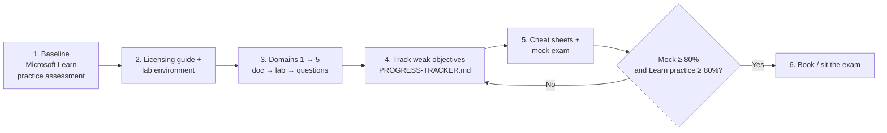

# Study roadmap

How to use this repository to pass MD-102, whether it's your first attempt or a retake.

## The path

## Time budget

| Block | Hours | Where |
|---|---|---|
| Setup (licensing + lab build) | 5 | [licensing-guide.md](licensing-guide.md), [lab-environment-setup.md](lab-environment-setup.md) |
| Domain 1 - Prepare infrastructure (20-25%) | ~12 | [01-Prepare-Infrastructure](../01-Prepare-Infrastructure/README.md) |
| Domain 2 - Manage and maintain devices (25-30%) | ~18 | [02-Manage-Maintain-Devices](../02-Manage-Maintain-Devices/README.md) |
| Domain 3 - Protect devices (15-20%) | ~10 | [03-Protect-Devices](../03-Protect-Devices/README.md) |
| Domain 4 - Manage and secure applications (15-20%) | ~9 | [04-Manage-Secure-Applications](../04-Manage-Secure-Applications/README.md) |
| Domain 5 - Optimize endpoint operations (10-15%) | ~8 | [05-Optimize-Endpoint-Operations](../05-Optimize-Endpoint-Operations/README.md) |
| Review, cheat sheets, mock exam | ~10 | [07-Cheat-Sheets](../07-Cheat-Sheets/README.md), [mock exam](../06-Practice-Questions/mock-exam.md) |
| **Total** | **~72** | Spread over [8 weeks](8-week-study-plan.md) at ~9 h/week |

## How to study each objective

1. **Read the objective verbatim** at the top of the doc. Circle the verbs (*plan*, *configure*, *monitor*, *troubleshoot*) - the exam tests those actions.
2. Read **Concept in plain English** and the diagram. Explain it out loud in two sentences.
3. Do the **lab** (or at least walk through it). Hands-on memory beats reading.
4. Read **Exam tips and common traps** twice.
5. Answer the practice questions for that objective (links in [EXAM-OBJECTIVE-MAP.md](../EXAM-OBJECTIVE-MAP.md)).
6. Mark the objective in [PROGRESS-TRACKER.md](../PROGRESS-TRACKER.md): 🔴 weak / 🟡 okay / 🟢 confident.

## For a retake

A narrow fail usually means **two or three weak areas**, not a lack of general knowledge.

- Use your **score report** bars: start with the lowest-scoring domains, but don't skip the high-weight Domain 2.
- Take Microsoft's free **practice assessment** first to find 🔴 objectives, then study only those docs and labs in weeks 1-4.
- Focus on **what changed** in the October 27, 2026 outline (see [CHANGELOG](../CHANGELOG.md#exam-outline-tracking)): Security Copilot agents, alerts and service health, Autopilot device preparation, Windows Backup, Hotpatch, Cloud PKI and Tunnel for MAM are frequent gaps.
- Practise **scenario reading**: highlight "minimize cost", "least privilege", "without enrolling", "minimize administrative effort" - they decide between two otherwise correct answers ([scenario cheat sheet](../07-Cheat-Sheets/01-scenario-to-answer.md)).

## Exam-day technique

- Read the **last sentence first** - it tells you what's being asked.
- In a **Yes/No question series** (the same scenario with different proposed solutions) you can't return to earlier questions in the set: decide carefully.
- Eliminate answers with **retired or renamed products** (Azure AD, MEM, Microsoft Store for Business, *Require approved client app*).
- Microsoft Learn is available during the exam for reference - use it to confirm settings paths, not to learn topics from scratch. Check the current exam rules on the [exam page](https://learn.microsoft.com/credentials/certifications/exams/md-102/).

## Official resources

- [Study guide for Exam MD-102](https://learn.microsoft.com/credentials/certifications/resources/study-guides/md-102)
- [Exam MD-102 page](https://learn.microsoft.com/credentials/certifications/exams/md-102/) (links to the certification and the free practice assessment)
- [Practice assessments for Microsoft Certifications](https://learn.microsoft.com/credentials/certifications/practice-assessments-for-microsoft-certifications)
- [Exam sandbox](https://aka.ms/examdemo)
- More in [RESOURCES.md](../RESOURCES.md)
