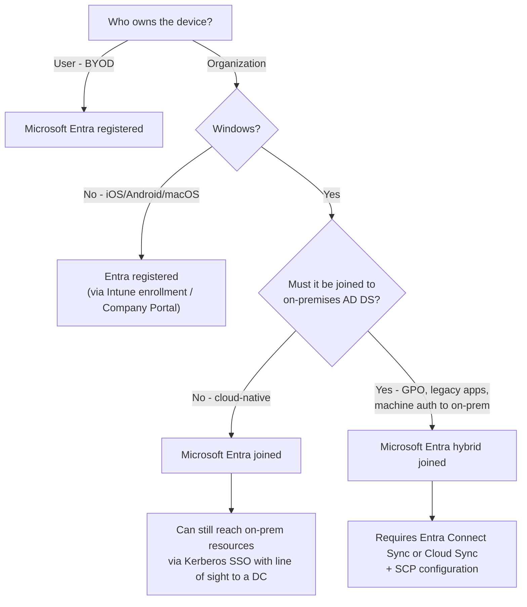

# 1.1.1 Choose an appropriate device join type

> **Exam objective:** Choose an appropriate device join type, including considerations such as device registration and Microsoft Entra join
>
> **Domain:** 1 - Prepare infrastructure for devices (20-25%) · **Skill:** 1.1 Add devices to Microsoft Entra ID
>
> **Hands-on:** [LAB-1.03 Register a BYOD device and compare join types](../labs/LAB-1.03-register-byod-compare-join-types.md)

## Concept in plain English

Before Intune can manage a device well, Microsoft Entra ID needs to know about it. A device gets an identity in Entra ID in one of three ways:

| Join type | Who owns the device | Sign-in account | Typical device |
|---|---|---|---|
| **Microsoft Entra registered** | User (BYOD) - sometimes corporate phones | Personal local/Microsoft account on the device; work account added in apps | Personal Windows laptop, iPhone, Android, Mac |
| **Microsoft Entra joined** | Organization | Work account (Entra ID) at the Windows sign-in screen | New corporate Windows 11 laptop, Cloud PC, shared device |
| **Microsoft Entra hybrid joined** | Organization | Work account synced from on-premises AD DS | Existing domain-joined PCs that still need Group Policy or on-prem auth |

The join type decides how the user signs in, whether SSO to cloud *and* on-premises resources works, whether Conditional Access can treat the device as "corporate", and which enrollment methods are available.

## How it works



Key point: **only Windows devices can be Microsoft Entra joined or hybrid joined** (plus macOS with Platform SSO, which registers the device and can create an Entra-backed local account). iOS, iPadOS, Android and macOS devices enrolled in Intune become **Entra registered**.

## Licensing requirements

| Requirement | License |
|---|---|
| Entra registration / join / hybrid join | Microsoft Entra ID Free (any tenant) |
| Automatic MDM enrollment during join | Entra ID P1 + Intune Plan 1 |
| Conditional Access that uses device state | Entra ID P1 |
| Hybrid join sync | Microsoft Entra Connect Sync or Cloud Sync (no extra license) |

## Configuration steps

### Microsoft Entra admin center

1. **Entra admin center > Identity > Devices > All devices > Device settings**
   - *Users may join devices to Microsoft Entra* → **All** or **Selected** (restrict join in production to a group).
   - *Users may register their devices with Microsoft Entra* → **All** (required for Intune enrollment of personal devices; it's set to All and greyed out once Intune enrollment is configured).
   - *Require multifactor authentication to register or join devices* → prefer the **Register or join devices** user action in Conditional Access instead of this legacy toggle.
   - *Maximum number of devices per user* → default 50.
2. **Local administrator settings** → *Global Administrator role is added as local administrator during Microsoft Entra join* (Yes by default). *Registering user is added as local administrator* → **None** or **Selected** for least privilege (Windows Autopilot can also control this).
3. **Hybrid join only** → in **Microsoft Entra Connect** choose *Configure device options > Configure Hybrid Microsoft Entra join* to create the **Service Connection Point (SCP)**. Alternatively, deploy a client-side SCP registry key through Group Policy for targeted rollout.

### PowerShell / Microsoft Graph

```powershell
# On a device - check its join state
dsregcmd /status | Select-String 'AzureAdJoined|EnterpriseJoined|DomainJoined|WorkplaceJoined|DeviceId|TenantName'

# Tenant-wide - count devices by join type (trustType: AzureAd = joined, ServerAd = hybrid, Workplace = registered)
Connect-MgGraph -Scopes Device.Read.All
Get-MgDevice -All -Property trustType,operatingSystem |
    Group-Object trustType, operatingSystem | Sort-Object Count -Descending |
    Select-Object Count, Name
```

## Comparison

| Capability | Entra registered | Entra joined | Entra hybrid joined |
|---|---|---|---|
| Platforms | Windows 10/11, iOS/iPadOS, Android, macOS, Linux (Ubuntu/RHEL) | Windows 10/11 (not Home) | Windows 10/11, Windows Server 2016+ (down-level retired) |
| Sign-in to device with | Local / personal account | Entra ID account | AD DS account (synced) |
| Device owner in Entra | User | Organization | Organization |
| Requires on-prem AD DS | No | No | **Yes** + Entra Connect/Cloud Sync |
| SSO to cloud apps | Yes (Primary Refresh Token on Windows via WAM) | Yes | Yes |
| SSO to on-prem resources | Limited | Yes, if line of sight to DC | Yes |
| Windows Autopilot | No | **User-driven, self-deploying, pre-provisioning, device preparation** | User-driven + pre-provisioning only (requires Intune Connector for Active Directory) |
| Group Policy | No | No (use Intune) | Yes |
| Windows Hello for Business | Not typical | Cloud Kerberos trust (recommended) | Cloud Kerberos trust / key trust / cert trust |
| BitLocker key escrow | - | Entra ID | Entra ID and/or AD DS |
| Windows LAPS backup | - | Entra ID | Entra ID **or** AD DS |
| Conditional Access "compliant device" | Yes (if Intune-enrolled) | Yes | Yes |
| Conditional Access "hybrid joined device" | No | No | Yes |

## Exam tips and common traps

- **"Personal device" / "BYOD" / "users sign in with their personal account" → Entra registered.**
- **"New devices", "cloud-only", "no on-premises infrastructure", "Windows Autopilot self-deploying" → Entra joined.** Self-deploying mode does **not** support hybrid join.
- **"Must continue to receive Group Policy" or "must authenticate to on-premises domain at sign-in" → hybrid join** (and needs Entra Connect + SCP).
- Entra joined devices can still access on-prem file shares with Kerberos SSO - don't choose hybrid join just because "users need a file server" unless the question adds Group Policy or computer-account auth.
- **Windows 10/11 Home cannot be Entra joined** - only registered (add a work account).
- Hybrid join needs the device to *see* AD DS during registration (line of sight or VPN before sign-in). Autopilot hybrid join over VPN requires the *Skip AD connectivity check* setting.
- Microsoft recommends **Entra join for new Windows devices**; hybrid join is a transition state.

## Real-world notes

- Most enterprises run a mix: legacy fleet hybrid joined, new hardware Entra joined via Autopilot. Set a cutover date and don't rebuild new devices as hybrid.
- Audit `trustType` regularly. Hybrid devices showing *Pending* registration usually mean the SCP is wrong, the device isn't in a synced OU, or the `userCertificate` attribute didn't sync.
- A device that is both **domain joined and Entra registered** (dual state) confuses Conditional Access. Windows 10 1803+ removes the registered state automatically after hybrid join. You can also block it with the `BlockAADWorkplaceJoin` registry value.
- Restricting "Users may join devices" to a group and using Autopilot is the cleanest way to stop users joining random VMs.

## Microsoft Learn references

- [What is a device identity?](https://learn.microsoft.com/entra/identity/devices/overview)
- [Microsoft Entra registered devices](https://learn.microsoft.com/entra/identity/devices/concept-device-registration)
- [Microsoft Entra joined devices](https://learn.microsoft.com/entra/identity/devices/concept-directory-join)
- [Microsoft Entra hybrid joined devices](https://learn.microsoft.com/entra/identity/devices/concept-hybrid-join)
- [Plan your Microsoft Entra device deployment](https://learn.microsoft.com/entra/identity/devices/plan-device-deployment)
- [Configure hybrid join](https://learn.microsoft.com/entra/identity/devices/how-to-hybrid-join)
