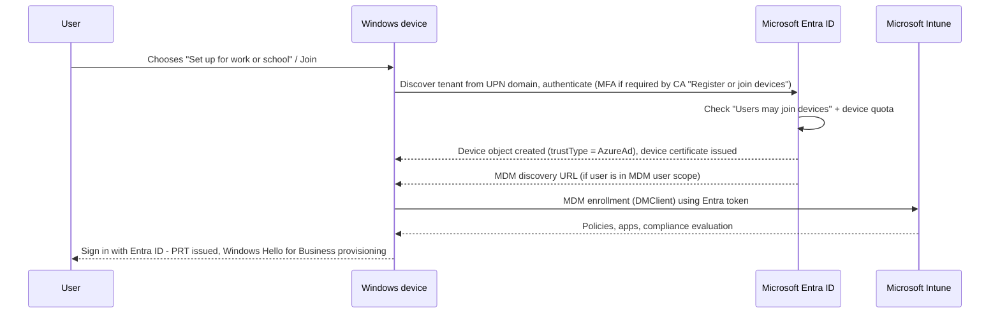

# 1.1.2 Join devices to Microsoft Entra ID

> **Exam objective:** Join devices to Microsoft Entra ID
>
> **Domain:** 1 - Prepare infrastructure for devices (20-25%) · **Skill:** 1.1 Add devices to Microsoft Entra ID
>
> **Hands-on:** [LAB-1.02 Entra join and automatic enrollment](../labs/LAB-1.02-entra-join-automatic-enrollment.md)

## Concept in plain English

A Microsoft Entra joined device is a Windows device that belongs to the organization and signs users in with their Entra ID credentials. There's no domain controller involved. The device receives a **Primary Refresh Token (PRT)** for SSO. If automatic enrollment is configured, it also enrolls into Intune in the same step.

There are four ways to Entra join a Windows device:

| Method | When to use | Enrolls in Intune? |
|---|---|---|
| **OOBE** (out-of-box experience) - user picks *Set up for work or school* | Small scale, manual | Yes, if MDM user scope includes the user |
| **Settings > Accounts > Access work or school > Connect > Join this device to Microsoft Entra ID** | Existing Windows installation (Pro/Enterprise) | Yes, if in MDM scope |
| **Windows Autopilot** | At scale, zero-touch, the recommended approach | Yes - always |
| **Provisioning package (bulk enrollment)** with Windows Configuration Designer | Kiosks, shared devices, offline staging | Yes - uses a bulk-enrollment token (package token valid up to 180 days) |

## How it works



## Licensing requirements

- Windows 10/11 **Pro, Enterprise, Education** (not Home).
- Entra ID Free is enough to join. **Automatic Intune enrollment requires Entra ID P1** and an Intune license.

## Configuration steps

### Prepare the tenant (Entra admin center)

1. **Identity > Devices > Device settings**
   - *Users may join devices to Microsoft Entra* → **Selected** → group `SG-Lab-Users` (production best practice), or **All**.
   - *Maximum number of devices per user* → as required.
2. **Local administrator settings > Manage additional local administrators on all Microsoft Entra joined devices** → assign the **Microsoft Entra Joined Device Local Administrator** role (renamed from *Device Administrators*) to a small support group only.
3. **Mobility (MDM and WIP) > Microsoft Intune** → set *MDM user scope* (covered in [1.2.2](1.2.2-windows-automatic-enrollment.md)).
4. *(Recommended)* **Conditional Access** → policy targeting user action **Register or join devices** → **Require MFA**. Don't use the legacy "Require MFA to register or join devices" toggle together with it.

### Join manually on the device

1. **Settings > Accounts > Access work or school > Connect**.
2. Select **Join this device to Microsoft Entra ID** (the link at the bottom - not the main sign-in box, which only *registers*).
3. Sign in with `user1@contoso.onmicrosoft.com`, complete MFA, confirm the organization.
4. Restart and sign in as the Entra user (`Other user`, then the UPN).

### Verify

```powershell
dsregcmd /status
#  AzureAdJoined : YES
#  DomainJoined  : NO
#  AzureAdPrt    : YES          (user signed in with Entra account)
#  MdmUrl        : https://enrollment.manage.microsoft.com/...  (Intune)
```

In the **Intune admin center > Devices > Windows**, the device shows *Join type: Microsoft Entra joined*, *Ownership: Corporate*, and *Managed by: Intune*.

### Microsoft Graph

```powershell
Connect-MgGraph -Scopes Device.Read.All
Get-MgDevice -Filter "trustType eq 'AzureAd'" -All -Property displayName,operatingSystemVersion,isManaged,isCompliant,approximateLastSignInDateTime |
    Select-Object displayName, operatingSystemVersion, isManaged, isCompliant, approximateLastSignInDateTime
```

## Comparison: ways to Entra join

| | OOBE | Settings app | Autopilot | Provisioning package |
|---|---|---|---|---|
| Needs hardware hash upload | No | No | Yes (profile) / No (device preparation) | No |
| User interaction | Full OOBE | Some | Minimal / none | None after package applied |
| Primary user set | Yes | Yes | Yes (user-driven) / No (self-deploying) | **No** (bulk token = userless) |
| Joining user is local admin | By default | By default | Configurable in profile | No |
| Best for | Lab, few devices | Converting existing installs | Scale | Kiosk, shared, labs |

## Exam tips and common traps

- The **"Join this device to Microsoft Entra ID"** link in Access work or school is different from **"Connect"**, which only registers (adds a work account). Questions sometimes describe a device that "shows as registered instead of joined" - the user used the wrong option.
- Error **"Your organization has reached its device limit"** / 801c0003 → *Maximum number of devices per user* in Entra, or the user isn't allowed by *Users may join devices*.
- To give **help desk** local admin on every Entra joined device → **Microsoft Entra Joined Device Local Administrator** role (or Intune *Local user group membership* policy, see [1.3.8](1.3.8-local-group-membership.md)). Don't add them as Global Administrators.
- Bulk enrollment with a provisioning package **does not set a primary user**. It can't be used with Conditional Access policies that rely on user-based compliance, and user-targeted apps won't install.
- Joining requires the user to be allowed to join **and** within device quota. Enrolling additionally requires being in MDM scope **and** allowed by Intune enrollment restrictions.

## Real-world notes

- In production, restrict *Users may join devices* to an Autopilot-only path so users can't join random personal PCs as "corporate" devices.
- Microsoft removed the global administrator local admin default for new tenants in some scenarios; always confirm who is local admin with the LAPS approach in [1.3.7](1.3.7-windows-laps.md) and the local group policy in [1.3.8](1.3.8-local-group-membership.md).
- If a user ends up joined but not enrolled, check they were in MDM user scope **at the time of join**. You can enroll afterwards with `deviceenroller.exe /c /AutoEnrollMDM` (the hidden scheduled task) or by re-joining.

## Microsoft Learn references

- [How to: Join Windows devices to Microsoft Entra ID](https://learn.microsoft.com/entra/identity/devices/device-join-plan)
- [Microsoft Entra joined devices](https://learn.microsoft.com/entra/identity/devices/concept-directory-join)
- [Manage device identities - device settings](https://learn.microsoft.com/entra/identity/devices/manage-device-identities)
- [Manage local administrators on Microsoft Entra joined devices](https://learn.microsoft.com/entra/identity/devices/assign-local-admin)
- [Troubleshoot devices by using dsregcmd](https://learn.microsoft.com/entra/identity/devices/troubleshoot-device-dsregcmd)
