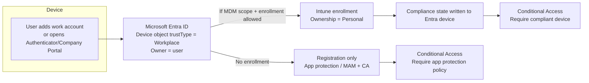

# 1.1.3 Register devices to Microsoft Entra ID

> **Exam objective:** Register devices to Microsoft Entra ID
>
> **Domain:** 1 - Prepare infrastructure for devices (20-25%) · **Skill:** 1.1 Add devices to Microsoft Entra ID
>
> **Hands-on:** [LAB-1.03 Register a BYOD device and compare join types](../labs/LAB-1.03-register-byod-compare-join-types.md)

## Concept in plain English

**Microsoft Entra registration** gives a device a lightweight identity in the directory *without* changing how the user signs in to the device. The user keeps their personal account and adds their work account in an app or in Settings. It's the foundation for **BYOD**. Once a device is registered, Conditional Access can see it, and Intune can manage it if the device also enrolls.

Registration happens in several ways:

| Platform | How registration happens |
|---|---|
| Windows 10/11 | **Settings > Accounts > Access work or school > Connect** and sign in, or sign in to a Microsoft 365 app and accept *Allow my organization to manage my device*. Registered + enrolled if in MDM user scope. |
| iOS/iPadOS | Intune **Company Portal** enrollment, **account-driven user enrollment** (Settings > VPN & Device Management), or signing in to **Microsoft Authenticator** (registration only, used for app protection / device-based CA). |
| Android | Company Portal / Intune app work-profile enrollment, or **Microsoft Authenticator** / Company Portal for registration-only (broker for MAM). |
| macOS | Company Portal enrollment, or **Platform SSO** (Secure Enclave key registration). |
| Linux | Microsoft Intune app on Ubuntu / RHEL. |

## How it works



Registration gives the device a **device ID and certificate**. Compliance is only reported if the device is **also enrolled** in Intune. A registered-only device can satisfy *Require approved client app / app protection policy*, but it **cannot** satisfy *Require device to be marked as compliant*.

## Licensing requirements

- Registration: Entra ID Free.
- Enrollment and compliance: Intune Plan 1 + Entra ID P1 (automatic enrollment, Conditional Access).

## Configuration steps

### Tenant settings

1. **Entra admin center > Devices > Device settings > Users may register their devices with Microsoft Entra** → **All**. When Intune or Microsoft 365 Basic Mobility and Security is configured, this setting is forced to *All*.
2. Protect registration with Conditional Access → **User actions > Register or join devices → Require MFA**.
3. Intune side (optional but typical): allow personal devices in **enrollment restrictions** ([1.2.1](1.2.1-intune-enrollment-settings.md)) and configure **MDM user scope** so Windows registration triggers enrollment ([1.2.2](1.2.2-windows-automatic-enrollment.md)).

### Register a Windows device (user steps)

1. **Settings > Accounts > Access work or school > Connect**.
2. Enter the work email in the main box (do **not** choose the "Join" link).
3. Sign in and complete MFA → *You're all set*.
4. `dsregcmd /status` → `WorkplaceJoined : YES`, `AzureAdJoined : NO`.

### Register iOS/Android without enrolling

Install **Microsoft Authenticator** and add the work account → the device is registered and Authenticator acts as the broker for SSO and app protection policies. On Android the Company Portal can also be the broker.

### Graph queries

```powershell
Connect-MgGraph -Scopes Device.Read.All
# Registered devices (Workplace), and whether Intune manages them
Get-MgDevice -Filter "trustType eq 'Workplace'" -All -Property displayName,operatingSystem,isManaged,isCompliant,registrationDateTime |
    Sort-Object registrationDateTime -Descending |
    Format-Table displayName, operatingSystem, isManaged, isCompliant, registrationDateTime
```

## Comparison: registered-only vs registered + enrolled

| | Registered only | Registered + Intune enrolled |
|---|---|---|
| Entra device object | Yes | Yes |
| Intune device object | No | Yes (Personal) |
| Device configuration / Wi-Fi / VPN profiles | No | Yes |
| App protection policies (MAM) | Yes | Yes |
| CA: Require compliant device | ❌ | ✅ |
| CA: Require app protection policy | ✅ | ✅ |
| Remote actions | Selective wipe of app data only | Retire / wipe per platform |
| User privacy impact | Minimal | Higher (inventory, some settings) |

## Exam tips and common traps

- "Users must access corporate email from personal phones **without enrolling**" → register (Authenticator/Company Portal as broker) + **app protection policy** + CA *Require app protection policy*.
- "Device shows in Entra but not in Intune" → registered but not enrolled: the user isn't in **MDM user scope**, or enrollment restrictions block personal devices.
- For Windows, **registered = "Connect"**, **joined = "Join this device to Microsoft Entra ID"**.
- Registration requires the setting *Users may register their devices* - you can't set it to *None* while Intune enrollment is in use.
- Hybrid joined devices shouldn't also be registered (dual state). Windows 10 1803+ cleans this up. Block it with `HKLM\SOFTWARE\Policies\Microsoft\Windows\WorkplaceJoin\BlockAADWorkplaceJoin = 1`.

## Real-world notes

- Registered devices pile up quickly. Use a scheduled Graph script (objective [5.1.1](../../05-Optimize-Endpoint-Operations/docs/5.1.1-powershell-graph-automation.md)) to clean up stale objects, for example devices with `approximateLastSignInDateTime` older than 90 days. (The Security Copilot Device Offboarding Agent that helped with this was removed on June 1, 2026.)
- For BYOD Windows, many organizations choose **MAM for Windows** (Edge with app protection) instead of enrolling personal PCs.

## Microsoft Learn references

- [Microsoft Entra registered devices](https://learn.microsoft.com/entra/identity/devices/concept-device-registration)
- [Manage device identities](https://learn.microsoft.com/entra/identity/devices/manage-device-identities)
- [Conditional Access: Register or join devices user action](https://learn.microsoft.com/entra/identity/conditional-access/concept-conditional-access-cloud-apps#user-actions)
- [Manage stale devices in Microsoft Entra ID](https://learn.microsoft.com/entra/identity/devices/manage-stale-devices)
