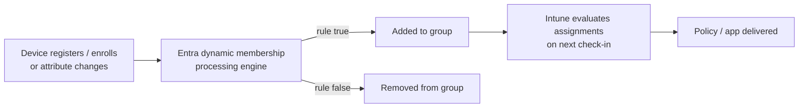

# 1.1.4 Plan and implement device groups and dynamic membership rules

> **Exam objective:** Plan and implement groups for devices in Microsoft Entra ID, including dynamic group membership rules
>
> **Domain:** 1 - Prepare infrastructure for devices (20-25%) · **Skill:** 1.1 Add devices to Microsoft Entra ID
>
> **Hands-on:** [LAB-1.04 Dynamic device groups](../labs/LAB-1.04-dynamic-device-groups.md)

## Concept in plain English

Nearly everything in Intune is assigned to **Microsoft Entra groups**. Device groups let you target settings at hardware regardless of who signs in. That matters for kiosks, shared devices, Autopilot, and settings that must apply before a user signs in.

| Membership type | How members get in | Use for |
|---|---|---|
| **Assigned** (static) | Admin adds devices | Pilots, exceptions, enrollment time grouping, small targeted sets |
| **Dynamic device** | Rule evaluated against device attributes | "All corporate Windows", "All Autopilot devices", per-OS or per-model targeting |
| **Dynamic user** | Rule against user attributes | Department-based app assignment |

A group can be dynamic **for users or for devices, never both**.

## How it works



Dynamic evaluation isn't instant. Processing can take minutes to hours in large tenants, which is why **enrollment time grouping** (objective 2.2.6) and **assignment filters** exist.

## Licensing requirements

- **Dynamic groups require Entra ID P1** (each user who is a member of, or whose device is a member of, a dynamic group must be covered).
- Assigned groups: Entra ID Free.

## Useful device attributes and rules

| Goal | Rule |
|---|---|
| All Windows devices | `(device.deviceOSType -eq "Windows")` |
| Corporate-owned Windows | `(device.deviceOSType -eq "Windows") and (device.deviceOwnership -eq "Company")` |
| All Autopilot-registered devices | `(device.devicePhysicalIDs -any (_ -startsWith "[ZTDid]"))` |
| Autopilot devices with group tag `Sales` | `(device.devicePhysicalIDs -any (_ -eq "[OrderID]:Sales"))` |
| Autopilot devices from a purchase order | `(device.devicePhysicalIDs -any (_ -eq "[PurchaseOrderId]:76222342342"))` |
| Windows 11 devices | `(device.deviceOSType -eq "Windows") and (device.deviceOSVersion -startsWith "10.0.2")` |
| iPads | `(device.deviceModel -startsWith "iPad")` |
| Intune-managed Android Enterprise fully managed | `(device.deviceOSType -eq "AndroidForWork") and (device.managementType -eq "MDM")` * |
| Entra joined only | `(device.deviceTrustType -eq "AzureAD")` (hybrid = `ServerAD`, registered = `Workplace`) |
| Devices in a category chosen in Company Portal | `(device.deviceCategory -eq "Finance")` |
| Devices by enrollment profile name | `(device.enrollmentProfileName -eq "iOS-ADE-Corp")` |
| Intune "extensionAttribute" set by script | `(device.extensionAttribute1 -eq "Kiosk")` |

\* Android Enterprise OS type values vary (`AndroidEnterprise`, `AndroidForWork`) - check a device's properties before writing the rule.

**Operators:** `-eq`, `-ne`, `-startsWith`, `-notStartsWith`, `-contains`, `-notContains`, `-match` (regex), `-in`, `-notIn`, `-any`/`-all` (multi-value like `devicePhysicalIDs`). Combine with `and` / `or` / `not`.

## Configuration steps

### Intune or Entra admin center

1. **Groups > All groups > New group**.
2. *Group type* **Security**, *Membership type* **Dynamic Device**.
3. **Add dynamic query** → use the rule builder or **Edit** to paste the rule syntax.
4. **Validate Rules** tab → add a known device to test (shows ✔ / ✖ per device).
5. **Create**, then check **Dynamic membership rules > processing status**.

### Microsoft Graph

```powershell
Connect-MgGraph -Scopes Group.ReadWrite.All
New-MgGroup -DisplayName 'DG-Windows-Corporate' -MailEnabled:$false -MailNickname 'DG-Windows-Corporate' `
    -SecurityEnabled -GroupTypes 'DynamicMembership' `
    -MembershipRule '(device.deviceOSType -eq "Windows") and (device.deviceOwnership -eq "Company")' `
    -MembershipRuleProcessingState 'On'
```

See [`08-Scripts/graph/New-DynamicDeviceGroup.ps1`](../../08-Scripts/graph/New-DynamicDeviceGroup.ps1).

## Planning: groups vs filters vs enrollment time grouping

| Need | Best tool | Why |
|---|---|---|
| Broad, stable population (all corporate Windows) | Dynamic device group | Reusable across Intune, Entra, Defender |
| Refine an assignment (only Windows 11 24H2 within *All devices*) | **Assignment filter** | Evaluated at check-in, no group latency, works with *All users/All devices* |
| Device must get apps/policy *during* setup | **Enrollment time grouping** (static group owned by Intune Provisioning Client) | Membership added at enrollment - no dynamic delay |
| Temporary pilot | Assigned group | Precise control |
| User-affinity targeting | User group (+ filter) | Follows the user across devices |

## Exam tips and common traps

- **Autopilot profile targeting:** assign deployment profiles to a **device** group, commonly the `[ZTDid]` dynamic rule. Group tags in Autopilot become `[OrderID]:<tag>`.
- **Device preparation policies** are assigned to a **user group**, and devices are added to the **static** device group configured in the policy (enrollment time grouping). A dynamic group isn't allowed there.
- Dynamic groups need **Entra ID P1**. If the question says "minimize admin effort, devices added automatically", pick dynamic. If it says "immediately during enrollment", pick enrollment time grouping.
- `deviceOwnership` values are `Company` / `Personal`. Intune sets them; you can change them in Intune device properties.
- You **cannot** mix user and device rules in one dynamic group. Nested groups aren't supported in dynamic rules, except `memberOf` in preview.
- Don't assign **device-context** settings (for example, BitLocker) to user groups and expect them to apply before sign-in. Kiosks and shared devices need device groups.

## Real-world notes

- Naming convention matters at scale: `DG-` dynamic device, `SG-` assigned, `UG-` dynamic user, with the platform in the name.
- A dynamic rule with a typo silently evaluates to zero members. Always validate against a known device.
- Large tenants: prefer **All devices + filters** over dozens of dynamic groups. Filters evaluate faster and reduce Entra processing load.
- Keep a static *exclusion* group (for example, `SG-Exclude-Baseline`) for break-fix exceptions, and document every member.

## Microsoft Learn references

- [Dynamic membership rules for groups](https://learn.microsoft.com/entra/identity/users/groups-dynamic-membership)
- [Create or update a dynamic group](https://learn.microsoft.com/entra/identity/users/groups-create-rule)
- [Create an Autopilot device group](https://learn.microsoft.com/autopilot/enrollment-autopilot)
- [Add groups to organize users and devices in Intune](https://learn.microsoft.com/intune/fundamentals/tenant-administration/add-groups)
- [Enrollment time grouping](https://learn.microsoft.com/intune/device-enrollment/setup-time-grouping)
