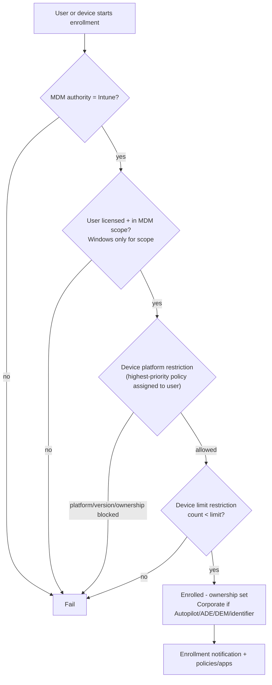

# 1.2.1 Configure enrollment settings in Microsoft Intune

> **Exam objective:** Configure enrollment settings in Microsoft Intune
>
> **Domain:** 1 - Prepare infrastructure for devices (20-25%) · **Skill:** 1.2 Enroll devices to Microsoft Intune
>
> **Hands-on:** [LAB-1.01 Tenant baseline and enrollment restrictions](../labs/LAB-1.01-tenant-baseline-enrollment-settings.md)

## Concept in plain English

Enrollment settings decide **who** can enroll **what kind** of device, **how many**, and **what the user sees** while doing it. They're the gatekeeper between Microsoft Entra registration/join and full Intune management.

| Setting | What it controls | Location (Intune admin center) |
|---|---|---|
| **MDM authority** | Which service manages devices (Intune) | Tenant administration > Tenant status |
| **Device platform restrictions** | Allowed platforms, min/max OS version, block personally owned, block manufacturers (Android) | Devices > Enrollment > Device platform restriction |
| **Device limit restrictions** | Max devices a user can enroll (1-15, default 5) | Devices > Enrollment > Device limit restriction |
| **Corporate device identifiers** | Pre-declare IMEI/serial (and Windows manufacturer+model+serial) so devices are marked corporate | Devices > Enrollment > Corporate device identifiers |
| **Device enrollment managers (DEM)** | Service account that can enroll up to 1,000 devices | Devices > Enrollment > Device enrollment managers |
| **Device categories** | Users pick a category in Company Portal → drives dynamic groups | Devices > Device categories |
| **Enrollment notifications** | Email/push to user after enrollment | Devices > Enrollment > [platform] > Enrollment notifications |
| **Company Portal branding & customization** | Name, logo, support contact, privacy URL, what IT can/can't see | Tenant administration > Customization |
| **Terms and conditions** | Legacy Intune T&C (prefer Entra Terms of use in CA) | Tenant administration > Terms and conditions |
| **Apple / Android connectors** | APNs certificate, ADE tokens, Managed Google Play binding | Devices > Enrollment > Apple / Android |

## How it works



Restrictions are **user-targeted** policies with **priority**. The *All Users* default policy is always lowest priority. When a user is in several groups, the highest-priority (lowest number) policy wins - they're not merged.

**Exceptions:** Enrollment restrictions **don't apply** to devices enrolled via DEM (device limit), Apple ADE/ Apple Configurator (personally-owned setting), Autopilot / co-management / bulk / GPO (Windows personal block), or Android Enterprise corporate-owned methods.

## Licensing requirements

Intune Plan 1. Automatic Windows enrollment and Conditional Access also need Entra ID P1.

## Configuration steps

### 1. MDM authority

New tenants are set to **Intune** automatically. Check **Tenant administration > Tenant status > Tenant details > MDM authority**. (Configuration Manager hybrid MDM and Basic Mobility and Security are legacy authorities.)

### 2. Device platform restriction

1. **Devices > Enrollment > Device platform restriction** → tab per platform (Windows / Android / iOS / macOS) → **Create restriction**.
2. Configure:

| Platform | Options |
|---|---|
| Windows (MDM) | Allow/Block, min/max OS version (for example `10.0.22621`), **Personally owned: Block** |
| iOS/iPadOS | Allow/Block, min/max version, block personally owned |
| macOS | Allow/Block, block personally owned (no version control) |
| Android Enterprise (work profile) | Allow/Block, min/max version, block personally owned |
| Android device administrator | **Block** (deprecated for GMS devices) |

3. Assign to a user group, then set priority.

### 3. Device limit restriction

**Devices > Enrollment > Device limit restriction > Create restriction** → limit 1-15 → assign → priority.

> The Entra setting *Maximum number of devices per user* is a separate, **directory-level** limit (default 50) for registration/join. The **lower** of the two effectively caps the user.

### 4. Corporate identifiers (Windows)

To block personal Windows devices but still allow Entra join through OOBE/Settings for known hardware, upload a CSV of `Manufacturer,Model,SerialNumber` (Windows 11 22H2+). Otherwise, a Windows *personally owned: Block* restriction blocks every enrollment that isn't Autopilot, DEM, bulk, GPO or co-management.

### 5. Company Portal customization

**Tenant administration > Customization > Default policy > Edit**: organization name, colours, logos, IT support contact, **privacy statement URL**, *Device enrollment: Available, with prompts / Available, no prompts / Unavailable* (the last hides enrollment in Company Portal for MAM-only users).

### Microsoft Graph

```powershell
Connect-MgGraph -Scopes DeviceManagementServiceConfig.Read.All
# List enrollment restrictions and their priorities
Invoke-MgGraphRequest -Method GET -Uri 'https://graph.microsoft.com/beta/deviceManagement/deviceEnrollmentConfigurations' |
    Select-Object -ExpandProperty value |
    Select-Object displayName, priority, '@odata.type'
```

## Comparison: enrollment gatekeepers

| Control | Scope | Targets | Can block personal? | Can cap count? |
|---|---|---|---|---|
| Entra *Users may join/register* | Directory | Users/groups | No | - |
| Entra *Max devices per user* | Directory | All users | No | Yes (join/register) |
| Intune **MDM user scope** | Windows auto-enroll | User groups | No | - |
| Intune **platform restriction** | Enrollment | User groups (priority) | **Yes** | - |
| Intune **device limit restriction** | Enrollment | User groups (priority) | - | **Yes (≤15)** |
| Conditional Access (Intune enrollment app) | Sign-in | Users | Indirect (MFA, ToU) | - |

## Exam tips and common traps

- **"Prevent users from enrolling more than 3 devices"** → device limit restriction (not the Entra device quota).
- **"Block personal iOS devices but allow corporate iPads from ABM"** → platform restriction *Personally owned: Block* for iOS. ADE devices are corporate and unaffected.
- **"Block Android device administrator"** → platform restriction. Microsoft recommends blocking DA because Android devices may try DA first.
- **DEM accounts:** up to **1,000** devices, user can't use Conditional Access-dependent features in the same way, no user affinity for apps like VPP user licensing, *and* they bypass the device limit restriction. The DEM user **must** have an Intune license.
- **Priority:** Only one restriction of each type applies per user - the highest priority. The default *All users* policy can be edited but not deleted or reprioritized.
- Error **"Device cap reached"** / `DeviceCapReached` → device limit restriction. Error **"Enrollment restriction"** / `0x801c0003`-type messages on Windows → platform restriction or MDM scope.
- **Enrollment time grouping** and **enrollment notifications** are configured *inside* enrollment policies (Android corporate, Apple ADE, Autopilot device preparation).

## Real-world notes

- Keep the default restriction permissive for **admins/testing** and create a strict, high-priority restriction for **All employees**, or the other way round. Document the priority order.
- Use **device categories** sparingly - users choose poorly. Prefer group tags (Autopilot) or enrollment profile names for automatic grouping.
- Set a real **privacy statement URL** and "what IT can see" text in Company Portal customization - it reduces BYOD pushback.
- The APNs certificate expires **every 365 days**. Renew it with the **same Apple Account**. A new Apple Account forces all iOS/macOS devices to re-enroll.

## Microsoft Learn references

- [Enrollment restrictions overview](https://learn.microsoft.com/intune/device-enrollment/restrictions)
- [Create device platform restrictions](https://learn.microsoft.com/intune/device-enrollment/create-device-platform-restrictions)
- [Create device limit restrictions](https://learn.microsoft.com/intune/device-enrollment/create-device-limit-restrictions)
- [Identify devices as corporate-owned](https://learn.microsoft.com/intune/device-enrollment/add-corporate-identifiers)
- [Device enrollment manager](https://learn.microsoft.com/intune/device-enrollment/setup-enrollment-manager)
- [Set the MDM authority](https://learn.microsoft.com/intune/fundamentals/setup-mdm-authority)
- [Customize the Intune Company Portal](https://learn.microsoft.com/intune/apps/company-portal-app)
