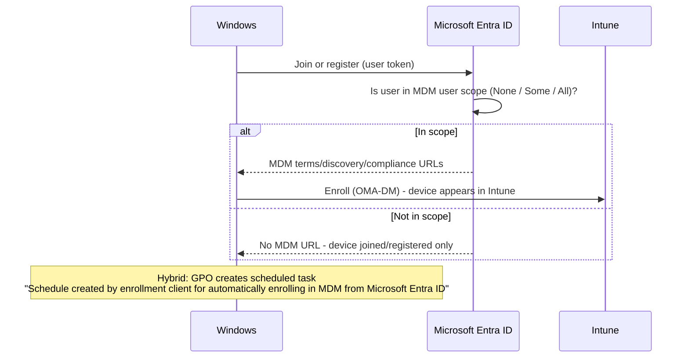

# 1.2.2 Configure automatic enrollment for Windows

> **Exam objective:** Configure automatic enrollment for Windows
>
> **Domain:** 1 - Prepare infrastructure for devices (20-25%) · **Skill:** 1.2 Enroll devices to Microsoft Intune
>
> **Hands-on:** [LAB-1.02 Entra join and automatic enrollment](../labs/LAB-1.02-entra-join-automatic-enrollment.md)

## Concept in plain English

Automatic enrollment means a Windows device enrolls into Intune **as a side effect of** joining or registering with Microsoft Entra ID. Nobody has to open Company Portal. It's controlled by the **MDM user scope** on the *Microsoft Intune* mobility app in Entra ID.

| Scenario | What triggers enrollment |
|---|---|
| Entra join (OOBE, Settings, Autopilot) | Join itself, if the user is in MDM user scope |
| Entra register (add work account) on Windows 10/11 | Registration, if in MDM user scope (device becomes *Personal*) |
| Hybrid joined devices | **Group Policy** *Enable automatic MDM enrollment using default Microsoft Entra credentials* (or Configuration Manager co-management) |
| Bulk / provisioning package | Package token (no MDM scope needed for the token account) |

## How it works



If a user is in **both** MDM and MAM user scope, **MDM wins** for Entra joined devices. On Entra registered Windows devices, MAM scope previously drove Windows Information Protection, which is retired.

## Licensing requirements

- **Entra ID P1** (or P2) - automatic enrollment is a premium feature.
- Intune license for the user.
- Windows 10/11 Pro, Enterprise, or Education.

## Configuration steps

### Set MDM user scope

1. **Intune admin center > Devices > Windows > Enrollment > Automatic Enrollment** (or **Entra admin center > Mobility (MDM and WIP) > Microsoft Intune**).
2. **MDM user scope** → **Some** → select `SG-Lab-Users` (or **All**).
3. Leave the MDM terms of use / discovery / compliance URLs at their defaults:
   - Discovery: `https://enrollment.manage.microsoft.com/enrollmentserver/discovery.svc`
4. **MAM user scope** → None (unless you're using MAM for Windows scenarios).
5. **Save**.

### DNS (CNAME) for manual enrollment with a custom domain

Automatic enrollment doesn't need DNS. Users who type their email into *Access work or school > Enroll only in device management* do need CNAMEs for each verified domain:

| Record | Points to |
|---|---|
| `EnterpriseEnrollment.contoso.com` | `EnterpriseEnrollment-s.manage.microsoft.com` |
| `EnterpriseRegistration.contoso.com` | `EnterpriseRegistration.windows.net` |

Validate with **Devices > Enrollment > Windows > CNAME validation**.

### Hybrid joined devices - Group Policy

1. Confirm devices are hybrid joined (`dsregcmd /status` → `AzureAdJoined : YES`, `DomainJoined : YES`).
2. GPO: **Computer Configuration > Administrative Templates > Windows Components > MDM > Enable automatic MDM enrollment using default Microsoft Entra credentials** → Enabled → **User Credential** (the user must be in MDM scope and licensed). **Device Credential** is used for co-management and doesn't require a user license at enrollment.
3. After `gpupdate`, a scheduled task under **Task Scheduler > Microsoft > Windows > EnterpriseMgmt** triggers enrollment when the user signs in.

### Verify

```powershell
# Enrollment info on the client
Get-ChildItem 'HKLM:\SOFTWARE\Microsoft\Enrollments' |
    ForEach-Object { Get-ItemProperty $_.PSPath } |
    Where-Object ProviderID -eq 'MS DM Server' |
    Select-Object UPN, ProviderID, EnrollmentType

# Event log: Applications and Services > Microsoft > Windows > DeviceManagement-Enterprise-Diagnostics-Provider > Admin
Get-WinEvent -LogName 'Microsoft-Windows-DeviceManagement-Enterprise-Diagnostics-Provider/Admin' -MaxEvents 20 |
    Select-Object TimeCreated, Id, Message
```

Event **75** = enrollment succeeded. Event **76** = failed (with an error code).

## Comparison: Windows enrollment methods

| Method | User interaction | Ownership | Needs MDM scope | Typical use |
|---|---|---|---|---|
| Autopilot (profile / device preparation) | Minimal | Corporate | Yes (user-driven) | New corporate devices |
| Entra join via OOBE/Settings | Moderate | Corporate* | Yes | Small scale |
| Add work account (register) | Low | Personal | Yes | BYOD Windows |
| Enroll only in device management | Low | Personal | No (needs CNAME or server URL) | Rare / special cases |
| GPO auto-enroll (hybrid) | None | Corporate | Yes (user credential) | Existing domain fleet |
| Co-management (Configuration Manager) | None | Corporate | No (device credential) | Legacy ConfigMgr fleets |
| Provisioning package (bulk) | None | Corporate | No | Kiosk/shared/staging |

\*Entra joined devices are shown as *Corporate*, but a Windows **Personally owned: Block** restriction still treats OOBE/Settings joins as personal unless the device has a corporate identifier.

## Exam tips and common traps

- **"Devices join Entra ID but don't appear in Intune"** → MDM user scope is *None* or excludes the user, or the user has no Intune license.
- **MDM user scope = Some** requires a **user** group. Device groups aren't supported.
- **Hybrid joined devices must be hybrid joined first.** The GPO doesn't join them to Entra.
- **User Credential vs Device Credential** in the GPO: pick *Device Credential* only for co-management scenarios.
- MDM scope applies to **Windows only**. iOS, Android and macOS always use Company Portal or ADE-based flows.
- Error **0x80180014** usually means an enrollment restriction or a previous Intune record (delete the old device). **0x8018002b** means the UPN has an unverified domain or the user isn't in MDM scope.

## Real-world notes

- Start with **MDM user scope = Some** for a pilot group, then move to **All** once your enrollment restrictions block what you don't want (for example, personal Windows devices).
- Many "not enrolling" hybrid tickets turn out to be: the device isn't hybrid joined yet (no line of sight to a DC during first sign-in), the user isn't licensed, or a conflicting ConfigMgr co-management workload.
- Enabling automatic enrollment for **All** users while personal Windows is allowed means every user who adds a work account in Outlook enrolls a personal PC. Decide deliberately.

## Microsoft Learn references

- [Set up automatic enrollment for Windows devices](https://learn.microsoft.com/intune/device-enrollment/windows/setup-automatic)
- [Enroll a Windows device automatically using Group Policy](https://learn.microsoft.com/windows/client-management/enroll-a-windows-10-device-automatically-using-group-policy)
- [Windows enrollment methods](https://learn.microsoft.com/intune/device-enrollment/windows/enrollment-methods)
- [Troubleshoot Windows enrollment errors](https://learn.microsoft.com/troubleshoot/mem/intune/device-enrollment/troubleshoot-windows-enrollment-errors)
