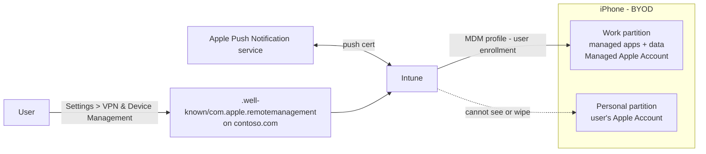

# 1.2.3 Configure personal enrollment for macOS, iOS, iPadOS

> **Exam objective:** Configure personal enrollment for macOS, iOS, iPadOS
>
> **Domain:** 1 - Prepare infrastructure for devices (20-25%) · **Skill:** 1.2 Enroll devices to Microsoft Intune
>
> **Hands-on:** [LAB-1.05 Apple personal enrollment and APNs](../labs/LAB-1.05-apple-personal-enrollment.md)

## Concept in plain English

Personal (BYOD) Apple devices can be enrolled so the organization manages **either the whole device** (*device enrollment*) or **only a separate work partition** (*user enrollment*). All Apple MDM depends on the **Apple MDM push certificate (APNs)**.

### iOS/iPadOS personal enrollment options (Intune)

| Method | Min OS | What's managed | User experience | Notes |
|---|---|---|---|---|
| **Account driven user enrollment** | iOS/iPadOS 15 | Work partition (separate APFS volume) only | Settings > General > VPN & Device Management > sign in with work account | Recommended BYOD method. Needs **service discovery** file + **Managed Apple Account** (or federated authentication with ABM). Uses **JIT registration** + Authenticator. |
| **Web based device enrollment** | iOS/iPadOS 15 | Whole device (BYOD scope) | Safari + Settings, no Company Portal app | Uses JIT registration. Works without Managed Apple Accounts. |
| **Device enrollment with Company Portal** | iOS 15+ supported | Whole device (BYOD scope) | Company Portal app → download profile → Settings | Classic flow. |
| **Determine based on user choice** | - | User picks | Choice screen | "I own this device" → secure entire device or only work apps. |
| ~~User enrollment with Company Portal~~ (profile-based) | - | - | - | **Deprecated** - not available for new enrollments. |

### macOS personal enrollment

| Method | What's managed | Notes |
|---|---|---|
| **Device enrollment with Company Portal for macOS** | Whole Mac (user-approved MDM) | User installs Company Portal, signs in, installs management profile in *System Settings > Privacy & Security > Profiles*. |
| Account driven user enrollment (macOS 14+) | Work partition | Supported by Apple. Check Intune's support status for your tenant. |
| Direct enrollment / Apple Configurator | Corporate staging | Not BYOD. |

## How it works



**User enrollment privacy boundaries:** Intune can't see the serial number, UDID, IMEI, or personal apps. It can't wipe the full device (only the work partition), can't set a device passcode beyond basic requirements, and can't deploy device-wide certificates or VPN (only per-app VPN).

## Licensing requirements

- Intune Plan 1 (user license).
- Entra ID P1 if Conditional Access requires enrollment/compliance.
- A free Apple Account for the APNs certificate (use a shared, organizational Apple Account).
- **Managed Apple Accounts** from Apple Business Manager for account-driven user enrollment, or federated authentication between ABM and Microsoft Entra ID.

## Configuration steps

### 1. Apple MDM push certificate (required for all Apple enrollment)

1. **Devices > Enrollment > Apple > Apple MDM Push certificate**.
2. Agree, **Download your CSR**.
3. Go to the Apple Push Certificates Portal (identity.apple.com), sign in with the **organizational Apple Account**, **Create a Certificate**, upload the CSR, download the `.pem`.
4. Back in Intune: enter the Apple Account, upload the `.pem`, **Upload**.
5. Calendar reminder: **renew before 365 days with the same Apple Account**.

### 2. Account driven user enrollment (iOS/iPadOS)

1. **Service discovery:** publish `https://contoso.com/.well-known/com.apple.remotemanagement` (no file extension, `Content-Type: application/json`):

   ```json
   {"Servers":[{"Version":"mdm-byod","BaseURL":"https://manage.microsoft.com/EnrollmentServer/PostReportDeviceInfoForUEV2?aadTenantId=00000000-0000-0000-0000-000000000000"}]}
   ```

2. **JIT registration:** create an iOS **Single sign-on app extension** device configuration profile (Microsoft Entra ID type) and assign **Microsoft Authenticator** as a required app.
3. **Devices > Enrollment > Apple > Enrollment types > Create profile > iOS/iPadOS** → *Enrollment type* = **Account driven user enrollment** (or **Determine based on user choice**) → assign to **user groups**.
4. Users enroll from **Settings > General > VPN & Device Management > Sign in to Work or School Account**.

### 3. Web based device enrollment

Same JIT prerequisites. Enrollment type = **Web based device enrollment**. Users go to the Company Portal **website** in Safari and download the profile.

### 4. macOS with Company Portal

1. APNs certificate in place.
2. Allow macOS personal devices in the platform restriction.
3. User downloads Company Portal for macOS (`https://go.microsoft.com/fwlink/?linkid=853070`), signs in, installs the management profile, approves it in System Settings.

## Comparison: device vs user enrollment (iOS)

| | Device enrollment (BYOD) | Account driven user enrollment |
|---|---|---|
| Inventory | Serial, IMEI, full app list (managed apps) | Limited, no serial/UDID/IMEI |
| Wipe | Full wipe or retire | Work partition only (retire) |
| Passcode policy | Full | Limited (no complex requirements beyond basic) |
| Per-app VPN | ✅ | ✅ |
| Device-wide VPN / Wi-Fi / certificates | ✅ | Wi-Fi ✅, device VPN ❌ |
| Managed Apple Account needed | ❌ | ✅ (or federated) |
| Switch methods later | - | Must unenroll and re-enroll |
| Supervision | ❌ | ❌ |

## Exam tips and common traps

- **"Personal iPhones - protect corporate data but IT must not see personal apps or wipe the device"** → **account driven user enrollment** (or MAM without enrollment if only Microsoft apps are needed).
- **"Enroll without installing the Company Portal app"** → **web based device enrollment** (iOS 15+) or account-driven user enrollment.
- **Error "Your Apple ID does not support the expected services on this device"** → service discovery file missing or wrong content type.
- **APNs certificate expired** → devices stop receiving commands. Renew it with the **same** Apple Account. A new Apple Account = re-enroll every device.
- **Supervised mode** is only possible for corporate devices (ADE or Apple Configurator), never BYOD.
- **Profile-based user enrollment (with Company Portal)** is deprecated. Don't pick it for a new deployment.

## Real-world notes

- Use a **shared mailbox-based Apple Account** for APNs (for example `apple-mdm@contoso.com`), store its credentials in the privileged vault, and document the renewal date. A departed admin's personal Apple Account is the classic outage cause.
- Hosting the `.well-known` file often needs the web team, which is usually the slowest part of an account-driven rollout.
- Many organizations skip BYOD enrollment for iOS altogether and use **app protection policies + CA "Require app protection policy"** (objective [4.2.1](../../04-Manage-Secure-Applications/docs/4.2.1-app-protection-policies.md) covers this).

## Microsoft Learn references

- [Overview of Apple User Enrollment](https://learn.microsoft.com/intune/device-enrollment/apple/user-enrollment-methods-ios)
- [Set up account driven Apple User Enrollment](https://learn.microsoft.com/intune/device-enrollment/apple/setup-account-driven-user)
- [Set up web based device enrollment for iOS](https://learn.microsoft.com/intune/device-enrollment/apple/setup-web-based-ios)
- [Get an Apple MDM push certificate](https://learn.microsoft.com/intune/device-enrollment/apple/create-mdm-push-certificate)
- [Enrollment guide: Apple mobile devices](https://learn.microsoft.com/intune/device-enrollment/apple/guide-ios-ipados)
