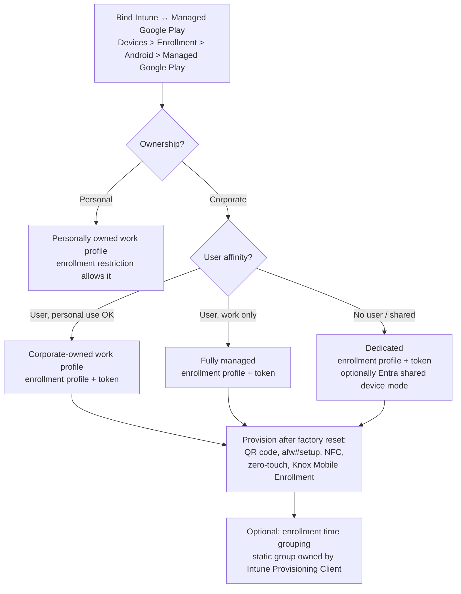

# 1.2.4 Configure enrollment profiles for Android devices

> **Exam objective:** Configure enrollment profiles for Android devices, including fully managed, dedicated, corporate-owned devices with a work profile, enrollment restrictions and troubleshooting enrollment failures
>
> **Domain:** 1 - Prepare infrastructure for devices (20-25%) · **Skill:** 1.2 Enroll devices to Microsoft Intune
>
> **Hands-on:** [LAB-1.06 Android Enterprise profiles and troubleshooting](../labs/LAB-1.06-android-enterprise-enrollment-profiles.md)

## Concept in plain English

Intune manages Android through **Android Enterprise**, Google's management framework. First you **bind Intune to Managed Google Play**. Then you pick a *solution set* per device population:

| Solution set | Ownership | Who uses it | What IT controls | Enrollment start |
|---|---|---|---|---|
| **Personally owned work profile** (BYOD) | Personal | One user | Work profile only | User: Company Portal / web-based enrollment (`aka.ms/enrollmyandroid`) |
| **Corporate-owned work profile (COPE)** | Corporate | One user, personal use allowed | Whole device (limited) + work profile | Factory reset → QR / token / zero-touch / Knox |
| **Fully managed (COBO)** | Corporate | One user, work only | Entire device | Factory reset → QR / `afw#setup` / NFC / zero-touch / Knox |
| **Dedicated (COSU)** | Corporate | Kiosk, shared, no user affinity (or Entra shared device mode) | Entire device, lock-task / multi-app kiosk | Factory reset → QR / token / zero-touch / Knox |
| **AOSP** (user-associated / userless) | Corporate | Devices without Google Mobile Services (for example, AR/VR headsets, some rugged devices) | Entire device | QR code |
| ~~Device administrator~~ | - | - | - | **Deprecated** for devices with GMS - block it |

## How it works

**Enrollment tokens** tie a device to a profile. Dedicated-device tokens always have a configurable **expiration date**. Fully managed and COPE profiles offer **default tokens** (long-lived) or **staging tokens** (an admin pre-provisions the device, then the user completes enrollment). Dedicated tokens come in two types: *Corporate-owned dedicated device (default)* or **Microsoft Entra shared device mode**. Revoking a token or letting it expire stops new enrollments; it doesn't affect enrolled devices.

## Licensing requirements

- Intune Plan 1 (user license; dedicated devices without users can use **Intune device-only** licenses).
- Entra ID P1 for Conditional Access.
- A Google account (not a Gmail personal user ideally, but any Google account works) to bind Managed Google Play.
- Android 8.0+ for COBO/dedicated. COPE on Android 8+ (Android 11+ changes the COPE model). Check current Intune minimums.

## Configuration steps

### 1. Bind Managed Google Play

**Devices > Enrollment > Android > Managed Google Play** → *I agree* → **Launch Google to connect now** → sign in with the organizational Google account → complete sign-up. Intune automatically approves Company Portal, Microsoft Intune app, Authenticator, and other required apps.

### 2. Personally owned work profile

1. **Devices > Enrollment > Device platform restriction > Android** → allow **Android Enterprise (work profile)**, set *Personally owned* = Allow. Block **Android device administrator**.
2. No profile or token is needed. Users open Company Portal or `https://aka.ms/enrollmyandroid` (web-based enrollment).

### 3. Corporate-owned: create enrollment profiles

**Devices > Enrollment > Android** → pick the section:

| Section | Create | Key settings |
|---|---|---|
| **Enrollment Profiles > Corporate-owned devices with work profile** | Profile | Name, token type (Default/Staging), token expiration, **Device group** (enrollment time grouping) |
| **Corporate-owned, fully managed user devices** | Toggle *Allow users to enroll* + profiles | Token type: *Corporate-owned, fully managed* (default) or *via staging* (admin prepares, user completes) |
| **Corporate-owned dedicated devices** | Profile | Token type: **Corporate-owned dedicated device (default)** or **Microsoft Entra shared device mode**; token expiry |

After you create the profile, open it → **Token** → show the **QR code** or copy the token string.

### 4. Provision the device

| Method | Steps | Android version |
|---|---|---|
| **QR code** | Factory reset → tap welcome screen 6 times → scan QR | 9+ has built-in QR reader |
| **`afw#setup`** (DPC identifier) | On Google sign-in screen type `afw#setup` → install Android Device Policy → enter token | Fully managed / dedicated / COPE |
| **NFC** | NFC bump from a programmer device | 8+ (limited) |
| **Zero-touch / Knox Mobile Enrollment** | Device auto-enrolls on first boot | See [1.2.6](1.2.6-knox-mobile-enrollment-zero-touch.md) |

### 5. Troubleshooting enrollment failures

| Symptom | Likely cause | Fix |
|---|---|---|
| "Can't enroll - device not supported" / blocked | Platform restriction blocks Android Enterprise or personal devices, or OS below minimum | Adjust restriction, check priority |
| "Device cap reached" | Device limit restriction | Raise limit or remove stale devices |
| QR scan does nothing / "Can't set up device" | Device not factory reset, no network, token expired or revoked | Reset, connect Wi-Fi first, create a new token |
| Stuck on "Getting ready for work setup" | Blocked Google endpoints / proxy | Allow Google and Intune endpoints, test on open network |
| Work profile created but apps don't install | Managed Google Play apps not approved/assigned, or Play Store blocked | Approve in MGP, assign as Required |
| Enrollment time grouping failure | Group owner isn't Intune Provisioning Client, or staging token used | Fix owner; ETG not supported with staging tokens |
| User gets DA flow on a GMS device | DA not blocked | Block Android device administrator in restrictions |

Useful tools: **Devices > Monitor > Enrollment failures**, the **Troubleshooting + support** blade for the user, **Intune app > Help > Send logs** (Company Portal logs), and **Devices > Monitor > Enrollment time grouping failures**.

## Comparison

| | BYOD work profile | COPE | Fully managed | Dedicated |
|---|---|---|---|---|
| Factory reset needed | No | Yes | Yes | Yes |
| User affinity | Yes | Yes | Yes | No / shared |
| Personal apps | Personal side | Personal profile | No | No |
| Full device wipe | ❌ (retire work profile) | ✅ | ✅ | ✅ |
| Kiosk / lock task | ❌ | ❌ | ❌ | ✅ |
| Entra shared device mode | ❌ | ❌ | ❌ | ✅ |
| Token/QR | ❌ | ✅ | ✅ | ✅ |
| Enrollment time grouping | ❌ | ✅ | ✅ | ✅ (not staging tokens) |

## Exam tips and common traps

- **"Corporate phones - employees may install personal apps, IT must be able to wipe the device"** → **COPE**.
- **"Warehouse scanners shared by shift workers, locked to one app"** → **Dedicated** (+ **Entra shared device mode** if users sign in/out of apps like Teams).
- **"Corporate devices, work use only"** → **Fully managed**.
- **"Personal Android, separate work data"** → **personally owned work profile** - no token, no reset.
- **Device administrator is deprecated** for GMS devices - the right answer is to block it in the platform restriction.
- **Tokens expire.** If "new devices can't enroll but older ones are fine", check the token's expiration date.
- **AOSP** is for devices **without Google Mobile Services** (for example, some Meta Quest or RealWear headsets) - not for regular phones.
- The **Intune app** (not only Company Portal) is the management app on Android Enterprise corporate devices and on the new web-based BYOD enrollment.

## Real-world notes

- Use separate dedicated-device profiles per use case (scanner, kiosk, shared phone) so the **enrollment profile name** can drive dynamic groups or filters: `(device.enrollmentProfileName -eq "AE-Dedicated-Scanner")`.
- Give dedicated-device tokens a **short expiry** and rotate them. A leaked QR code lets anyone enroll a device into your tenant.
- Personally owned work profile devices are moving to the **Android Management API**. Custom OMA-URI profiles no longer work there, so replace them with settings catalog equivalents.

## Microsoft Learn references

- [Enrollment guide: Android](https://learn.microsoft.com/intune/device-enrollment/android/guide)
- [Connect Intune to Managed Google Play](https://learn.microsoft.com/intune/device-enrollment/android/connect-managed-google-play)
- [Set up personally owned work profile enrollment](https://learn.microsoft.com/intune/device-enrollment/android/setup-personal-work-profile)
- [Set up corporate-owned work profile enrollment](https://learn.microsoft.com/intune/device-enrollment/android/setup-corporate-work-profile)
- [Set up fully managed enrollment](https://learn.microsoft.com/intune/device-enrollment/android/setup-fully-managed)
- [Set up dedicated device enrollment](https://learn.microsoft.com/intune/device-enrollment/android/setup-dedicated)
- [Enrollment time grouping](https://learn.microsoft.com/intune/device-enrollment/setup-time-grouping)
