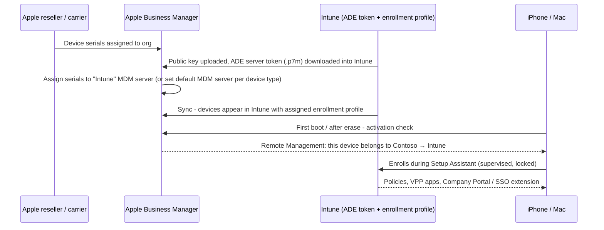

# 1.2.5 Configure corporate enrollment for macOS and iOS by integrating Intune with Apple Business Manager

> **Exam objective:** Configure corporate enrollment for macOS and iOS devices by integrating Intune with Apple Business Manager
>
> **Domain:** 1 - Prepare infrastructure for devices (20-25%) · **Skill:** 1.2 Enroll devices to Microsoft Intune
>
> **Hands-on:** [LAB-1.07 Apple Business Manager and Automated Device Enrollment](../labs/LAB-1.07-apple-business-manager-ade.md)

## Concept in plain English

**Apple Business Manager (ABM)** is Apple's portal for organization-owned devices. When a reseller or carrier links your purchases to your ABM organization, ABM knows the serial numbers. You connect ABM to Intune with an **Automated Device Enrollment (ADE) token**, formerly known as DEP. The devices then enroll **automatically during Setup Assistant**. The enrollment is **supervised** on iOS/iPadOS and can be **locked** so users can't remove management.

ABM also provides:

- **Apps and Books** (volume purchasing) → a **VPP location token** in Intune (covered in objective [4.1.8](../../04-Manage-Secure-Applications/docs/4.1.8-store-apps-abm-managed-google-play.md)).
- **Managed Apple Accounts** and **federated authentication** with Microsoft Entra ID.

Apple School Manager (ASM) is the education equivalent.

## How it works



## Licensing requirements

- Intune Plan 1 (user license, or device-only licenses for userless devices).
- Apple Business Manager account (free). Devices must be purchased through Apple or participating resellers/carriers, **or** added manually with **Apple Configurator** (iPhone app for Macs/iPhones, or the Mac app for iOS), which gives a 30-day provisional period in which the user can remove management.
- Active **APNs certificate** in Intune.

## Configuration steps

### 1. Create the ADE token

1. **Intune > Devices > Enrollment > Apple > Enrollment program tokens > Add**.
2. Accept, **Download your public key** (`.pem`).
3. In **ABM > Preferences (your name) > Your MDM Servers > Add** → name it `Intune-Contoso` → upload the public key → **Download token** (`.p7m`).
4. Back in Intune: enter the **Apple Account** used to create the token (for renewal tracking), upload the `.p7m`, **Create**.
5. In ABM, set **Default Device Assignment** for iPhone/iPad/Mac to the Intune server, or assign individual serials/orders.
6. In Intune, **Sync** the token. Devices appear under the token's **Devices** list.

> The ADE token expires **every year**. Renew it in ABM (download a new token for the *same* MDM server) and upload it to the *existing* token in Intune.

### 2. Create enrollment profiles

**Enrollment program tokens > [token] > Profiles > Create profile > iOS/iPadOS** (or macOS). The new experience also offers these under **Devices > Enrollment > Apple > Enrollment policies**.

| Setting | Options / notes |
|---|---|
| **User affinity** | *Enroll with user affinity* (a user signs in, which enables Company Portal, CA, and user-licensed apps) or *Enroll without user affinity* (shared/kiosk devices, device-licensed apps) |
| **Authentication method** | **Setup Assistant with modern authentication** (recommended - Entra sign-in during Setup Assistant, supports MFA) / Company Portal / ~~Setup Assistant (legacy)~~ |
| Install Company Portal with VPP | Yes (requires VPP token) |
| **Supervised** | Yes (iOS/iPadOS ADE devices are always supervised on iOS 13+) |
| **Locked enrollment** | Yes - user can't remove the management profile |
| Sync with computers | Deny (iOS) |
| **Shared iPad** | For multi-user iPads (without user affinity) |
| Await final configuration | Yes - holds the user at Setup Assistant until critical policies arrive |
| Device name template | `{{SERIAL}}`, `{{DEVICETYPE}}` tokens (iOS) |
| **Setup Assistant screens** | Show/Hide each pane (Location, Apple Pay, Siri, Screen Time, and so on) |
| macOS: **Account settings** / **Platform SSO** | Create a local primary account, or use Entra-based Platform SSO during Setup Assistant (macOS 14+) |
| **Enrollment time grouping** | Static device group owned by the Intune Provisioning Client |

Set a **default profile** on the token so newly synced devices get it automatically, or assign profiles to specific serials.

### 3. Assign and enroll

Erase the device (or power on new) → Setup Assistant → *Remote Management* screen → user signs in with an Entra account (modern auth) → device enrolls → Company Portal and apps install.

### Microsoft Graph (inventory)

```powershell
Connect-MgGraph -Scopes DeviceManagementServiceConfig.Read.All
$tokens = Invoke-MgGraphRequest GET 'https://graph.microsoft.com/beta/deviceManagement/depOnboardingSettings'
$tokens.value | Select-Object tokenName, appleIdentifier, tokenExpirationDateTime, lastSuccessfulSyncDateTime
```

## Comparison: Apple enrollment methods

| | ADE via ABM | Apple Configurator | Company Portal (BYOD) | Account driven user enrollment |
|---|---|---|---|---|
| Ownership | Corporate | Corporate | Personal | Personal |
| Supervised | ✅ | ✅ (iOS) | ❌ | ❌ |
| Locked (non-removable) | ✅ | 30-day provisional | ❌ | ❌ |
| Zero touch | ✅ | ❌ (tethered/manual) | ❌ | ❌ |
| User affinity optional | ✅ | ✅ | Required | Required |
| Shared iPad | ✅ | ❌ | ❌ | ❌ |
| OS update enforcement (DDM) | ✅ | ✅ (supervised) | Limited | Limited |

## Exam tips and common traps

- **"Corporate iPhones must be supervised and users must not remove management"** → ABM + ADE profile with **locked enrollment**.
- **"Devices purchased from a retail store, not an Apple reseller"** → add them to ABM with **Apple Configurator** (provisional period applies).
- **"Enroll with user affinity + modern auth"** is required for Conditional Access, Company Portal, and user-based app licensing. **Without user affinity** → no CA, no user apps, used for kiosk/shared iPad.
- **Tokens expire annually** - the ADE token, the VPP token, and the APNs certificate are three separate renewals.
- A device must be **erased** to go through ADE if it has already been set up - ADE only runs during Setup Assistant.
- **Setup Assistant (legacy)** authentication is deprecated. Choose **Setup Assistant with modern authentication**.

## Real-world notes

- Always set **Default device assignment** in ABM so new purchases flow to Intune automatically; the most common ticket is "new iPad didn't enroll" because nobody assigned the serial.
- Keep one ADE token per business unit only if you need different Apple Accounts or scope tags; otherwise one token with multiple profiles is simpler.
- Enable **Await final configuration** so users don't reach the home screen before Wi-Fi, certificates, and passcode policy arrive.
- Apple sometimes shortens the portal's name to *Apple Business* in newer documentation - it is the same service.

## Microsoft Learn references

- [Set up automated device enrollment for iOS/iPadOS](https://learn.microsoft.com/intune/device-enrollment/apple/setup-automated-ios)
- [Set up automated device enrollment for macOS](https://learn.microsoft.com/intune/device-enrollment/apple/setup-automated-macos)
- [Overview of automated device enrollment (Apple mobile)](https://learn.microsoft.com/intune/device-enrollment/apple/overview-automated-enrollment-apple)
- [Set up Apple Configurator enrollment](https://learn.microsoft.com/intune/device-enrollment/apple/setup-configurator-ios)
- [Apple Business Manager User Guide](https://support.apple.com/guide/apple-business-manager/welcome/web)
