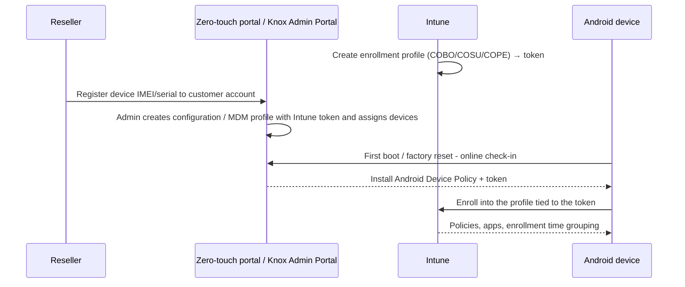

# 1.2.6 Configure Android enrollment with Samsung Knox Mobile Enrollment or Google zero-touch

> **Exam objective:** Configure enrollment for Android devices by integrating Intune with Samsung Knox Mobile Enrollment or Google zero-touch enrollment
>
> **Domain:** 1 - Prepare infrastructure for devices (20-25%) · **Skill:** 1.2 Enroll devices to Microsoft Intune
>
> **Hands-on:** [LAB-1.08 Knox Mobile Enrollment and zero-touch](../labs/LAB-1.08-knox-zero-touch-enrollment.md)

## Concept in plain English

QR codes and `afw#setup` require someone to touch every device. **Zero-touch** methods are the Android equivalent of Apple ADE: the reseller registers the device's IMEI/serial to your organization, and on first boot (or after a factory reset) the device **automatically downloads Intune's device policy controller and enrolls**.

| | **Google zero-touch enrollment** | **Samsung Knox Mobile Enrollment (KME)** |
|---|---|---|
| Devices | Many OEMs (Pixel, Samsung, Motorola, Zebra, and others) bought from a **zero-touch reseller** | **Samsung** Galaxy devices only |
| Portal | Zero-touch customer portal (partner.android.com/zerotouch) **or the iframe inside Intune** | Samsung Knox Admin Portal (Knox Mobile Enrollment) |
| How devices get there | Reseller uploads IMEIs/serials to your zero-touch account | Samsung reseller upload, or **Knox Deployment App** (Bluetooth/NFC/Wi-Fi Direct) for devices you already own |
| Intune link | **Configuration** = EMM DPC (Android Device Policy) + **extras JSON containing the Intune enrollment token** | **MDM profile** = *Android Enterprise* type, Intune DPC, and the enrollment token in *custom JSON* |
| Supported Intune modes | Fully managed, dedicated, COPE | Fully managed, dedicated, COPE (Android Enterprise); also DA (legacy) |
| Cost | Free | Free (KME) |

## How it works



Because the Intune **token** decides which profile the device lands in, you need **one zero-touch configuration / KME profile per Intune enrollment profile** (for example, one for fully managed and one for dedicated scanners).

## Licensing requirements

- Intune Plan 1 (or device-only licenses for dedicated devices).
- Managed Google Play binding.
- Devices purchased from an authorized zero-touch reseller or a Samsung reseller that participates in KME. Existing devices can be added to KME with the Knox Deployment App.

## Configuration steps

### Google zero-touch (from inside Intune)

1. Create the Intune enrollment profile, for example **Corporate-owned, fully managed** → note the token.
2. **Devices > Enrollment > Android > Zero-touch enrollment** (the embedded iframe) → **link your zero-touch account** (reseller creates it with your Google account). You can link multiple accounts.
3. In the iframe (or the zero-touch portal) create a **configuration**:
   - EMM DPC: **Android Device Policy** (Intune's DPC for Android Enterprise).
   - DPC extras: JSON with the Intune token:

   ```json
   {
     "android.app.extra.PROVISIONING_ADMIN_EXTRAS_BUNDLE": {
       "com.google.android.apps.work.clouddpc.EXTRA_ENROLLMENT_TOKEN": "ABCDEFGHIJKLMNOPQRST"
     }
   }
   ```

   - Company name, support email/phone, and a custom message.
4. **Devices** tab → assign the configuration to devices (or set it as the **default configuration**).
5. Factory reset or power on the device → connect to Wi-Fi → it enrolls automatically.

### Samsung Knox Mobile Enrollment

1. Sign up at the Samsung Knox portal and approve KME. Add your reseller ID, or use the **Knox Deployment App** for owned devices.
2. **Knox Mobile Enrollment > MDM profiles > Create** → **Android Enterprise** → MDM = **Microsoft Intune** → *Choose the Intune DPC* (Android Device Policy) → paste the **custom JSON** with the Intune enrollment token (same `EXTRA_ENROLLMENT_TOKEN` key).
3. Options: skip setup wizard screens, *allow end user to cancel enrollment* = **No**, add EULAs and support info.
4. **Devices** → assign the profile to uploaded IMEIs/serials, or configure **auto-approve** for your reseller.
5. First boot → KME prompts → device enrolls into Intune.

> **Important:** If a device is registered for **both** zero-touch and KME, conflicts can occur. Register each device in only one service.

### Troubleshooting

| Symptom | Cause |
|---|---|
| Device boots to normal setup, no enrollment | Device not assigned a configuration/profile, not uploaded by reseller, or no network during setup |
| "Can't set up device - contact IT" | Token in DPC extras expired/revoked or mistyped JSON |
| Enrolls to the wrong mode (dedicated vs fully managed) | Wrong token in the configuration |
| Samsung device ignores zero-touch | Registered in KME too, or KME profile takes precedence |

## Comparison: Android corporate provisioning methods

| Method | Touch required | Scale | OEM |
|---|---|---|---|
| QR code | Tap 6× + scan | Small-medium | Any (Android 9+ built-in reader) |
| `afw#setup` | Type identifier + token | Small | Any |
| NFC | Bump | Small | Any (limited) |
| **Zero-touch** | None | Large | Many OEMs via reseller |
| **Knox Mobile Enrollment** | None | Large | Samsung |

## Exam tips and common traps

- **"Samsung devices, no touch, reseller support"** → **Knox Mobile Enrollment**. **"Mixed OEM fleet from a zero-touch reseller"** → **Google zero-touch**.
- **"Existing Samsung devices already in the building"** → KME with the **Knox Deployment App** (zero-touch needs reseller registration).
- The link to Intune is **always the enrollment token** placed in DPC extras / custom JSON. Changing the token in Intune (revoking or expiry) breaks provisioning.
- Zero-touch and KME support **corporate** modes only. Personally owned work profile never uses them.
- **Enrollment time grouping** still works because it's attached to the Intune enrollment profile behind the token (not with staging tokens).

## Real-world notes

- Negotiate zero-touch/KME registration in the **purchase contract** - it's free for the reseller but is often forgotten.
- Keep a **long-lived default token** per profile for zero-touch configurations, or set a renewal reminder when using expiring tokens (dedicated devices).
- Rugged devices (Zebra, Honeywell) commonly use zero-touch plus **OEMConfig** (objective [2.2.5](../../02-Manage-Maintain-Devices/docs/2.2.5-specialty-devices.md)) for vendor-specific settings.

## Microsoft Learn references

- [Enroll Android Enterprise devices using Google zero-touch](https://learn.microsoft.com/intune/device-enrollment/android/setup-zero-touch)
- [Automatically enroll Android devices with Samsung Knox Mobile Enrollment](https://learn.microsoft.com/intune/device-enrollment/android/setup-samsung-knox-mobile)
- [Enrollment guide: Android](https://learn.microsoft.com/intune/device-enrollment/android/guide)
- [Google zero-touch enrollment for IT admins](https://support.google.com/work/android/answer/7514005)
