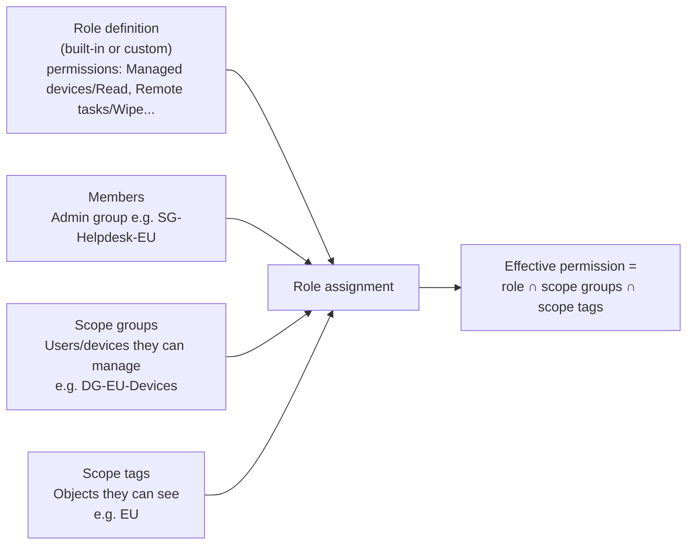

# 1.3.1 Manage built-in and custom roles for Intune and Windows 365

> **Exam objective:** Manage built-in and custom roles for Intune and Windows 365, including role assignments
>
> **Domain:** 1 - Prepare infrastructure for devices (20-25%) · **Skill:** 1.3 Implement identity and compliance
>
> **Hands-on:** [LAB-1.09 Custom roles and scope tags](../labs/LAB-1.09-custom-roles-scope-tags.md)

## Concept in plain English

Intune has its **own RBAC system**, separate from Microsoft Entra roles. An Intune **role** is a set of permissions ("what"). A **role assignment** connects that role to:

1. **Members (admin groups)** - *who* gets the permissions.
2. **Scope (groups)** - *which users/devices* they can act on (remote actions, assignment targets).
3. **Scope tags** - *which objects* (policies, apps, devices) they can see (see [1.3.2](1.3.2-scope-tags-scoped-administration.md)).

Windows 365 uses the same Intune RBAC engine with Cloud PC-specific roles and permissions.

## How it works



A single role can have **multiple assignments** (for example, *Help Desk Operator* for EU and for US, each with its own members and scope). An admin in several assignments gets the **union** of them.

## Built-in roles

### Microsoft Entra roles that grant Intune access

| Entra role | Intune access |
|---|---|
| Global Administrator | Full (avoid for daily work) |
| **Intune Administrator** | Full Intune, including RBAC, tenant settings, and Windows 365 |
| **Windows 365 Administrator** | Manage Cloud PCs, provisioning policies, Windows 365 licensing, and related Entra groups/devices |
| Security Administrator | Endpoint security node, security baselines, Defender connector |
| Global Reader / Security Reader | Read-only views |
| Cloud Device Administrator | Entra device objects, **read LAPS passwords** and BitLocker keys (not Intune policy) |

### Intune built-in roles (Tenant administration > Roles > All roles)

| Role | Typical use |
|---|---|
| **Policy and Profile Manager** | Compliance, configuration, enrollment profiles |
| **Application Manager** | Apps, app protection, app configuration |
| **Help Desk Operator** | Remote tasks (sync, restart, reset passcode, Remote Help), view devices/users |
| **Read Only Operator** | View everything, change nothing |
| **Endpoint Security Manager** | Endpoint security policies, baselines, Defender integration |
| **Intune Role Administrator** | Manage custom roles and assignments |
| School Administrator | Intune for Education |
| Organizational Messages Manager | Windows organizational messages |
| **Endpoint Privilege Manager / Reader** | EPM policies and elevation requests |
| **Cloud PKI Administrator / Reader** | Microsoft Cloud PKI CAs |
| **Cloud PC Administrator / Cloud PC Reader** | Windows 365 provisioning policies, images, Azure network connections, Cloud PC actions |

Built-in roles **can't be edited**, but you can **duplicate** them to make a custom role.

## Licensing requirements

Intune Plan 1. Admins don't need an Intune license (unlicensed admin access is default for tenants created after July 2021). Windows 365 roles are meaningful only with Windows 365 licenses in the tenant.

## Configuration steps

### Create a custom role

1. **Intune admin center > Tenant administration > Roles > All roles > Create** (or **Duplicate** a built-in role).
2. *Basics*: `Contoso - Tier1 Helpdesk`.
3. *Permissions* - for example:
   - Managed devices: **Read**
   - Remote tasks: **Sync devices**, **Reboot now**, **Rotate local admin password**, **Collect diagnostics**, **Offer remote assistance** (Remote Help)
   - Organization: **Read**
   - Device compliance policies: **Read**
4. *Scope tags*: the tags that **the role itself** is visible under (who can see/modify this role definition).
5. **Create**.

### Assign the role

1. Open the role → **Assignments > Assign**.
2. *Admin groups (members)*: `SG-Lab-Helpdesk`.
3. *Scope groups*: **Selected groups** → `SG-Lab-Users` (or All users / All devices).
4. *Scope tags*: `Lab-EU` (objects they can see).
5. **Create**.

### Windows 365

**Tenant administration > Roles > Windows 365 roles** (or the same *All roles* list, filtered): assign **Cloud PC Administrator** to Cloud PC admins. Custom roles can include *Cloud PC* permissions (provisioning policies, Azure network connections, device images, user settings, Cloud PC remote actions). To manage W365 licensing and groups outside Intune, use the Entra **Windows 365 Administrator** role.

### Check an admin's effective permissions

**Tenant administration > Roles > My permissions** (for yourself), or **Users > [user] > Intune role assignments**.

### Microsoft Graph

```powershell
Connect-MgGraph -Scopes DeviceManagementRBAC.ReadWrite.All
# List role definitions
Get-MgBetaDeviceManagementRoleDefinition | Select-Object displayName, isBuiltIn
# Role assignments for a role
$role = Get-MgBetaDeviceManagementRoleDefinition -Filter "displayName eq 'Help Desk Operator'"
Get-MgBetaDeviceManagementRoleDefinitionRoleAssignment -RoleDefinitionId $role.Id |
    Select-Object displayName, members, resourceScopes, scopeMembers
```

## Comparison: Entra roles vs Intune roles

| | Entra roles | Intune RBAC roles |
|---|---|---|
| Managed in | Entra admin center | Intune admin center > Tenant administration > Roles |
| Granularity | Directory-wide | Per-permission + scope groups + scope tags |
| Can scope to specific devices | Only with administrative units (limited Intune effect) | Yes (scope groups/tags) |
| PIM (just-in-time) | Yes | Yes - assign the Intune role to a **PIM for Groups** group |
| Examples | Intune Administrator, Windows 365 Administrator | Help Desk Operator, Policy and Profile Manager |

## Exam tips and common traps

- **"Help desk must restart and sync devices in the Paris office only"** → custom (or Help Desk Operator) role, **scope groups** = Paris users/devices, **scope tags** = Paris.
- **Scope groups ≠ scope tags.** Scope groups limit the *targets* (who you can act on or assign to). Scope tags limit the *objects you can see*.
- The permission to **read BitLocker keys** in Intune is *Managed devices > View BitLocker keys* (also Entra roles like Cloud Device Administrator). **Reading LAPS passwords** requires the Entra permission `microsoft.directory/deviceLocalCredentials/password/read` (Cloud Device Administrator, Intune Administrator, or a custom Entra role).
- To manage Intune roles themselves you need **Intune Role Administrator** or Intune Administrator.
- **Least privilege:** avoid Intune Administrator for help desk. Choose the built-in role that exactly matches the task.

## Real-world notes

- Put Intune role **members** in **PIM for Groups** groups so elevated roles are time-bound and audited.
- Keep a role/assignment matrix in source control (export with Graph) - drift in RBAC is a common audit finding.
- Watch out for *All devices* scope on help desk roles in multi-region tenants. It's the default when you're in a hurry.

## Microsoft Learn references

- [Role-based access control with Microsoft Intune](https://learn.microsoft.com/intune/fundamentals/role-based-access-control/overview)
- [Built-in role permissions](https://learn.microsoft.com/intune/fundamentals/role-based-access-control/ref-built-in-roles)
- [Create a custom role](https://learn.microsoft.com/intune/fundamentals/role-based-access-control/create-custom-role)
- [Role-based access control for Windows 365](https://learn.microsoft.com/windows-365/enterprise/role-based-access)
- [Microsoft Entra built-in roles](https://learn.microsoft.com/entra/identity/role-based-access-control/permissions-reference)
