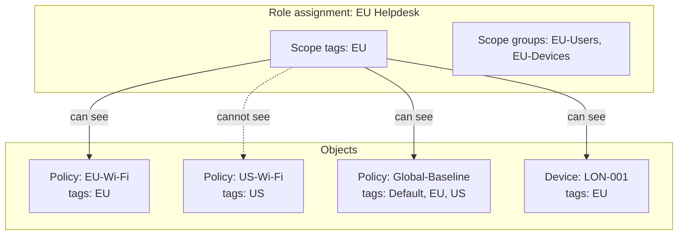

# 1.3.2 Configure scope tags and scoped administration

> **Exam objective:** Configure scope tags and scoped administration for multi-admin environments
>
> **Domain:** 1 - Prepare infrastructure for devices (20-25%) · **Skill:** 1.3 Implement identity and compliance
>
> **Hands-on:** [LAB-1.09 Custom roles and scope tags](../labs/LAB-1.09-custom-roles-scope-tags.md)

## Concept in plain English

In a large or multi-region organization, the London IT team shouldn't see or edit the Sydney team's policies. **Scope tags** are labels you attach to Intune **objects** (policies, profiles, apps, devices, enrollment restrictions, roles). An admin can only see objects whose tags match a tag in their role assignment.

**Scoped administration** = role (permissions) + scope groups (targets) + scope tags (visibility). Together they give you *distributed IT*.

## How it works



Rules to remember:

- Every object gets the **Default** scope tag if no other tag is set.
- An admin whose assignment has **no scope tags** gets the **Default** tag - they see only *Default*-tagged objects.
- If you tag an object with **EU** only (removing Default), admins with only *Default* can no longer see it.
- **Devices** get tags either manually or automatically: a scope tag can be **assigned to device groups**, and devices in those groups inherit the tag.
- An admin creating an object can only add tags they have themselves. New objects get the admin's tags by default.

## Licensing requirements

Intune Plan 1.

## Configuration steps

1. **Tenant administration > Roles > Scope tags > Create**: name `Lab-EU`, description.
2. *(Optional)* **Assignments**: add device group `DG-EU-Devices` → all devices in it are auto-tagged `Lab-EU`.
3. Tag objects: open a policy/app → **Properties > Scope tags > Edit** → add `Lab-EU`. Remove *Default* if other admins mustn't see it.
4. Role assignment: **Roles > [role] > Assignments > Assign** → *Scope tags* = `Lab-EU`, *Scope groups* = EU groups.
5. Sign in as the EU admin → confirm only tagged objects appear.

### Microsoft Graph

```powershell
Connect-MgGraph -Scopes DeviceManagementRBAC.ReadWrite.All
New-MgBetaDeviceManagementRoleScopeTag -DisplayName 'Lab-EU' -Description 'EU distributed IT'
Get-MgBetaDeviceManagementRoleScopeTag | Select-Object id, displayName
```

Policies expose `roleScopeTagIds` in Graph (for example `deviceConfigurations`, `configurationPolicies`), so you can bulk-tag with PATCH requests.

## Comparison: scope tags vs scope groups vs filters

| | Scope tags | Scope groups | Assignment filters |
|---|---|---|---|
| Purpose | **Visibility** of objects to admins | **Targets** an admin can manage/assign to | **Refine** which devices an assignment applies to |
| Applies to | Admins (RBAC) | Admins (RBAC) | Devices at check-in |
| Configured on | Objects + role assignment | Role assignment | Policy/app assignment |
| Example | EU admin sees only EU policies | EU admin can wipe only EU devices | Policy applies only to Windows 11 24H2 |

## Exam tips and common traps

- **"Admins in each region must see only their region's policies"** → scope tags. **"...and can only manage their region's devices"** → add scope groups.
- To **automatically tag devices**, assign the scope tag to a **device group** (no scripts needed).
- An object with **no tags** has **Default**. Removing Default hides the object from Default-only admins.
- Scope tags **don't restrict** which groups a policy is assigned to - scope groups do.
- Not every object type supports scope tags, but most modern ones do (configuration, compliance, apps, enrollment restrictions, Autopilot profiles, endpoint security, scripts, roles).

## Real-world notes

- Define tags by **administrative boundary** (region/business unit), not by device type. Device type belongs in groups and filters.
- Global baselines should carry **all** regional tags so every admin can see what applies to their devices, but only the central team gets edit permission.
- Audit with Graph: list objects that still carry only *Default* after a tag rollout.

## Microsoft Learn references

- [Use RBAC and scope tags for distributed IT](https://learn.microsoft.com/intune/fundamentals/role-based-access-control/scope-tags)
- [Role-based access control overview](https://learn.microsoft.com/intune/fundamentals/role-based-access-control/overview)
