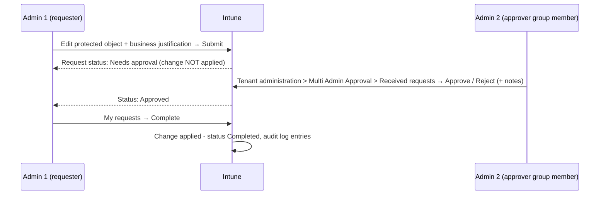

# 1.3.3 Implement and manage multi-admin approval

> **Exam objective:** Implement and manage multi-admin approval
>
> **Domain:** 1 - Prepare infrastructure for devices (20-25%) · **Skill:** 1.3 Implement identity and compliance
>
> **Hands-on:** [LAB-1.10 Multi-admin approval](../labs/LAB-1.10-multi-admin-approval.md)

## Concept in plain English

A single compromised or careless Intune admin can wipe every device or push a malicious script to the whole fleet. **Multi Admin Approval (MAA)** uses **access policies** to require that a **second administrator approves** changes to protected resource types before Intune applies them.

### Resource types an access policy can protect

| Profile type | Protects |
|---|---|
| **Apps** | App deployments (not app protection policies) |
| **Scripts** | Windows PowerShell scripts deployed to devices |
| **Device actions** | **Wipe, retire, delete** |
| **Compliance policies** | Create/manage compliance policies |
| **Configuration policies** | Settings catalog policies |
| **Role-based access control** | Roles, role assignments, admin/member groups |
| **Access policies** | Creating/managing MAA policies themselves |
| **Tenant configuration** | Device categories |

All actions on a protected resource are covered: create, edit, delete, **assign**.

## How it works

Key behaviours:

- The **same admin** who submitted the request must select **Complete** after approval.
- An admin **can't approve their own** request, even Global Administrators or Intune Administrators.
- **No notifications** are sent. The requester must contact approvers.
- Only **one pending request per object** at a time.
- Since 2026, MAA **also applies to Graph API calls made by apps with app-only (app-auth) tokens**. Automation must follow the approval workflow or be excluded explicitly on the policy's **Exclusions** tab. Delegated calls are always enforced.

## Licensing requirements

Intune Plan 1. No add-on required.

## Configuration steps

### Prerequisites for approvers

1. Create an **Entra security group** (not a Microsoft 365 group or mail-enabled group), for example `SG-Lab-MAA-Approvers`, with **direct** user members.
2. Add that group as a **member group in an Intune role assignment** (for example *Read Only Operator*), so members have at least read permission for the resource type. Otherwise Intune periodically removes the members.
3. Approvers need the **Approval for Multi Admin Approval** permission (included in Intune Administrator; add to a custom role for others).

### Create an access policy

1. **Tenant administration > Multi Admin Approval > Access policies > Create**.
2. *Basics*: name `MAA - Device wipe/retire/delete`, *Profile type* = **Device actions**.
3. *Approvers*: add `SG-Lab-MAA-Approvers`.
4. *Exclusions* (optional): enterprise apps using app-only auth that must bypass MAA - use sparingly.
5. *Review + submit for approval* → enter a **business justification**.
6. A **second admin** approves the access policy itself (creating an access policy is also subject to approval).
7. The first admin opens the policy and selects **Complete**.

### Day-to-day

- Requester: **My requests** (status: Needs approval → Approved → Completed / Rejected / Canceled). They can cancel before approval.
- Approver: **Received requests** → review → **Approve** or **Reject** with notes.
- Audit: **Tenant administration > Audit logs** records every request and decision.

> ⚠️ **Deadlock warning:** An access policy for **Role-based access control** also protects the role assignments MAA depends on. Configure all RBAC assignments (including the approver group's role) **before** enabling a Role access policy. If you get locked out, delete the Role access policy, wait 3-5 minutes, fix RBAC, then re-create it.

## Comparison: MAA vs PIM

| | Multi Admin Approval | Privileged Identity Management |
|---|---|---|
| Protects | Specific **changes** (objects/actions) | **Role activation** (who holds a role) |
| Approval point | Every change to protected resource | Once per activation window |
| Scope | Intune resource types | Entra roles, groups, Azure roles |
| Best together | ✅ PIM for "who is admin now" + MAA for "high-impact changes" | |

## Exam tips and common traps

- **"Ensure a device wipe requires approval by a second administrator"** → MAA access policy, profile type **Device actions**.
- **"Prevent a single admin from deploying a PowerShell script to all devices"** → MAA **Scripts**.
- The requester must **Complete** the change after approval. Approval alone doesn't apply it.
- The approver group must be a **security group** assigned to an Intune role. Nested groups and M365 groups fail silently.
- MAA doesn't protect app **protection** policies (only app deployments).
- Automation using app-only Graph tokens can now return **HTTP 4xx** on protected resources. Update the automation or add an exclusion.

## Real-world notes

- Start with **Device actions** and **Scripts**, which carry the highest blast radius. Add Apps and RBAC later.
- Agree a response SLA with approvers. MAA has no notifications, so use Teams or a ticket queue.
- The Security Copilot **Change Review Agent**, which assisted with MAA script approvals, was retired from the Intune admin center on August 31, 2026. Review scripts manually or with Defender/Entra signals.

## Microsoft Learn references

- [Use access policies to require multi admin approval](https://learn.microsoft.com/intune/fundamentals/role-based-access-control/multi-admin-approval)
- [Use Multi Admin Approval with the Microsoft Graph API](https://learn.microsoft.com/intune/fundamentals/role-based-access-control/multi-admin-approval-graph-api)
- [Audit logs for Intune activities](https://learn.microsoft.com/intune/governance/monitor-audit-logs)
