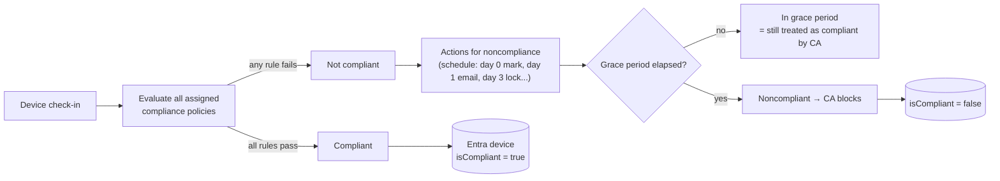

# 1.3.4 Implement compliance policies for all supported platforms

> **Exam objective:** Implement compliance policies for all supported device platforms by using Intune
>
> **Domain:** 1 - Prepare infrastructure for devices (20-25%) · **Skill:** 1.3 Implement identity and compliance
>
> **Hands-on:** [LAB-1.11 Compliance policy and Conditional Access](../labs/LAB-1.11-compliance-conditional-access.md)

## Concept in plain English

A **compliance policy** is a set of *rules* ("BitLocker must be on", "OS at least 14.0", "no jailbreak"). Intune evaluates each enrolled device and writes **Compliant / Not compliant** to the device object in Microsoft Entra ID. Conditional Access then uses that flag ([1.3.5](1.3.5-conditional-access-require-compliance.md)).

Compliance policies **don't change settings**. Configuration profiles do that. Compliance only **checks and reports**, then runs **actions for noncompliance**.

Two layers:

1. **Compliance policy settings (tenant-wide)** - *Endpoint security > Device compliance > Compliance policy settings*.
2. **Device compliance policies (per platform)** - assigned to user or device groups.

## How it works



**Compliance states:** Compliant · In grace period · Not compliant · Not evaluated · Error · Conflict. The most restrictive result across all policies wins.

## Tenant-wide compliance policy settings

| Setting | Default | Meaning |
|---|---|---|
| **Mark devices with no compliance policy assigned as** | Compliant | Set to **Not compliant** in production so unmanaged gaps don't silently pass CA |
| **Enhanced jailbreak detection** (iOS) | Disabled | Uses location services to re-check jailbreak status more often |
| **Compliance status validity period (days)** | 30 (1-120) | A device that doesn't check in within this period becomes noncompliant |

## Platform settings at a glance

| Platform | Notable settings |
|---|---|
| **Windows 10/11** | Device Health (BitLocker, Secure Boot, Code integrity - via Device Health Attestation, evaluated after a reboot), min/max OS version, valid build ranges, password (for non-Hello scenarios), **require encryption of data storage**, firewall, TPM, antivirus, antispyware, Defender Antimalware + security intelligence up to date, real-time protection, **Microsoft Defender for Endpoint machine risk score**, **custom compliance** (PowerShell discovery script + JSON rules) |
| **iOS/iPadOS** | Jailbroken, min/max OS/build, passcode, restricted apps, **device threat level** (Defender for Endpoint / MTD) |
| **Android Enterprise** (fully managed, dedicated, COPE, BYOD work profile) | Rooted, Play Integrity verdict (basic/strong), min security patch level, OS version, password, encryption, threat level, Company Portal app integrity, block USB debugging |
| **macOS** | OS version, System Integrity Protection, password, FileVault, firewall, Gatekeeper |
| **Linux** (Ubuntu/RHEL) | Distribution/version, encryption, password complexity, custom scripts |
| **AOSP / Android device admin** | Limited set |

## Actions for noncompliance

| Action | Notes |
|---|---|
| **Mark device noncompliant** | Default, day **0**. Increase days to create a **grace period** |
| Send email to end user | Uses a **notification message template** (supports tokens like `{{DeviceName}}`), can CC groups |
| Send push notification to end user | Company Portal / Intune app |
| Remotely lock the noncompliant device | Android, iOS, macOS, Windows |
| **Add device to retire list** | Admin reviews **Devices > Retire noncompliant devices** and retires in bulk |

## Licensing requirements

- Intune Plan 1 for compliance.
- Entra ID P1 for Conditional Access to act on compliance.
- Defender for Endpoint P2 (or P1 for some signals) for the *machine risk score* rule. Custom compliance: Intune Plan 1 on Windows 10/11, Linux.

## Configuration steps

### Tenant settings

**Endpoint security > Device compliance > Compliance policy settings** → *Mark devices with no compliance policy assigned as* = **Not compliant** → *Compliance status validity period* = 30.

### Windows 10/11 policy

1. **Devices > Compliance > Create policy > Windows 10 and later**.
2. Settings (lab):
   - Device Health: **Require BitLocker**, **Require Secure Boot**
   - Device Properties: Minimum OS version `10.0.22631`
   - System Security: **Firewall** Require, **TPM** Require, **Antivirus** Require, **Microsoft Defender Antimalware** Require, security intelligence up-to-date Require
   - Microsoft Defender for Endpoint: *Require the device to be at or under the machine risk score* = **Medium** (after onboarding, domain 3)
3. **Actions for noncompliance**: Mark noncompliant **1 day**. Send email **1 day** (create a notification template first). Add to retire list **30 days**.
4. Assign to `SG-Lab-Users` (user) or `DG-Lab-Windows-Corporate` (device).

### iOS / Android / macOS

Create one policy per platform (and per Android Enterprise mode), for example iOS: *Jailbroken devices = Block*, *Minimum OS = 17.0*, *Require passcode*.

### Monitor

- **Devices > Monitor > Noncompliant devices / Device compliance** reports.
- Device > **Device compliance** blade shows per-setting status.
- **Reports > Device compliance > Noncompliant devices and settings** (exportable).

### Microsoft Graph

```powershell
Connect-MgGraph -Scopes DeviceManagementManagedDevices.Read.All
Get-MgDeviceManagementManagedDevice -Filter "complianceState eq 'noncompliant'" -All |
    Select-Object deviceName, operatingSystem, userPrincipalName, lastSyncDateTime
```

See [`08-Scripts/graph/Get-NoncompliantDevices.ps1`](../../08-Scripts/graph/Get-NoncompliantDevices.ps1).

## Comparison: compliance policy vs configuration profile

| | Compliance policy | Configuration profile |
|---|---|---|
| Purpose | **Evaluate** state | **Enforce** settings |
| Output | Compliant / Not compliant → Entra | Setting applied / error / conflict |
| Used by Conditional Access | ✅ | ❌ |
| Actions | Email, push, lock, retire list | - |
| Example | "BitLocker must be on" | "Turn on BitLocker silently" |

## Exam tips and common traps

- **"Devices with no compliance policy are allowed through CA"** → change the tenant setting to **Not compliant**.
- **"Give users 3 days to fix before blocking access"** → set *Mark device noncompliant* to **3 days** (grace period). Emails can go on day 0.
- **Device Health Attestation settings (BitLocker/Secure Boot/Code integrity) need a reboot** before they report correctly - new devices can show noncompliant at first.
- **"Require BitLocker" (health attestation) vs "Require encryption of data storage"** - the latter checks the OS drive encryption state via the DeviceStatus CSP and works without a reboot. Microsoft recommends *Require encryption* for faster, more reliable reporting on some hardware.
- Compliance evaluates the **most restrictive** state across all assigned policies. If two policies conflict, the stricter one wins.
- A device that stops checking in becomes noncompliant after the **validity period** (default 30 days).
- **Machine risk score** needs the **Defender for Endpoint connector** enabled with *Connect Windows devices to Microsoft Defender for Endpoint* in the connector settings.

## Real-world notes

- Separate compliance **by platform and ownership** (for example, BYOD iOS vs ADE iOS) so you can tighten corporate devices without breaking BYOD.
- Don't put everything in compliance. Use it for the **few signals that must gate access** (encryption, OS floor, threat level, jailbreak). Too many rules produce noncompliance noise and help desk load.
- Always send the **email action on day 0** with self-help instructions. It cuts tickets significantly.

## Microsoft Learn references

- [Device compliance policies overview](https://learn.microsoft.com/intune/device-security/compliance/overview)
- [Create a compliance policy](https://learn.microsoft.com/intune/device-security/compliance/create-policy)
- [Windows compliance settings](https://learn.microsoft.com/intune/device-security/compliance/ref-windows-settings)
- [Configure actions for noncompliant devices](https://learn.microsoft.com/intune/device-security/compliance/configure-noncompliance-actions)
- [Compliance policy settings (tenant-wide)](https://learn.microsoft.com/intune/device-security/compliance/tenant-settings)
