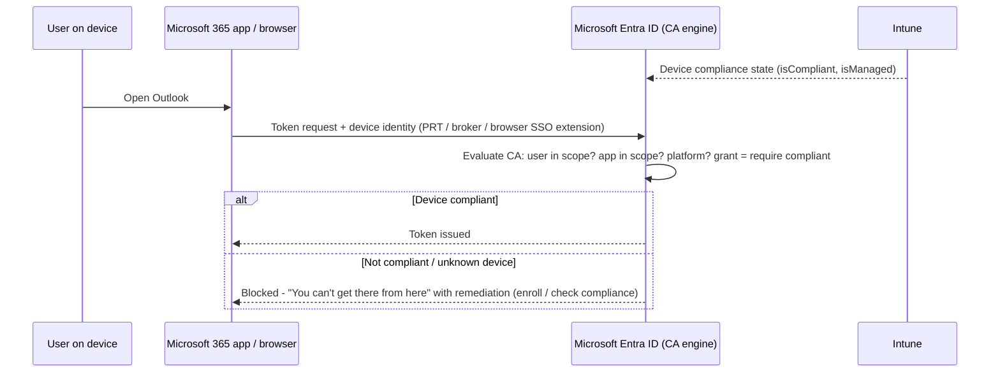

# 1.3.5 Implement Conditional Access policies that require a compliance status

> **Exam objective:** Implement Microsoft Entra Conditional Access policies that require a compliance status
>
> **Domain:** 1 - Prepare infrastructure for devices (20-25%) · **Skill:** 1.3 Implement identity and compliance
>
> **Hands-on:** [LAB-1.11 Compliance policy and Conditional Access](../labs/LAB-1.11-compliance-conditional-access.md)

## Concept in plain English

**Conditional Access (CA)** is Microsoft Entra ID's policy engine: *if* a user signs in to *these apps* under *these conditions*, *then* grant with requirements, or block. Intune feeds CA one crucial signal: **is this device compliant?**

The grant control **Require device to be marked as compliant** means only Intune-enrolled devices that pass all their compliance policies can access the targeted apps.

## How it works



The device must **present its identity**:

- Windows: signed in with an Entra account (PRT). For browsers: Edge signed in, Chrome with the *Microsoft Single Sign On* extension, or Firefox with its Windows SSO setting.
- iOS/Android: **Microsoft Authenticator** (iOS) or **Company Portal / Intune app** (Android) as the broker.
- macOS: Company Portal / Enterprise SSO plug-in.

## Common grant controls

| Grant control | Requires | Typical use |
|---|---|---|
| **Require multifactor authentication** / authentication strength | Entra ID P1 | Baseline for all users |
| **Require device to be marked as compliant** | Intune enrollment + compliance | Corporate/BYOD enrolled devices |
| **Require Microsoft Entra hybrid joined device** | Hybrid join | Legacy domain fleet |
| **Require app protection policy** | Intune APP (MAM) on iOS/Android (and Edge on Windows) | BYOD without enrollment (domain 4) |
| ~~Require approved client app~~ | - | **Read-only since June 30, 2026** - can't be added to new or edited policies |
| Require terms of use | Entra ToU | Legal acceptance |

Multiple controls: **Require all selected** (AND) or **Require one of the selected** (OR). For example, *Require compliant device **OR** hybrid joined* lets both populations in during a migration.

## Licensing requirements

- **Microsoft Entra ID P1** for Conditional Access (P2 for sign-in/user risk conditions).
- Intune Plan 1 for compliance.

## Configuration steps

### Policy: Require compliant device for Microsoft 365 on all platforms

1. **Entra admin center > Entra ID > Conditional Access > Policies > New policy**.
2. Name: `CA010 - Require compliant device - Office 365`.
3. **Users**: Include `SG-Lab-Users` (production: All users). **Exclude** break-glass accounts.
4. **Target resources**: **Office 365** (the app group).
5. **Conditions** (optional): Device platforms: Windows, iOS, Android, macOS.
6. **Grant**: **Require device to be marked as compliant** (+ Require MFA with *Require all* if desired).
7. **Enable policy**: **Report-only** first → review **Sign-in logs > Report-only** and the **CA insights and reporting workbook** → switch **On**.

### Policy: Block unknown / unsupported platforms

Include all users → All resources → Conditions: Device platforms Include **Any device**, Exclude Windows/iOS/Android/macOS/Linux → **Block**.

### Test with the What If tool

**Conditional Access > Policies > What If** → pick user, app, platform, device state → shows which policies apply.

### Filter for devices (condition)

CA supports **Filter for devices** using device attributes, for example exclude privileged access workstations `device.extensionAttribute1 -eq "PAW"`, or target `device.trustType -eq "ServerAD"`.

### Microsoft Graph

```powershell
Connect-MgGraph -Scopes Policy.Read.All
Get-MgIdentityConditionalAccessPolicy |
    Where-Object { $_.GrantControls.BuiltInControls -contains 'compliantDevice' } |
    Select-Object DisplayName, State
```

## Comparison: device-based vs app-based CA

| | Require compliant device | Require app protection policy |
|---|---|---|
| Enrollment needed | ✅ | ❌ |
| Works on BYOD without MDM | ❌ | ✅ |
| Platforms | Windows, macOS, iOS, Android, Linux | iOS, Android, Windows (Edge) |
| Protects | Access from the whole device | Data inside managed apps |
| Browser access | Needs SSO extension/signed-in browser | Edge with app protection |

## Exam tips and common traps

- **"Users can access Exchange Online only from compliant devices"** → CA with *Target resources = Office 365 Exchange Online* (or Office 365) + **Require device to be marked as compliant**.
- **Report-only** is the answer to "evaluate the impact without affecting users".
- A device that's **Entra registered but not enrolled** can never be compliant, so it will be blocked by *Require compliant device*.
- **"Allow either compliant OR hybrid joined devices"** → select both controls with **Require one of the selected controls**.
- **Chrome on Windows** fails compliant-device CA unless the *Microsoft Single Sign On* extension is installed (or `CloudAPAuthEnabled` is configured).
- *Require approved client app* is **read-only** as of **June 30, 2026**. New designs use **Require app protection policy**.
- Always **exclude break-glass accounts** from CA. Exam questions sometimes test this as "prevent lockout".
- The **Microsoft Intune Enrollment** app (and **Microsoft Intune** app) should be excluded from compliant-device policies. Otherwise users can't enroll, because they aren't compliant yet (chicken and egg). A policy requiring **MFA** for the Intune Enrollment app is the recommended alternative.

## Real-world notes

- Naming convention (`CA0xx - <Persona> - <Resource> - <Control>`) and a CA policy matrix save hours of troubleshooting.
- Use **sign-in logs > Conditional Access tab** and **device ID** in the sign-in record to prove whether the device presented its identity. "Device ID blank" usually means a browser without SSO.
- Roll out compliance CA per platform: Windows first (fewest surprises), then iOS/Android after the Authenticator/Company Portal broker experience is documented for users.

## Microsoft Learn references

- [Use Conditional Access with Intune compliance](https://learn.microsoft.com/intune/device-security/conditional-access-integration/overview)
- [Require device compliance with Conditional Access](https://learn.microsoft.com/entra/identity/conditional-access/policy-all-users-device-compliance)
- [Conditional Access: Grant controls](https://learn.microsoft.com/entra/identity/conditional-access/concept-conditional-access-grant)
- [Migrate approved client app to app protection policy](https://learn.microsoft.com/entra/identity/conditional-access/migrate-approved-client-app)
- [Conditional Access report-only mode](https://learn.microsoft.com/entra/identity/conditional-access/concept-conditional-access-report-only)
- [What If tool](https://learn.microsoft.com/entra/identity/conditional-access/what-if-tool)
