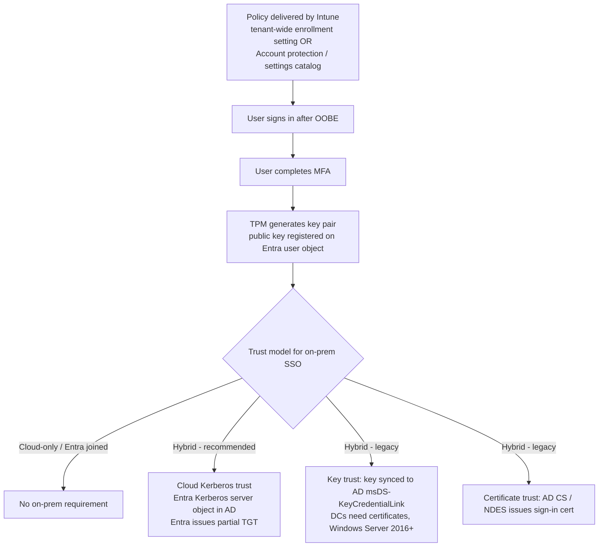

# 1.3.6 Configure Windows Hello for Business by using Intune

> **Exam objective:** Configure Windows Hello for Business by using Intune
>
> **Domain:** 1 - Prepare infrastructure for devices (20-25%) · **Skill:** 1.3 Implement identity and compliance
>
> **Hands-on:** [LAB-1.12 Windows Hello for Business](../labs/LAB-1.12-windows-hello-for-business.md)

## Concept in plain English

**Windows Hello for Business (WHfB)** replaces passwords with a **device-bound asymmetric key pair** protected by the TPM, unlocked by a **PIN or biometric** gesture. The private key never leaves the device, so it's **phishing-resistant** and counts as **MFA** (something you have + something you know/are).

Don't confuse it with *Windows Hello* (convenience PIN) on personal devices. Convenience PIN just wraps the password.

## How it works



**Deployment models:** cloud-only · hybrid (cloud Kerberos trust ← Microsoft recommended, key trust, certificate trust) · on-premises only (not Intune).

## Licensing requirements

- No premium license is needed for WHfB itself (Entra ID Free). **Cloud Kerberos trust** needs Windows 10 21H2 (with updates) / Windows 11, and AD DS domain controllers on Windows Server 2016 or later with current updates.
- Intune Plan 1 to deploy the policy. Entra ID P1 for Conditional Access *authentication strengths* that require it.

## Configuration options in Intune

| Method | Scope | When to use |
|---|---|---|
| **Devices > Enrollment > Windows > Windows Hello for Business** | **Tenant-wide**, applied during enrollment/OOBE to all Windows devices | Simple org-wide default. Can be *Enabled*, *Disabled* or *Not configured* |
| **Endpoint security > Account protection** policy | Group-targeted | Different settings for groups; also configures Credential Guard |
| **Settings catalog > Windows Hello For Business** | Group-targeted, most granular | Cloud Kerberos trust (`Use Cloud Trust For On Prem Auth`), ESS, advanced PIN options |
| Identity protection template (legacy) | Group-targeted | Older tenants |

> Group-targeted policies **override** the tenant-wide enrollment setting for targeted devices. Settings apply at the **device** scope (recommended) or user scope.

### Key settings

| Setting | Typical value |
|---|---|
| Use Windows Hello for Business | Enabled |
| Require TPM | True (don't allow software keys) |
| PIN minimum / maximum length | 6 / 127 |
| Lowercase / uppercase / special characters | Allowed / Not allowed / Required |
| PIN expiration (days) / history | 0 (never) / 0 |
| Allow biometric authentication | True |
| Use enhanced anti-spoofing | True (where supported) |
| **Use Cloud Trust For On Prem Auth** | **Enabled** for hybrid cloud Kerberos trust |
| Use security keys for sign-in | Enabled (FIDO2 keys at the lock screen) |
| **Enable ESS with supported peripherals** | Enhanced Sign-in Security (biometrics isolated with VBS) |
| Multifactor unlock (Device Unlock) | First/second unlock factor groups, trusted signals (Bluetooth phone, IP, Wi-Fi) |

## Configuration steps

### Cloud Kerberos trust for hybrid users (overview)

1. On-premises: install the **AzureADHybridAuthenticationManagement** module and run `Set-AzureADKerberosServer -Domain contoso.local -UserPrincipalName admin@contoso.onmicrosoft.com` to create the **Microsoft Entra Kerberos server object**.
2. Intune: **Settings catalog > Windows Hello For Business > Use Cloud Trust For On Prem Auth = Enabled** and **Use Windows Hello For Business (Device) = true**.
3. Assign to the device group. The user signs in, completes MFA, and provisions a PIN. On-prem SSO works through the partial TGT Entra issues.

### Cloud-only (Entra joined) - lab

1. **Devices > Enrollment > Windows > Windows Hello for Business** → *Configure Windows Hello for Business* = **Enabled**, PIN min 6, *Use security keys for sign-in* = Enabled, **Save**.
2. Or create **Endpoint security > Account protection > Create > Windows > Account protection** → set WHfB settings → assign.
3. On the device: sign in → *Set up a PIN* prompt appears after MFA.

### Verify

```powershell
dsregcmd /status | Select-String 'NgcSet|NgcKeyId|CanReset|AzureAdPrt|CloudTgt|OnPremTgt'
#  NgcSet   : YES   → WHfB container provisioned
#  CloudTgt : YES   → cloud Kerberos trust working (hybrid)
```

Event log: **Applications and Services Logs > Microsoft > Windows > User Device Registration > Admin** (event 358 = prerequisites check, 300 = key registered).

## Comparison: WHfB trust models

| | Cloud Kerberos trust | Key trust | Certificate trust |
|---|---|---|---|
| PKI needed | ❌ | DCs need certs | Full AD CS + cert deployment |
| Wait for key sync to AD | ❌ | ✅ (Entra Connect sync delay) | - |
| Supports RDP with WHfB | Partial (use Remote Credential Guard) | Partial | ✅ |
| Microsoft recommendation | **Yes** | Legacy | For specific cert scenarios |
| Complexity | Low | Medium | High |

## Exam tips and common traps

- **"Passwordless, phishing-resistant sign-in to Windows with on-premises SSO, minimal infrastructure"** → WHfB **cloud Kerberos trust**.
- The **tenant-wide** WHfB setting under *Enrollment* applies to **all** devices at enrollment. Use Account protection or the settings catalog to target specific groups.
- WHfB requires **MFA at provisioning**. Users without MFA registered get stuck at *"Set up a PIN"*.
- **Biometrics alone never unlock without a PIN fallback.** The PIN is always there.
- PIN is **device-specific** - it isn't a password, and it doesn't roam. Stealing the PIN without the device is useless.
- **PIN reset:** enable the *PIN recovery* setting (Microsoft PIN reset service) to allow non-destructive reset from the lock screen.
- For hybrid key trust, a common failure is *"That option is temporarily unavailable"* right after provisioning, because the key hasn't synced to AD yet. Cloud Kerberos trust avoids that.

## Real-world notes

- Pair WHfB with **Conditional Access authentication strength = Phishing-resistant MFA** for admins.
- Turn on **Enhanced Sign-in Security** on new hardware with compatible cameras/fingerprint readers - it isolates biometric templates with VBS.
- Keep one approach. Conflicting tenant-wide and group-targeted policies are the top cause of "PIN prompt not showing".

## Microsoft Learn references

- [Windows Hello for Business overview](https://learn.microsoft.com/windows/security/identity-protection/hello-for-business/)
- [Configure WHfB with Intune](https://learn.microsoft.com/windows/security/identity-protection/hello-for-business/configure)
- [Cloud Kerberos trust deployment](https://learn.microsoft.com/windows/security/identity-protection/hello-for-business/deploy/hybrid-cloud-kerberos-trust)
- [Windows Hello for Business policy in Intune (enrollment)](https://learn.microsoft.com/intune/device-enrollment/windows/setup-windows-hello-for-business)
- [Account protection policy](https://learn.microsoft.com/intune/device-security/endpoint-security/account-protection-policy)
