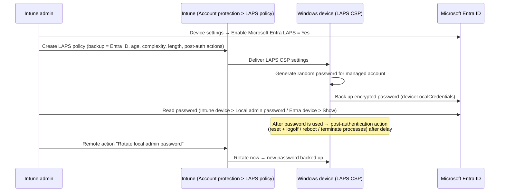

# 1.3.7 Implement and manage Windows LAPS with Intune and Microsoft Entra ID

> **Exam objective:** Implement and manage Windows Local Administrator Password Solution (Windows LAPS) by using Microsoft Intune and Microsoft Entra ID
>
> **Domain:** 1 - Prepare infrastructure for devices (20-25%) · **Skill:** 1.3 Implement identity and compliance
>
> **Hands-on:** [LAB-1.13 Windows LAPS and local group membership](../labs/LAB-1.13-windows-laps-local-groups.md)

## Concept in plain English

If every PC shares the same local admin password, one stolen hash compromises the fleet (pass-the-hash / lateral movement). **Windows LAPS** is built into Windows. It gives each device's local admin account a **unique, random, automatically rotated password** and **backs it up to Microsoft Entra ID or Active Directory**, where authorized admins can read it.

- Built into Windows 10 (20H2+ with the April 2023 update), Windows 11 (21H2+), and Windows Server 2019+. No MSI is needed.
- *Legacy Microsoft LAPS* (the MSI) is deprecated. Don't use it with the Windows LAPS policy on the same account.

## How it works



## Licensing requirements

- Any Microsoft Entra ID license (Free works) for Entra backup. Intune Plan 1 to deploy the policy.
- Devices: Entra joined or **hybrid joined** (hybrid can back up to Entra **or** AD, not both for the same account).

## Configuration steps

### 1. Enable LAPS in Microsoft Entra ID (tenant switch)

**Entra admin center > Devices > Device settings > Enable Microsoft Entra Local Administrator Password Solution (LAPS)** → **Yes**. Without it, devices can't back up passwords to Entra (event log shows backup failures).

### 2. Create the Intune LAPS policy

**Endpoint security > Account protection > Create policy > Windows > Local admin password solution (Windows LAPS)**:

| Setting | Lab value | Notes |
|---|---|---|
| **Backup Directory** | Backup the password to Microsoft Entra only | Or AD only / Disabled |
| **Password Age Days** | 30 | Entra: 7-365 days |
| **Administrator Account Name** | *(blank)* = built-in Administrator (well-known SID -500) | Or a custom account name - the account must already exist, or be created by **Automatic Account Management** (Windows 11 24H2+) |
| Password Complexity | Large + small letters + numbers + special characters | 24H2 adds passphrase options |
| Password Length | 20 | 8-64 |
| **Post Authentication Actions** | Reset password and logoff | Also: reset password, reset + reboot, reset + logoff + terminate processes (24H2) |
| Post Authentication Reset Delay | 8 hours | 0 = disabled |
| Automatic Account Management (24H2+) | Enabled, target = custom/new account, randomize name, disable when not needed | Removes the need to pre-create the account |

Assign to a **device group** (LAPS is device-scoped). Also make sure the built-in Administrator account is **enabled** if you manage it (for example, with the settings catalog *Local Policies Security Options > Accounts Enable Administrator Account Status*), or use Automatic Account Management.

### 3. Read the password

- **Intune:** Devices > [device] > **Local admin password** → *Show local administrator password* (shows account name, password, last rotation, next rotation).
- **Entra:** Devices > [device] > **Local administrator password recovery**.
- **PowerShell:**

```powershell
# Microsoft Graph PowerShell (LAPS cmdlets in the LAPS module use Graph under the hood)
Connect-MgGraph -Scopes 'Device.Read.All','DeviceLocalCredential.Read.All'
Get-LapsAADPassword -DeviceIds 'CONTOSO-LAB-01' -IncludePasswords -AsPlainText
```

**Who can read?** Global Administrator, **Cloud Device Administrator**, **Intune Administrator**, or a custom Entra role (needs Entra ID P1) with `microsoft.directory/deviceLocalCredentials/password/read`. Helpdesk Administrator, Security Administrator and Security Reader can read **metadata only** (`.../standard/read`). Every recovery is audited in Entra audit logs (*Recover device local administrator password*). If the Entra device object is deleted, the stored password is lost.

### 4. Rotate on demand

Intune: **Devices > [device] > ... > Rotate local admin password** (needs the *Remote tasks: Rotate local admin password* permission). Bulk rotation is available from **Devices > Bulk device actions**.

### 5. Troubleshoot on the device

```powershell
Get-WinEvent -LogName 'Microsoft-Windows-LAPS/Operational' -MaxEvents 20 | Select TimeCreated, Id, Message
Invoke-LapsPolicyProcessing          # force a policy cycle
Get-LapsDiagnostics -OutputFolder C:\Temp\LAPS   # collects logs and a trace
```

Key event IDs: **10003** / **10004** (processing cycle started / finished), **10005** (cycle failed), **10029** (new password backed up to Microsoft Entra ID), **10018** (backed up to AD), **10020** (local managed account updated), **10041** (managed account authentication detected → post-authentication action scheduled). Entra-specific failures (for example, the tenant switch isn't enabled or the device identity is broken) log errors such as **10025**-**10032** and **10059**.

## Comparison: Windows LAPS backup targets

| | Microsoft Entra ID | Active Directory |
|---|---|---|
| Device join types | Entra joined, hybrid joined | Hybrid joined, domain joined |
| Password encryption | Yes (service-side) | Optional (2016 DFL+) |
| Password history | Current only | Configurable (encrypted) |
| DSRM password backup | ❌ | ✅ (domain controllers) |
| Read via | Intune, Entra admin center, Graph | ADUC LAPS tab, `Get-LapsADPassword` |
| Rotate from Intune | ✅ | ❌ (use `Reset-LapsPassword` locally) |

## Exam tips and common traps

- **Two switches are required:** the tenant-level **Enable Microsoft Entra LAPS** in Entra device settings **and** the Intune LAPS policy. Missing the tenant switch = the device can't back up (no event **10029**, an Entra error event instead).
- **"Help desk must retrieve local admin passwords but not manage policies"** → Entra **Cloud Device Administrator** or a custom Entra role with `deviceLocalCredentials/password/read` (not an Intune-only role). *Helpdesk Administrator* sees only metadata, not the password.
- **"Password must change automatically after it is used"** → **post-authentication actions** + reset delay.
- LAPS manages **one** local account per device.
- **Rotate local admin password** is an **Intune remote action** (objective 2.4.5).
- Don't configure **both** legacy Microsoft LAPS (MSI/GPO) and Windows LAPS for the same account.

## Real-world notes

- Pair LAPS with removing standing local admin rights (objective 1.3.8) and **Endpoint Privilege Management** (objective 2.3.1). LAPS becomes the break-glass path rather than the daily path.
- Alert on **LAPS password reads** from Entra audit logs (activity *Recover device local administrator password*) - it's a strong privilege-use signal.
- Automatic Account Management (24H2+) lets you **rename and randomize** the managed account, which defeats scripted attacks against the well-known *Administrator* name.

## Microsoft Learn references

- [Windows LAPS overview](https://learn.microsoft.com/windows-server/identity/laps/laps-overview)
- [Intune support for Windows LAPS](https://learn.microsoft.com/intune/device-security/endpoint-security/windows-laps-overview)
- [Manage Windows LAPS policy with Intune](https://learn.microsoft.com/intune/device-security/endpoint-security/windows-laps-policy)
- [Windows LAPS in Microsoft Entra ID](https://learn.microsoft.com/entra/identity/devices/howto-manage-local-admin-passwords)
- [Windows LAPS event log reference](https://learn.microsoft.com/windows-server/identity/laps/laps-management-event-log)
