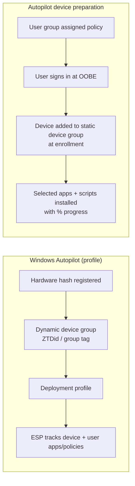

# 2.1.1 Choose between Windows Autopilot deployment profiles and device preparation policies

> **Exam objective:** Choose between Windows Autopilot deployment profiles and device preparation policies
>
> **Domain:** 2 - Manage and maintain devices (25-30%) · **Skill:** 2.1 Deploy and upgrade Windows clients by using cloud-based tools
>
> **Hands-on:** [LAB-2.02 Autopilot device preparation vs deployment profile](../labs/LAB-2.02-autopilot-device-preparation.md)

## Concept in plain English

There are now **two Autopilot engines**:

| | **Windows Autopilot** (classic) | **Windows Autopilot device preparation** (v2) |
|---|---|---|
| What you configure | **Deployment profile** + **Enrollment Status Page (ESP)** | One **device preparation policy** + a **static device group** owned by the *Intune Provisioning Client* |
| Registration | Devices must be **registered** (hardware hash / OEM / partner) | **No registration** needed. Optional **device association** binds hardware to the tenant |
| Assignment | Profile → **device** group | Policy → **user** group. The device joins the policy's device group at enrollment (**enrollment time grouping**) |
| Modes | User-driven, **pre-provisioned**, **self-deploying**, existing devices | **User-driven**, **automatic** (Windows 365 Cloud PCs) |
| Join types | Entra join, **hybrid join** | Entra join only |
| OS | Windows 10 + 11 | Windows 11 (24H2+, or 22H2/23H2 with KB5035942+) |
| Apps during OOBE | Up to 100 blocking apps (ESP), device + user phase | Selected "essential" apps (up to 25) and PowerShell scripts (up to 10), device context |
| Win32 + LOB in same deployment | ❌ (mixing is a known ESP problem) | ✅ |
| Reporting | Autopilot deployments report (not real-time) | Near real-time deployment report (apps, scripts, phase) |
| Clouds | Commercial | Commercial + **GCC High / DoD** |
| Extras | HoloLens, Teams Rooms, DFCI, co-management, Autopilot Reset, device name template | Simpler, faster, more observable |

## How it works

**If a device is registered with classic Autopilot, the classic profile wins** unless the device is **associated** for device preparation. A device runs only one of the two solutions.

## Licensing requirements

Windows 10/11 Pro, Enterprise or Education. Intune Plan 1 + Entra ID P1 (automatic enrollment). Same for both engines.

## Decision guide

| Requirement | Choose |
|---|---|
| Hybrid join | **Classic profile** (user-driven or pre-provisioned) |
| Kiosk / userless / shared with no user sign-in | **Classic self-deploying** |
| Partner or IT pre-stages apps before handing over (white glove) | **Classic pre-provisioning** |
| Reset an in-use device to business-ready | **Classic** (Autopilot Reset) |
| Enforce a device naming template | **Classic** (device preparation doesn't offer a name template) |
| Don't want to collect or upload hardware hashes | **Device preparation** |
| GCC High / DoD tenant | **Device preparation** |
| Need near real-time deployment troubleshooting | **Device preparation** |
| Must install Win32 **and** LOB apps during OOBE | **Device preparation** |
| HoloLens 2 or Teams Rooms | **Classic** |
| Windows 10 devices | **Classic** |

## Configuration steps (summary)

**Classic:** Devices > Windows > Enrollment > **Deployment profiles** → create profile → assign to device group. Plus **Enrollment Status Page** profile. Covered in [2.1.4](2.1.4-implement-autopilot-deployment.md).

**Device preparation:**

1. Create a static security group `SG-ETG-Windows` → owner **Intune Provisioning Client** (AppId `f1346770-5b25-470b-88bd-d5744ab7952c`; may appear as *Intune Autopilot ConfidentialClient*).
2. Assign apps/scripts/policies to that group.
3. Devices > Windows > Enrollment > **Device preparation policies > Create** → *Deployment mode* **User-driven**, *Join type* **Microsoft Entra joined**, *User account type* Standard/Administrator, *Device security group* = `SG-ETG-Windows`, *Minutes allowed before showing installation error* (default 60), allowed apps (essential) and scripts.
4. Assign the policy to a **user group**.
5. Make sure the users can **join devices** in Entra and that *Windows automatic enrollment* covers them. If personal Windows is blocked, add **corporate identifiers** (or use device association).

## Exam tips and common traps

- **"Minimize admin effort - no hardware hash collection"** → device preparation.
- **"Hybrid join", "pre-provisioned", "self-deploying", "Autopilot Reset", "device naming template", "HoloLens"** → classic Autopilot profile.
- Device preparation policies are assigned to **users**; classic profiles are assigned to **devices**.
- The device group in a device preparation policy must be **static (assigned)** and owned by the **Intune Provisioning Client**. A dynamic group isn't allowed.
- The **ESP** isn't used by device preparation - it has its own progress page.
- Registered (classic) devices ignore device preparation unless **associated**.

## Real-world notes

- Many organizations run both: device preparation for standard knowledge workers, classic for kiosks, hybrid-join leftovers and pre-provisioned devices.
- Keep the "essential" app list short (security agent, VPN, M365 Apps, Company Portal). Everything else installs after the desktop appears.
- The deployment report in device preparation shows per-app status - use it instead of `MDMDiagnosticsTool` for first-line troubleshooting.

## Microsoft Learn references

- [Compare Windows Autopilot device preparation and Windows Autopilot](https://learn.microsoft.com/autopilot/device-preparation/compare)
- [Overview of Windows Autopilot device preparation](https://learn.microsoft.com/autopilot/device-preparation/overview)
- [Device preparation user-driven tutorial](https://learn.microsoft.com/autopilot/device-preparation/tutorial/user-driven/entra-join-workflow)
- [Windows Autopilot device association](https://learn.microsoft.com/autopilot/device-preparation/device-association/overview)
- [Windows Autopilot overview](https://learn.microsoft.com/autopilot/overview)
