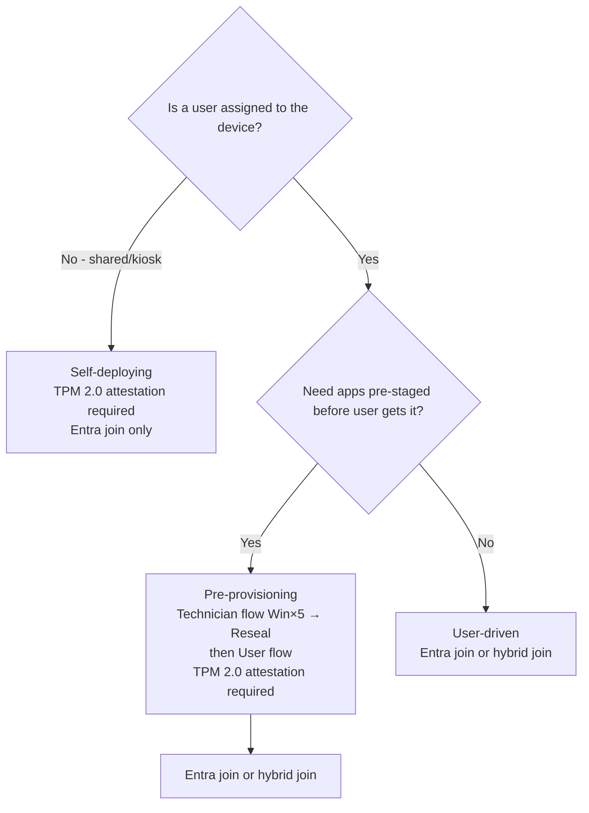

# 2.1.2 Choose between Windows Autopilot deployment modes

> **Exam objective:** Choose between Windows Autopilot deployment modes, including user-driven, pre-provisioning, and self-deploying
>
> **Domain:** 2 - Manage and maintain devices (25-30%) · **Skill:** 2.1 Deploy and upgrade Windows clients by using cloud-based tools
>
> **Hands-on:** [LAB-2.01 Autopilot user-driven with name template and ESP](../labs/LAB-2.01-autopilot-user-driven.md), [LAB-2.03 Pre-provisioning and self-deploying](../labs/LAB-2.03-autopilot-preprovisioning-self-deploying.md)

## Concept in plain English

| Mode | Who's at the keyboard | Result | Typical use |
|---|---|---|---|
| **User-driven** | The end user signs in during OOBE | Device assigned to that user | Standard laptop delivered to an employee |
| **Pre-provisioning** (formerly *white glove*) | **Technician/OEM** first (press **Windows key ×5**), then the user | Device-phase apps/policies pre-installed; user phase is fast | Large app payloads, slow user networks, partner staging |
| **Self-deploying** | **Nobody** - only a network connection | Userless, Entra joined device | Kiosks, digital signage, shared devices, meeting rooms |
| Existing devices | IT runs a task sequence that drops a JSON profile | Existing Windows reimaged into Autopilot | Windows 10 → 11 refresh on old hardware (ConfigMgr) |
| Autopilot Reset | User/admin triggers reset | Device returned to business-ready, keeps enrollment | Repurpose to new user |

## How it works

### Mode requirements

| | User-driven | Pre-provisioning | Self-deploying |
|---|---|---|---|
| Entra join | ✅ | ✅ | ✅ |
| Hybrid join | ✅ (Intune Connector for AD) | ✅ | ❌ |
| TPM 2.0 with attestation | ❌ | **✅** | **✅** |
| Physical device / VM | Both | Physical recommended (attestation) | Physical recommended (attestation) |
| User affinity | Yes | Yes | **No** (userless) |
| ESP user phase | ✅ | ✅ (during user flow) | ❌ (no user) |
| User-targeted apps during OOBE | ✅ | ✅ (user flow) | ❌ |
| Network | Internet | Ethernet or Wi-Fi at technician stage | **Wired Ethernet recommended** (no user to pick Wi-Fi unless the device is already connected) |
| Device-only license option | - | - | ✅ (Intune device license) |

## Licensing requirements

Same as Autopilot generally (Windows Pro/Enterprise/Education, Intune, Entra ID P1). Self-deploying devices can use **Intune device-only** licenses.

## Configuration steps

In the **deployment profile** (Devices > Windows > Enrollment > Deployment profiles > Create):

| Setting | User-driven | Pre-provisioning | Self-deploying |
|---|---|---|---|
| Deployment mode | User-driven | User-driven + **Allow pre-provisioned deployment = Yes** | **Self-Deploying** |
| Join to Microsoft Entra ID as | Entra joined / hybrid joined | Entra joined / hybrid joined | Entra joined |
| Convert all targeted devices to Autopilot | Optional | Optional | Optional |

### Pre-provisioning flow

1. Technician powers on at OOBE → presses **Windows key 5 times** → **Pre-provision with Windows Autopilot** → sees a QR code and profile info → **Provision**.
2. Device ESP runs: device-targeted apps, policies and certificates install.
3. Green screen → **Reseal** → device shuts down and ships.
4. User powers on → signs in → only user-targeted items are applied.

A **red screen** means failure (for example, TPM attestation or an app error) → **View logs** / **Reset**.

### Self-deploying flow

Power on → connect Ethernet → device authenticates using **TPM attestation** → Entra join → Intune enrollment → device ESP → sign-in screen (no user profile yet).

## Exam tips and common traps

- **"Kiosk", "digital sign", "no user interaction", "shared device in a lobby"** → **self-deploying**.
- **"Reduce time users wait at first sign-in", "partner prepares devices before delivery", "large apps"** → **pre-provisioning**.
- **Hybrid join + self-deploying = impossible**.
- Pre-provisioning and self-deploying both need **TPM 2.0 with attestation**. Virtual machines often fail attestation.
- Pre-provisioning technician flow is started with **Windows key × 5**. The user flow starts after **Reseal**.
- **User-targeted** apps don't install in the technician phase - only device-targeted ones. Assign critical apps to **device groups** when you use pre-provisioning.
- Hybrid join with Autopilot requires the **Intune Connector for Active Directory** and a **Domain Join** configuration profile. Over VPN it also needs *Skip AD connectivity check*.

## Real-world notes

- Pre-provisioning shines when you have many large Win32 apps. Budget OEM/partner costs for the service.
- Self-deploying devices have **no primary user**. Assign apps and policies to **device groups** and avoid user-based compliance for them.
- The newer Intune Connector for AD (2025 rewrite) uses a **managed service account (MSA)**. Legacy connectors had to be replaced.

## Microsoft Learn references

- [Windows Autopilot user-driven mode](https://learn.microsoft.com/autopilot/user-driven)
- [Windows Autopilot for pre-provisioned deployment](https://learn.microsoft.com/autopilot/pre-provision)
- [Windows Autopilot self-deploying mode](https://learn.microsoft.com/autopilot/self-deploying)
- [Windows Autopilot scenarios and capabilities](https://learn.microsoft.com/autopilot/tutorial/autopilot-scenarios)
- [Deploy hybrid joined devices with Intune and Autopilot](https://learn.microsoft.com/autopilot/windows-autopilot-hybrid)
