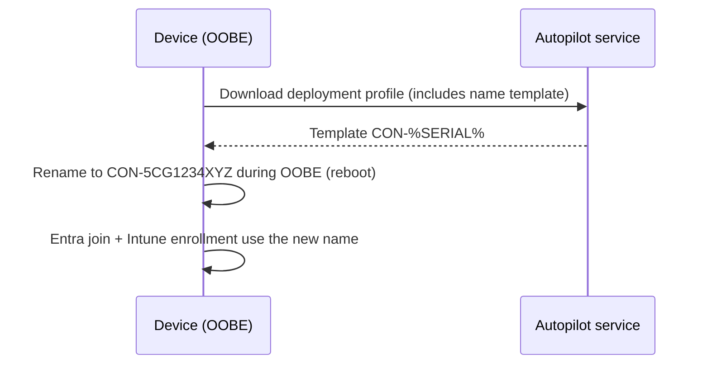

# 2.1.3 Apply a device name template by using Windows Autopilot

> **Exam objective:** Apply a device name template by using Windows Autopilot
>
> **Domain:** 2 - Manage and maintain devices (25-30%) · **Skill:** 2.1 Deploy and upgrade Windows clients by using cloud-based tools
>
> **Hands-on:** [LAB-2.01 Autopilot user-driven with name template and ESP](../labs/LAB-2.01-autopilot-user-driven.md)

## Concept in plain English

OEM devices ship with random names like `DESKTOP-7Q2K9ZT`. A **device name template** in the Autopilot **deployment profile** renames the device during OOBE so that inventory, help desk lookups and naming standards work from day one.

## Rules for the template

| Rule | Detail |
|---|---|
| Max length | **15 characters** (NetBIOS limit) |
| Allowed characters | Letters, numbers, hyphens. Names can't be only numbers |
| `%SERIAL%` | Inserts the hardware serial (truncated if needed to fit 15 chars) |
| `%RAND:x%` | Inserts *x* random digits (x ≤ 13 with prefix length considered) |
| Join type | **Microsoft Entra joined only**. Hybrid joined devices get their name from the **Domain Join** configuration profile (*computer name prefix* + random characters) |
| Where | Deployment profile → **Apply device name template = Yes** |
| Not available in | Windows Autopilot **device preparation** policies - rename with a PowerShell script or the **Rename device** remote action instead |

Examples:

| Template | Result |
|---|---|
| `CON-%SERIAL%` | `CON-5CG1234XYZ` (truncated to 15) |
| `LON-LT-%RAND:5%` | `LON-LT-48213` |
| `KIOSK%RAND:4%` | `KIOSK7731` |

## How it works

## Licensing requirements

Standard Autopilot requirements.

## Configuration steps

1. **Devices > Windows > Enrollment > Deployment profiles** → create or edit a profile.
2. **Out-of-box experience (OOBE)** page → *Apply device name template* = **Yes** → *Enter a name* = `CON-%SERIAL%`.
3. Assign the profile to your Autopilot device group.

### Other ways to name devices

| Method | Use when |
|---|---|
| Autopilot per-device **Device Name** (Windows Autopilot devices list → device → *Device Name*) | A specific device needs a specific name. It overrides the template |
| **Domain Join** profile *Computer name prefix* | Hybrid join |
| Intune remote action **Rename device** (Windows 10 1803+, Entra joined) | After deployment; single or bulk. Requires a restart |
| Company Portal / PowerShell script | Custom logic (for example, site code from IP) |

## Exam tips and common traps

- Template limit is **15 characters**. `%SERIAL%` can be truncated.
- **Hybrid join ignores the template** - use the Domain Join profile's prefix.
- Setting a name on an individual Autopilot device record **overrides** the profile template.
- Device preparation policies have **no** naming template.

## Real-world notes

- Serial-based names make asset reconciliation easy but reveal hardware identity. Random names suit high-security environments.
- Watch serial numbers from virtual machines (long GUID-like strings). Test your template on VMs before production.

## Microsoft Learn references

- [Configure Autopilot profiles - device name template](https://learn.microsoft.com/autopilot/profiles)
- [Rename a device remotely](https://learn.microsoft.com/intune/device-management/actions/rename)
- [Deploy hybrid joined devices (Domain Join profile)](https://learn.microsoft.com/autopilot/windows-autopilot-hybrid)
