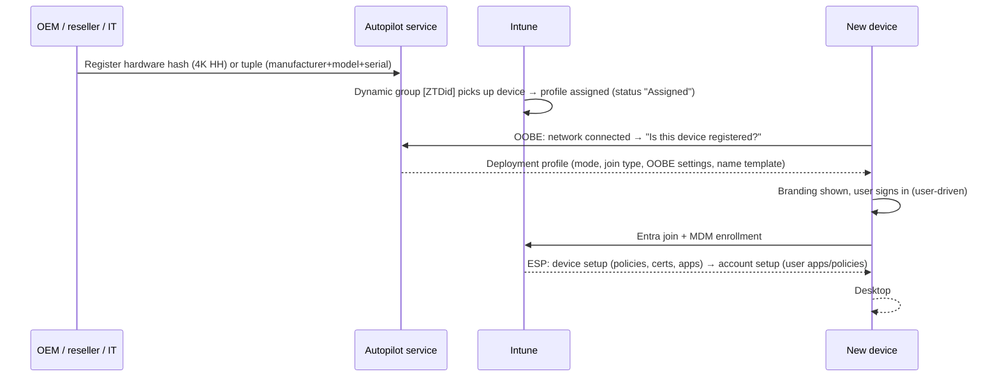

# 2.1.4 Implement Windows client deployment by using Windows Autopilot

> **Exam objective:** Implement Windows client deployment by using Windows Autopilot
>
> **Domain:** 2 - Manage and maintain devices (25-30%) · **Skill:** 2.1 Deploy and upgrade Windows clients by using cloud-based tools
>
> **Hands-on:** [LAB-2.01 Autopilot user-driven with name template and ESP](../labs/LAB-2.01-autopilot-user-driven.md)

## Concept in plain English

Windows Autopilot takes the **OEM-installed Windows** and turns it into a business-ready device over the internet. There's no imaging. The end-to-end classic flow:

1. **Register** the device (hardware hash) with the Autopilot service.
2. **Group** it (dynamic `[ZTDid]` / group tag groups).
3. **Assign** a deployment profile (+ ESP).
4. **Deploy**: the user powers on, connects, signs in, and the device joins, enrolls and installs apps.

## How it works



## Registration methods

| Method | Who | Notes |
|---|---|---|
| **OEM / Cloud Solution Provider / reseller** | Partner registers at purchase | Best. Uses Partner Center. Tuple or PKID also possible |
| **Manual CSV import** | IT, **Devices > Windows > Enrollment > Devices > Import** | CSV from `Get-WindowsAutopilotInfo` (Device Serial Number, Windows Product ID, Hardware Hash, optional Group Tag, Assigned User). Max 500 rows per CSV |
| `Get-WindowsAutopilotInfo -Online` | IT on the device | Uploads directly via Graph (needs admin consent/permissions) |
| **Convert all targeted devices to Autopilot** (profile setting) | Existing Intune Entra joined/hybrid devices | Hash registered automatically after assignment. Takes effect on next reset |

### Collecting the hash

```powershell
# On the device (OOBE: Shift+F10 opens a command prompt)
Install-Script -Name Get-WindowsAutopilotInfo -Force
Set-ExecutionPolicy -Scope Process -ExecutionPolicy Bypass -Force
Get-WindowsAutopilotInfo -OutputFile C:\Temp\AutopilotHWID.csv -GroupTag Sales
# or upload directly:
Get-WindowsAutopilotInfo -Online -GroupTag Sales
```

See also [`08-Scripts/autopilot/Export-AutopilotHash.ps1`](../../08-Scripts/autopilot/Export-AutopilotHash.ps1).

## Deployment profile settings (classic)

| Page | Setting | Notes |
|---|---|---|
| Basics | *Convert all targeted devices to Autopilot* | Registers existing enrolled devices |
| OOBE | Deployment mode | User-driven / Self-deploying |
| | Join to Microsoft Entra ID as | Entra joined / hybrid joined |
| | Microsoft Software License Terms | Hide |
| | Privacy settings | Hide |
| | Hide change account options | Hide (prevents "Sign in with a different account") |
| | **User account type** | **Standard** (recommended) / Administrator |
| | Allow pre-provisioned deployment | Yes/No |
| | Language (Region) / Automatically configure keyboard | Operating system default / specific |
| | Apply device name template | [2.1.3](2.1.3-autopilot-device-name-template.md) |
| Assignments | Device groups | Include/exclude |

**Company branding** (Entra ID > Company branding) supplies the logo and sign-in text shown during OOBE. It's required for a proper experience.

## Profile assignment states

`Not assigned` → `Assigning` → **`Assigned`**. Deploy only after the device shows **Assigned** (**Devices > Windows > Enrollment > Devices** → *Profile status*). A device OOBE'd before assignment gets the default Windows OOBE. Reset and retry.

## Licensing requirements

Windows 10/11 Pro, Enterprise, Education. Intune Plan 1. Entra ID P1 (automatic enrollment + company branding).

## Exam tips and common traps

- Order of operations: **register → group → assign profile (wait for Assigned) → deploy**.
- **Group tag** lets you target different profiles (for example, Sales vs Kiosk): `[OrderID]:Sales`.
- **Company branding in Entra ID** is required for the customized OOBE sign-in page.
- The user must be allowed to **join devices** and be in **MDM user scope**.
- To give users **standard** rights, set *User account type = Standard*.
- **Autopilot deployment report** (Devices > Monitor > Autopilot deployments) shows history for 30 days.
- Deleting an Intune device record **doesn't** deregister it from Autopilot. Deregister under **Windows Autopilot devices** (and delete the Entra object) if the device leaves the company.
- Autopilot needs network access to Microsoft endpoints (login.microsoftonline.com, ztd.dds.microsoft.com, enrollment endpoints, and so on). Proxies with authentication break OOBE.

## Real-world notes

- Ask your hardware vendor to register devices with a **group tag per site or role**. It's the single biggest time saver.
- Keep a **fallback profile** targeted by `[ZTDid]` so no Autopilot device ever gets "Not assigned".
- Troubleshoot with `mdmdiagnosticstool.exe -area Autopilot;TPM -cab c:\temp\autopilot.cab`, and the **Get-AutopilotDiagnostics** community script.

## Microsoft Learn references

- [Windows Autopilot overview](https://learn.microsoft.com/autopilot/overview)
- [Manually register devices with Windows Autopilot](https://learn.microsoft.com/autopilot/add-devices)
- [Configure Autopilot profiles](https://learn.microsoft.com/autopilot/profiles)
- [User-driven Microsoft Entra join tutorial](https://learn.microsoft.com/autopilot/tutorial/user-driven/azure-ad-join-workflow)
- [Windows Autopilot networking requirements](https://learn.microsoft.com/autopilot/requirements?tabs=networking)
- [Troubleshoot Autopilot](https://learn.microsoft.com/autopilot/troubleshooting-faq)
