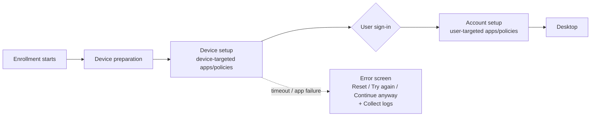

# 2.1.5 Create an Enrollment Status Page (ESP)

> **Exam objective:** Create an Enrollment Status Page (ESP)
>
> **Domain:** 2 - Manage and maintain devices (25-30%) · **Skill:** 2.1 Deploy and upgrade Windows clients by using cloud-based tools
>
> **Hands-on:** [LAB-2.01 Autopilot user-driven with name template and ESP](../labs/LAB-2.01-autopilot-user-driven.md)

## Concept in plain English

The **Enrollment Status Page** is the progress screen shown during Windows enrollment (Autopilot or OOBE Entra join). It can **block** the user from reaching the desktop until required apps, policies and certificates are installed. Without it, users land on a half-configured desktop.

ESP phases:

1. **Device preparation** - TPM attestation, Entra join, MDM enrollment, Intune Management Extension (IME) install.
2. **Device setup** - device-targeted policies, certificates, network profiles, apps.
3. **Account setup** - user-targeted policies and apps (after user sign-in; skipped for self-deploying).

## How it works

## Key ESP settings

| Setting | Recommended | Notes |
|---|---|---|
| **Show app and profile configuration progress** | Yes | Turns the ESP on |
| **Show an error when installation takes longer than** (minutes) | 60-90 | Default 60 |
| Show custom message when time limit or error occurs | Yes + help desk contact | |
| Turn on log collection and diagnostics page for end users | Yes | Lets users export logs |
| **Only show page to devices provisioned by OOBE** | Yes | Prevents ESP on existing devices that enroll later |
| **Block device use until all apps and profiles are installed** | Yes | Otherwise users can continue |
| Allow users to reset device if installation error occurs | Yes | |
| Allow users to use device if installation error occurs | No (production) | "Continue anyway" |
| **Block device use until required apps are installed if they are assigned to the user/device** | **Selected** apps | Track only the critical apps (**max 100**) instead of *All* |
| Only fail selected blocking apps in technician phase | Yes (pre-provisioning) | Non-blocking app failures don't fail pre-provisioning |
| **Install Windows quality updates** (might restart the device) | Yes (default for new profiles) | Installs the monthly security update during OOBE. Also required by Windows Backup restore |

### Assignment and priority

- A **default** ESP profile applies to all users and devices. Create additional profiles and assign them to **user or device groups** with **priority**. Assign to **device groups** for Autopilot, because the device-phase ESP evaluates before a user exists.
- Only one ESP profile applies (highest priority).

### Hide the account setup phase

Some organizations skip the user ESP phase to speed up sign-in. Use a **custom OMA-URI**: `./Vendor/MSFT/DMClient/Provider/MS DM Server/FirstSyncStatus/SkipUserStatusPage` = `True` (Boolean).

## Licensing requirements

Intune Plan 1.

## Configuration steps

1. **Devices > Windows > Enrollment > Enrollment Status Page > Create**.
2. Configure settings (table above). Pick **Selected** blocking apps: Microsoft 365 Apps, Company Portal, security agent, VPN client.
3. Assign to `DG-Lab-Autopilot` → set priority.

## Exam tips and common traps

- **"Users must not reach the desktop until BitLocker, Wi-Fi and the VPN app are applied"** → ESP with **Block device use until all apps and profiles are installed** + blocking apps.
- ESP tracks **required** apps assigned to the user or device. **Available** apps aren't tracked.
- **Don't mix LOB (MSI) and Win32 apps** in the ESP with classic Autopilot. Mixed installers (TrustedInstaller conflicts) are a classic failure. Package everything as Win32.
- Timeout errors → increase the timeout, or reduce blocking apps to the critical few.
- ESP **device setup** handles device-targeted items. **Account setup** handles user-targeted items. Self-deploying has **no** account setup.
- **Device preparation** (Autopilot v2) doesn't use the ESP.
- *Only show page to devices provisioned by OOBE* stops ESP from appearing when someone enrolls an existing PC via Settings.

## Real-world notes

- Default *All apps* blocking in large tenants = 2-hour OOBE. Always use **Selected** apps.
- Log collection on the error page saves a desk visit: have users email the ZIP, or use **Collect diagnostics** remotely.
- Track ESP failures in **Devices > Monitor > Autopilot deployments** and the IME log `C:\ProgramData\Microsoft\IntuneManagementExtension\Logs\IntuneManagementExtension.log`.

## Microsoft Learn references

- [Set up the Enrollment Status Page](https://learn.microsoft.com/intune/device-enrollment/windows/setup-status-page)
- [Troubleshoot the ESP](https://learn.microsoft.com/troubleshoot/mem/intune/device-enrollment/understand-troubleshoot-esp)
- [Windows Autopilot and Win32/LOB app considerations](https://learn.microsoft.com/autopilot/windows-autopilot-scenarios)
