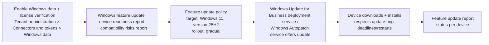

# 2.1.6 Plan and implement device upgrades for Windows 11 by using Intune

> **Exam objective:** Plan and implement device upgrades for Windows 11 by using Intune
>
> **Domain:** 2 - Manage and maintain devices (25-30%) · **Skill:** 2.1 Deploy and upgrade Windows clients by using cloud-based tools
>
> **Hands-on:** [LAB-2.04 Windows 11 upgrade](../labs/LAB-2.04-windows-11-upgrade.md)

## Concept in plain English

Windows 10 reached **end of support on October 14, 2025**. Intune moves Windows 10 devices to Windows 11, and moves Windows 11 devices between versions (for example 23H2 → 24H2 → 25H2), without reimaging, using a **Feature updates for Windows 10 and later** policy. The key steps:

1. **Assess** hardware readiness (TPM 2.0, Secure Boot, supported CPU, 4 GB RAM, 64 GB storage, UEFI).
2. **Check app compatibility** risks.
3. **Target** eligible devices with a feature update policy (phased with rollout options).
4. **Monitor** and remediate.

There's also an **edition upgrade** path (for example Pro → Enterprise) that's separate from the version upgrade.

## How it works

The feature update policy **holds** devices at the chosen version (they won't go beyond it) and **offers** that version if they're below it. Update rings still control deferrals, deadlines and restart behaviour (objective [3.2.2](../../03-Protect-Devices/docs/3.2.2-update-rings-feature-quality-updates.md)).

> Devices that don't meet Windows 11 hardware requirements **stay on Windows 10** even if targeted, and report as ineligible.

## Licensing requirements

| Capability | Requirement |
|---|---|
| Feature update policy | Intune + Windows Enterprise E3/E5, Education A3/A5, Microsoft 365 Business Premium, or Windows 365 Enterprise (Windows Autopatch service prerequisites) |
| Readiness and compatibility reports | Same, plus **Windows diagnostic data** enabled and **Windows license verification** in *Windows data* |
| Endpoint analytics *Work from anywhere* Windows 11 readiness | Endpoint analytics enrollment (Intune Plan 1) |
| Edition upgrade via subscription activation | Windows Enterprise E3/E5 user license, Entra joined/hybrid joined |

## Configuration steps

### 1. Enable the Windows data connector

**Tenant administration > Connectors and tokens > Windows data** → *Enable features that require Windows diagnostic data in processor configuration* = **On** → *I confirm that my tenant owns one of these licenses* (Windows license verification) = **On**. Also configure devices with diagnostic data at **Required** or higher (settings catalog: *System > Allow Telemetry*).

### 2. Assess readiness

- **Reports > Windows updates > Reports > Windows feature update device readiness report** → choose target (Windows 11 25H2) → review *Upgrade blocked*, *Replace device*, *Low/Medium risk*.
- **Windows feature update compatibility risks report** → apps and drivers with known issues.
- **Endpoint analytics > Work from anywhere > Windows** → Windows 11 readiness per device.

### 3. Create the feature update policy

1. **Devices > Windows updates > Feature updates > Create profile**.
2. *Feature update to deploy*: **Windows 11, version 25H2**.
3. *When a device isn't capable of running Windows 11, install the latest Windows 10 feature update* - toggle (only relevant to Windows 10 fleets).
4. **Rollout options**: *Make update available as soon as possible* / *Make update available on a specific date* / **Make update available gradually** (start date, end date, days between groups).
5. Assign to a pilot device group → then broad groups.

### 4. Monitor

- **Reports > Windows updates > Feature update report** (per policy): *Installed*, *In progress*, *Error*, *Cancelled*, *Ineligible* with alert details (for example, *Safeguard hold*).
- Safeguard holds: Microsoft blocks the update on devices with known compatibility issues. You can opt out with the *Disable safeguards* setting in the update ring. This is **not** recommended.

### Edition upgrade (Pro → Enterprise)

- Preferred: **Windows subscription activation**. An Entra user with a Windows Enterprise E3/E5 license signs in to a Pro device, which **steps up** to Enterprise automatically with no reboot.
- Alternative: **Edition upgrade and mode switch** configuration profile (template) with a product key or KMS key.

## Comparison: ways to reach Windows 11

| Method | When |
|---|---|
| **Feature update policy** (in-place) | Existing Windows 10/11 devices that meet hardware requirements |
| Windows Autopilot on new hardware | Hardware refresh |
| Autopilot for existing devices / reimage | Unsupported old install, but hardware OK |
| Windows 365 Cloud PC | Old endpoints you can't replace - stream Windows 11 |
| Extended Security Updates (Windows 10) | Temporary bridge (paid) |

## Exam tips and common traps

- **Use feature update policies, not update rings, to choose the target version.** Update rings only defer feature updates by days.
- Setting a ring's *Feature update deferral* to 365 days **doesn't** block a feature update policy's target version. The feature update policy takes precedence for the offer.
- Readiness reports need the **Windows data** connector and license verification turned on.
- Devices **without TPM 2.0 / supported CPU** can't be upgraded. The report shows *Replace device*.
- **Subscription activation** converts Pro → Enterprise when a licensed Entra user signs in. You don't need to reinstall.
- A feature update policy **won't downgrade** devices already on a newer version.

## Real-world notes

- Use **gradual rollout** with 7-day spacing. It spreads download load and catches app issues early.
- Pair with **Delivery Optimization** (objective [3.2.6](../../03-Protect-Devices/docs/3.2.6-delivery-optimization.md)) - a Windows 11 feature update is several GB.
- Keep a separate feature update policy for exception devices (for example, lab equipment pinned to an older version). Remember that a pinned version reaches end of servicing.

## Microsoft Learn references

- [Feature updates for Windows 10 and later policy](https://learn.microsoft.com/intune/device-updates/windows/feature-updates)
- [Windows feature update device readiness and compatibility risks reports](https://learn.microsoft.com/intune/device-updates/windows/readiness-reports)
- [Enable Windows data](https://learn.microsoft.com/intune/fundamentals/tenant-administration/data-enable-windows-data)
- [Windows 11 requirements](https://learn.microsoft.com/windows/whats-new/windows-11-requirements)
- [Windows subscription activation](https://learn.microsoft.com/windows/deployment/windows-subscription-activation)
