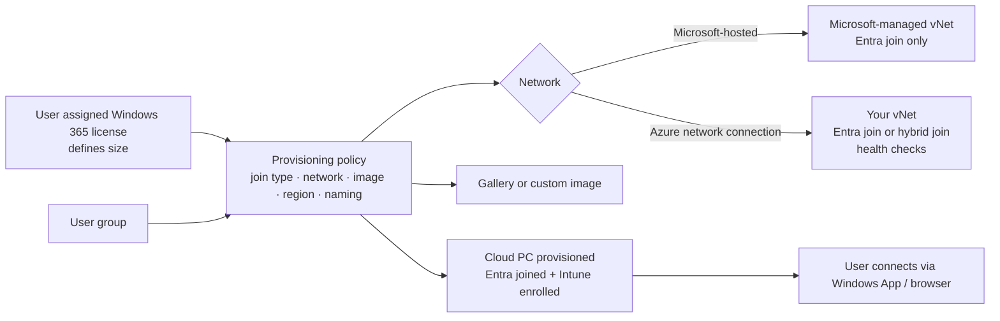

# 2.1.7 Provision and configure Windows 365 Cloud PCs by using Intune

> **Exam objective:** Provision and configure Windows 365 Cloud PCs by using Intune, including provisioning policies, network connections, and image management
>
> **Domain:** 2 - Manage and maintain devices (25-30%) · **Skill:** 2.1 Deploy and upgrade Windows clients by using cloud-based tools
>
> **Hands-on:** [LAB-2.05 Windows 365 Cloud PC provisioning](../labs/LAB-2.05-windows-365-cloud-pc.md)

## Concept in plain English

**Windows 365** streams a personal (or shared) **Cloud PC** from Microsoft's cloud. Each Cloud PC is a real Windows 11 Enterprise VM that's **Entra joined (or hybrid joined), enrolled in Intune**, and managed exactly like a physical device. You provision Cloud PCs from the **Intune admin center > Devices > Windows 365**.

Three building blocks:

| Block | Answers the question |
|---|---|
| **Provisioning policy** | *Who* gets a Cloud PC, with *which join type*, *which network*, *which image*, *which region*, *which language* |
| **Network** | *Microsoft-hosted network* (no Azure subscription needed) or **Azure network connection (ANC)** to your own Azure vNet |
| **Image** | *Gallery image* (Windows 11 Enterprise + Microsoft 365 Apps, optimized) or **custom image** uploaded from an Azure managed image |

Plus **user settings** policies (local admin rights, restore points, users can create restore points) and **Cloud PC size** (from the license).

## Editions

| Edition | Licensing | Management |
|---|---|---|
| **Windows 365 Enterprise** | Per user, fixed size (vCPU/RAM/storage) | Intune, custom images, ANC, full features |
| **Windows 365 Frontline** | Dedicated mode: 1 license = up to 3 users, one active at a time. **Shared mode**: pool of non-persistent Cloud PCs for a group | Intune |
| **Windows 365 Business** | Per user, ≤300 seats, self-service | No custom images, no ANC, optional Intune |
| **Windows 365 Flex** / Link | Flexible/shared scenarios and Windows 365 Link thin-client hardware | Intune |

## How it works

## Licensing requirements

- Windows 365 license per user (or per Frontline seat). Each user also needs **Windows Enterprise E3, Intune, and Entra ID P1** (included in Microsoft 365 E3/E5).
- ANC requires an **Azure subscription** with a vNet. Hybrid join also needs line of sight to AD DS domain controllers from that vNet.

## Configuration steps

### 1. Network

| Option | Requirements | Choose when |
|---|---|---|
| **Microsoft-hosted network** | None - pick a **region** in the provisioning policy | Cloud-native, Entra join, no need to reach on-prem |
| **Azure network connection** | Azure subscription, resource group, vNet/subnet with DNS resolving AD (hybrid), outbound access to W365 endpoints. For hybrid: domain, OU, service account with join rights | Access to on-prem/private resources over your network, hybrid join, custom routing/firewall |

**Devices > Windows 365 > Azure network connection > Create** → Entra join or hybrid join → subscription/vNet/subnet → (hybrid) AD domain, OU, credentials. Intune runs **health checks** (DNS, domain join, endpoints, Intune enrollment, Entra device sync). Status must be **Passed** before use.

### 2. Images

- **Gallery images:** Windows 11 Enterprise + Microsoft 365 Apps (*Windows 365 optimized*: Teams media optimization, language packs available).
- **Custom images:** create a **Gen2 generalized Azure managed image** (sysprep'd Windows 11 Enterprise) → **Devices > Windows 365 > Custom images > Add** → select subscription and image. Intune copies it. Status must be *Upload successful*.

### 3. Provisioning policy

**Devices > Windows 365 > Provisioning policies > Create policy**:

| Setting | Options |
|---|---|
| License type | Enterprise / Frontline (dedicated or shared) |
| Join type | **Microsoft Entra join** (Microsoft-hosted network or ANC) / **Microsoft Entra hybrid join** (ANC only) |
| Network / region | Microsoft-hosted + geography/region, or ANC |
| Single sign-on | **Use Microsoft Entra single sign-on** (recommended) |
| Image | Gallery / custom |
| Language & region | Installs language pack |
| Additional services | Windows Autopatch |
| Cloud PC naming | Template, for example `CPC-%USERNAME:5%-%RAND:5%` |
| Assignments | User groups (for Frontline, pick the license size per group) |

When a licensed user in the assigned group appears, provisioning takes roughly 30-60 minutes. Status: *Provisioning → Provisioned*.

### 4. User settings

**Devices > Windows 365 > User settings > Create** → *Enable local admin*, **Point-in-time restore** frequency (for example, every 12 hours), *Allow user to initiate restore*. Assign to user groups.

### 5. Manage Cloud PCs

Remote actions: **Reprovision**, **Restore** (point-in-time), **Resize** (change license size), **Restart**, **Collect diagnostics**, **Place under review** (forensics snapshot). Plus the **Connection quality**, **Cloud PC utilization** and **Cloud PC performance** reports. **Alerts** under *Tenant administration > Cloud PC alerts*.

## Comparison: Microsoft-hosted network vs ANC

| | Microsoft-hosted | Azure network connection |
|---|---|---|
| Azure subscription | ❌ | ✅ |
| Hybrid join | ❌ | ✅ |
| Reach on-prem resources | Via VPN client/ZTNA from the Cloud PC | Native routing (ExpressRoute/VPN from vNet) |
| Maintenance | Microsoft | You (DNS, NSG, routes, health checks) |
| Setup time | Minutes | Hours |

## Exam tips and common traps

- **"Cloud PCs must be hybrid joined"** → you **must** use an **Azure network connection**. The Microsoft-hosted network supports Entra join only.
- **"Minimize administrative effort / no Azure subscription"** → Microsoft-hosted network + Entra join + gallery image.
- Custom images must be **Gen2**, **generalized**, **Windows 11 Enterprise** (or supported Windows 10 builds), and at most 128 GB (64 GB recommended).
- Provisioning policies are assigned to **user groups**. Cloud PC **size** comes from the **license**, not the policy (Frontline shared mode is the exception).
- Changing a provisioning policy's image doesn't rebuild existing Cloud PCs. **Reprovision** does, and it wipes user data.
- **Windows 365 Business** can't use custom images or ANCs.
- RBAC: **Windows 365 Administrator** (Entra) or **Cloud PC Administrator** (Intune role) - see objective 1.3.1.

## Real-world notes

- Start with **Microsoft-hosted + Entra join**. Add ANC only when you truly need private routing or hybrid join; ANC health issues (DNS) are the #1 support topic.
- Enable **Windows Autopatch** in the provisioning policy to keep Cloud PCs on the same update cadence as physical devices.
- Use **restore points** as the user-facing "undo" button. It cuts reprovision requests.

## Microsoft Learn references

- [What is Windows 365 Enterprise?](https://learn.microsoft.com/windows-365/enterprise/overview)
- [Create a provisioning policy](https://learn.microsoft.com/windows-365/enterprise/create-provisioning-policy)
- [Network deployment options](https://learn.microsoft.com/windows-365/enterprise/deployment-options)
- [Create an Azure network connection](https://learn.microsoft.com/windows-365/enterprise/create-azure-network-connection)
- [Add custom device images](https://learn.microsoft.com/windows-365/enterprise/add-device-images)
- [Windows 365 Frontline](https://learn.microsoft.com/windows-365/enterprise/introduction-windows-365-frontline)
