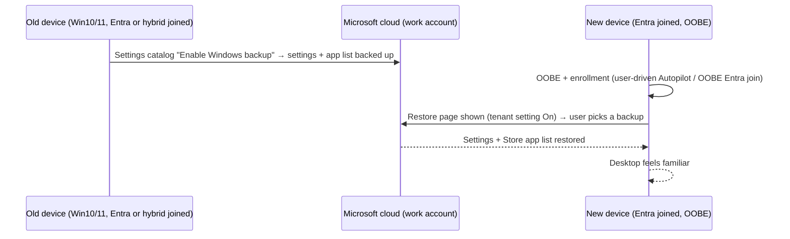

# 2.1.8 Implement Windows Backup by using Intune

> **Exam objective:** Implement Windows Backup by using Intune
>
> **Domain:** 2 - Manage and maintain devices (25-30%) · **Skill:** 2.1 Deploy and upgrade Windows clients by using cloud-based tools
>
> **Hands-on:** [LAB-2.06 Windows Backup](../labs/LAB-2.06-windows-backup.md)

## Concept in plain English

**Windows Backup for Organizations** lets users back up their **Windows settings** (accessibility, personalization, language/region, Wi-Fi-related preferences and the list of Microsoft Store apps) to the cloud with their work account, and **restore** them during OOBE on a new or reset device. It makes hardware refresh, Windows 10 → 11 migration and device resets far less disruptive.

It's **not** a file backup. Files belong in **OneDrive** (Known Folder Move).

Two parts, configured in **two places**:

| Part | Where in Intune | Scope |
|---|---|---|
| **Backup** | **Settings catalog > Sync your settings > Enable Windows backup** | Group-targeted (device/user) |
| **Restore** | **Devices > Enrollment > Windows > Windows Backup and Restore > Show restore page = On** | **Tenant-wide**, applied at enrollment |

## How it works

## Requirements

| | Backup | Restore |
|---|---|---|
| Join type | Entra joined **or** hybrid joined | **Entra joined only** |
| OS | Windows 10 22H2 (19044.6216+), Windows 11 22H2/23H2 (…5768+), 24H2 (26100.4946+) | Windows 11 22H2+ (22621.3958+), 23H2 (22631.3958+), 24H2 (26100.1301+), or the August 2025 cumulative update |
| Other | - | User has at least one backup. ESP setting **Install Windows quality updates** enabled (for builds older than July 2025). Autopilot must be **user-driven** |
| Role to configure restore | - | **Intune Service Administrator** (or Global Administrator) |

**Not supported for restore:** hybrid join, workplace join (registered), **self-deploying**, **pre-provisioning technician flow**, **Autopilot Reset**, enrollment through the Settings app, GPO enrollment, co-management enrollment, shared/userless devices, Government clouds.

## Licensing requirements

Intune Plan 1. Entra ID (work account). No extra add-on.

## Configuration steps

1. **Backup:** **Devices > Configuration > Create > Windows 10 and later > Settings catalog** → search **Sync your settings** → **Enable Windows backup** = Enabled → assign to users/devices.
   - Make sure the Connectivity policies that the backup depends on aren't set to *Disabled*.
2. **Restore:** **Devices > Enrollment > Windows** → **Windows Backup and Restore** → **Show restore page** = **On** → Save.
3. ESP: make sure *Install Windows quality updates* is on in your Enrollment Status Page profile.
4. On the new device: user-driven OOBE → sign in → a **Restore from backup** page lists previous devices → choose one → continue, or *Set up as new PC*.

### Reporting

**Devices > Windows > [device] > Enrollment** → *Windows Backup and Restore profile* status: *Not applicable*, *No policy assigned*, *Succeeded*, *Failed*, *No Backup Profiles*, *Setup as New PC Selected*.

## Comparison: what moves where

| Data | Tool |
|---|---|
| Windows settings, preferences, Store app list | **Windows Backup for Organizations** |
| Files (Desktop, Documents, Pictures) | **OneDrive Known Folder Move** |
| Microsoft 365 Apps settings | Cloud roaming (Office cloud policy / roaming settings) |
| Edge favorites/passwords | Edge sync with work account |
| Line-of-business apps | Reinstalled by Intune assignments |
| Device configuration | Intune policies (reapplied) |

## Exam tips and common traps

- **Restore is tenant-wide** and configured under **Enrollment**. **Backup** is a **settings catalog** policy. Questions often swap them.
- Restore requires **Entra join**. **Hybrid joined** devices can back up but can't restore.
- **Self-deploying** and **pre-provisioning technician** flows can't show the restore page (no user).
- Windows Backup doesn't back up files. Pair it with **OneDrive KFM**.
- Changing the restore setting only affects devices that **enroll after** the change.

## Real-world notes

- Turn on backup **months before** a refresh project so users have backups to restore.
- Combine with Autopilot user-driven + OneDrive KFM + Edge sync for a near "zero-touch migration" to new hardware.

## Microsoft Learn references

- [Windows Backup for Organizations in Microsoft Intune](https://learn.microsoft.com/intune/device-enrollment/windows/enable-backup-restore)
- [Windows settings backup and restore overview](https://learn.microsoft.com/windows/configuration/windows-backup/)
- [Windows device recovery framework](https://learn.microsoft.com/windows/configuration/windows-device-recovery-framework)
- [Redirect known folders to OneDrive](https://learn.microsoft.com/sharepoint/redirect-known-folders)
