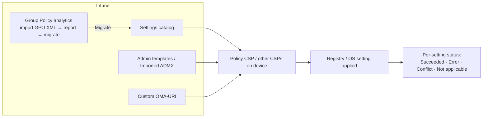

# 2.2.1 Create device configuration profiles for Windows devices

> **Exam objective:** Create device configuration profiles for Windows devices, including importing ADMX files and using Group Policy analytics
>
> **Domain:** 2 - Manage and maintain devices (25-30%) · **Skill:** 2.2 Plan and implement device configuration profiles
>
> **Hands-on:** [LAB-2.07 Settings catalog, ADMX import, Group Policy analytics and OMA-URI](../labs/LAB-2.07-windows-settings-catalog-admx-gpa.md)

## Concept in plain English

Configuration profiles **push settings** to devices through MDM **Configuration Service Providers (CSPs)** - the MDM equivalent of Group Policy. For Windows you have several profile *types*. Choosing the right one is a classic exam topic.

| Profile type | Use for | Notes |
|---|---|---|
| **Settings catalog** | Almost everything (5,000+ settings: Windows, Edge, Office, OneDrive, Defender, BitLocker, WHfB...) | **Default choice**. Searchable, shows the CSP, supports "Add settings" by keyword |
| **Templates > Administrative templates** | Built-in ADMX-backed settings (Windows, Office, Edge, OneDrive) | Legacy UI. Most content is also in the settings catalog |
| **Imported administrative templates** (custom ADMX) | **Third-party / in-house ADMX** (for example, Chrome, Zoom, Adobe, your own app) | Upload ADMX + ADML, then configure in *Templates > Imported Administrative templates* |
| **Templates > Custom** (OMA-URI) | CSP settings not exposed elsewhere, ADMX ingestion via OMA-URI | Strings, integers, XML payloads |
| **Templates > Wi-Fi, VPN, Trusted certificate, SCEP, PKCS, Email, Kiosk, Delivery Optimization, Domain Join, Edition upgrade, Device firmware (DFCI), Network boundary, Secure assessment...** | Scenario-specific payloads | Certificates and VPN/Wi-Fi reference each other |
| **Properties catalog** | Hardware/software **inventory** collection | Feeds Resource Explorer and device query for multiple devices |

**Group Policy analytics** analyses exported GPOs, reports MDM support for each setting, and **migrates** supported settings to a settings catalog policy.

## How it works



**Conflicts:** if two profiles set the same setting to **different** values, both report *Conflict* and neither value is guaranteed. Endpoint security, security baselines and settings catalog policies share the same CSPs, so conflicts can occur across them. With **Group Policy vs MDM** on hybrid devices, Group Policy wins by default unless you set **ControlPolicyConflict/MDMWinsOverGP** (Policy CSP, settings catalog: *Control Policy Conflict > MDM Wins Over GP*).

## Licensing requirements

Intune Plan 1. Some settings require Windows Enterprise/Education (for example, certain AppLocker/Credential Guard/Start layout settings). The settings catalog shows *Applies to* editions.

## Configuration steps

### Settings catalog

**Devices > Configuration > Create > New policy > Windows 10 and later > Settings catalog** → **Add settings** → search (for example, *"Camera"*) → select category → tick settings → configure → scope tags → assign.

Tip: the **ⓘ** icon shows the underlying CSP path, for example `./Device/Vendor/MSFT/Policy/Config/Camera/AllowCamera`.

### Import custom ADMX / ADML

1. **Devices > Configuration > Import ADMX > Import** → upload `contoso.admx` + `en-US\contoso.adml`.
2. Upload **dependencies first**. For example, many ADMX files reference `windows.admx` categories (already present). Some vendors need their base/"common" ADMX first. Upload fails with *"ADMX file referenced not found"* if a dependency is missing.
3. Wait for status **Available**.
4. **Create > Templates > Imported Administrative templates (Preview)** → configure the settings → assign.

Limits: 20 ADMX files per tenant (check current limits). Each file ≤1 MB. Only one language (ADML) is used.

### Group Policy analytics

1. On a DC: `Get-GPOReport -Name "Contoso Workstation Baseline" -ReportType Xml -Path C:\Temp\baseline.xml` (or GPMC > Save Report as XML).
2. **Devices > Manage devices > Group Policy analytics > Import** → upload the XML.
3. Review **MDM Support %**, per-setting *Supported / Not supported / Deprecated*, CSP mapping, and the **Min OS version**.
4. Select supported settings → **Migrate** → creates a **settings catalog** policy (review before assigning).
5. **Reports > Group policy analytics** shows the migration readiness summary.

### Custom OMA-URI example

| Name | OMA-URI | Type | Value |
|---|---|---|---|
| Hide "Recommended" in Start | `./Device/Vendor/MSFT/Policy/Config/Start/HideRecommendedSection` | Integer | `1` |

### Microsoft Graph

```powershell
Connect-MgGraph -Scopes DeviceManagementConfiguration.Read.All
# Settings catalog policies live under configurationPolicies (beta)
Invoke-MgGraphRequest GET 'https://graph.microsoft.com/beta/deviceManagement/configurationPolicies?$select=name,platforms,technologies,lastModifiedDateTime' |
  Select-Object -ExpandProperty value | Format-Table name, platforms, lastModifiedDateTime
```

## Comparison: which profile type?

| Need | Best choice |
|---|---|
| Disable camera, configure Edge, OneDrive KFM | Settings catalog |
| Configure Google Chrome or an in-house app with ADMX | Import ADMX |
| Assess an existing GPO estate for cloud migration | Group Policy analytics |
| Setting exists in a CSP but not in the catalog | Custom OMA-URI |
| Wi-Fi with certificates, VPN, SCEP/PKCS | Templates |
| Hybrid Autopilot domain join | Domain Join template |
| Collect inventory for device query | Properties catalog |

## Exam tips and common traps

- **"Migrate existing GPOs to Intune with the least effort"** → **Group Policy analytics** → Migrate.
- **"Configure settings for a third-party app that ships ADMX templates"** → **Import ADMX** (upload dependencies first).
- The **settings catalog** is the recommended place for new policies. Admin templates and many templates are legacy.
- A **Conflict** status means two policies disagree - fix it by removing one value. Don't assume "last write wins".
- On hybrid/co-managed devices GP can override MDM unless **MDMWinsOverGP** is set (it doesn't cover every GP area).
- **Device vs user scope:** settings catalog settings marked *(User)* apply in the user context. Assign them to user groups or all-devices depending on scenario.

## Real-world notes

- Export the Group Policy analytics report per GPO and track the unsupported settings list. Most are legacy (IE, old SMB) and can be dropped.
- One setting in one policy: keep settings modular (for example, `WIN - Edge - Security`, `WIN - OneDrive - KFM`) to avoid conflicts and make troubleshooting easy.
- Use **assignment filters** instead of cloning policies per model or OS version.

## Microsoft Learn references

- [Use the settings catalog](https://learn.microsoft.com/intune/device-configuration/settings-catalog/)
- [Import custom ADMX and ADML templates](https://learn.microsoft.com/intune/device-configuration/templates/administrative-templates-import-custom)
- [Group Policy analytics](https://learn.microsoft.com/intune/device-configuration/group-policy-analytics)
- [Custom settings for Windows (OMA-URI)](https://learn.microsoft.com/intune/device-configuration/templates/custom-settings-windows-10)
- [Policy CSP](https://learn.microsoft.com/windows/client-management/mdm/policy-configuration-service-provider)
- [Properties catalog](https://learn.microsoft.com/intune/device-configuration/collect-device-properties)
