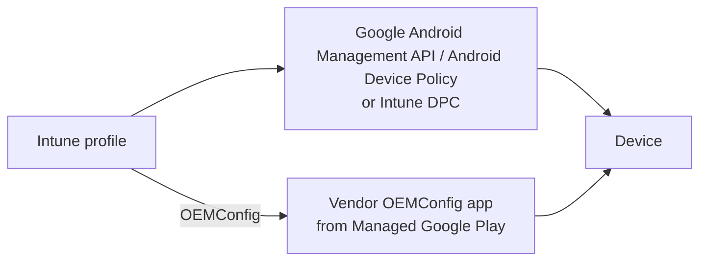

# 2.2.2 Create device configuration profiles for Android devices

> **Exam objective:** Create device configuration profiles for Android devices
>
> **Domain:** 2 - Manage and maintain devices (25-30%) · **Skill:** 2.2 Plan and implement device configuration profiles
>
> **Hands-on:** [LAB-2.08 Android, iOS and macOS configuration profiles](../labs/LAB-2.08-mobile-macos-configuration-profiles.md)

## Concept in plain English

Android profiles are built for a specific **Android Enterprise management mode**. The settings available depend on it:

| Mode | Scope of settings |
|---|---|
| Personally owned work profile | **Work profile only** (copy/paste between profiles, screen capture in work profile, work profile passcode) |
| Corporate-owned work profile (COPE) | Device-level (limited) + work profile |
| Fully managed / dedicated | **Whole device** (camera, USB, factory reset, kiosk, system updates, Wi-Fi) |
| AOSP (user-associated / userless) | Small set (passwords, Wi-Fi, certs, some restrictions) |

## Profile types (Android Enterprise)

| Type | Examples |
|---|---|
| **Settings catalog** (growing) | Device and work-profile restrictions. Microsoft is moving templates here, and personally owned work profile devices on Android Management API should use it |
| **Device restrictions** template | Camera, screen capture, factory reset, USB file transfer, Play Store access, **system update** policy, **dedicated device kiosk mode** (single-app/multi-app via **Managed Home Screen**), passwords |
| **Wi-Fi** | WPA/WPA2/WPA3 personal, enterprise EAP with certificates |
| **VPN** / per-app VPN | Microsoft Tunnel, Cisco, and others |
| **Trusted certificate / SCEP / PKCS** | Certificates for Wi-Fi, VPN, email |
| **Email** | Gmail / Nine Work (Outlook uses app configuration instead) |
| **OEMConfig** | Vendor-specific settings (Zebra, Samsung Knox Service Plugin, Honeywell) via the vendor's OEMConfig app in Managed Google Play |
| **Derived credential** | Smart-card-based scenarios |
| **Custom** (OMA-URI) | **No longer supported** for personally owned work profile devices. Limited elsewhere |

## How it works

For Android Enterprise, Intune sends policy through Google's **Android Management API** (AMAPI). The on-device **Android Device Policy** app enforces it. Settings are always evaluated in the context of the device's enrollment type.

## Licensing requirements

Intune Plan 1. OEMConfig and some specialty scenarios need a supported OEM. FOTA needs Intune Plan 2 (objective 3.2.5).

## Configuration steps

1. **Devices > Configuration > Create > New policy** → Platform **Android Enterprise** → Profile type (for example, **Device restrictions** under *Fully managed, dedicated, and corporate-owned work profile*, or under *Personally owned work profile*).
2. Example corporate policy:
   - General: *Screen capture* Block, *Camera* Allow, *Factory reset* Block, *USB file transfer* Block
   - Password: minimum length 6, *Require unlock with* Numeric complex
   - System update: **Automatic** or **Maintenance window** (02:00-04:00)
3. Example personally owned work profile policy: *Copy and paste between work and personal profiles* = Block. *Data sharing between work and personal profiles* = Apps in work profile can handle sharing requests from personal profile. *Work profile password* required.
4. Dedicated kiosk: **Device restrictions > Device experience** → *Kiosk mode* **Multi-app** → add apps (Managed Home Screen is auto-added) → customize the home screen, exit PIN.
5. Assign to groups (use **filters** by `enrollmentProfileName` for dedicated device types).

## Comparison: work profile vs fully managed controls

| Control | BYOD work profile | Fully managed |
|---|---|---|
| Block camera | Work apps only | Whole device |
| Block factory reset | ❌ | ✅ |
| Kiosk (lock task) | ❌ | Dedicated only |
| System update policy | ❌ | ✅ |
| Personal app inventory | ❌ | N/A (no personal side) |
| Wi-Fi profile | Work profile scoped | Device |

## Exam tips and common traps

- The profile must match the **enrollment type**. A fully managed restriction doesn't apply to a personally owned work profile device.
- **Kiosk mode** = **dedicated** devices + **Managed Home Screen** (multi-app).
- Vendor-specific settings (Zebra barcode scanner, Samsung Knox extras) → **OEMConfig**.
- Outlook configuration on Android isn't an email profile. It's an **app configuration policy** (objective 4.2.3).
- **Custom OMA-URI profiles aren't supported** on personally owned work profile devices. Use built-in/settings catalog settings.

## Real-world notes

- Keep one baseline per management mode, plus small targeted policies (Wi-Fi per site) with **filters**.
- Managed Home Screen supports **session PINs**, sign-in with Entra shared device mode, and automatic sign-out - ideal for shared frontline devices.

## Microsoft Learn references

- [Android Enterprise device restriction settings](https://learn.microsoft.com/intune/device-configuration/templates/ref-device-restrictions-android-enterprise)
- [Android Enterprise settings in the settings catalog](https://learn.microsoft.com/intune/device-configuration/settings-catalog/ref-android-settings)
- [Use OEMConfig on Android Enterprise devices](https://learn.microsoft.com/intune/device-configuration/templates/configure-oemconfig-android)
- [Configure Microsoft Managed Home Screen](https://learn.microsoft.com/intune/app-management/configuration/app-configuration-managed-home-screen-app)
