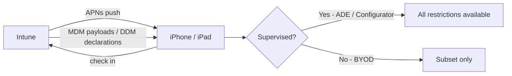

# 2.2.3 Create device configuration profiles for iOS/iPadOS devices

> **Exam objective:** Create device configuration profiles for iOS/iPadOS devices
>
> **Domain:** 2 - Manage and maintain devices (25-30%) · **Skill:** 2.2 Plan and implement device configuration profiles
>
> **Hands-on:** [LAB-2.08 Android, iOS and macOS configuration profiles](../labs/LAB-2.08-mobile-macos-configuration-profiles.md)

## Concept in plain English

iOS/iPadOS settings are delivered as Apple **configuration profiles** (payloads) and, increasingly, through **Declarative Device Management (DDM)**. Many restrictions only work on **supervised** devices (ADE or Apple Configurator), so enrollment type matters as much as the setting.

| Profile type | Examples |
|---|---|
| **Settings catalog** | Restrictions, passcode, Wi-Fi, **software update (DDM)**, accounts, notifications - Apple's newest payloads land here first |
| **Device restrictions** (template) | App Store, camera, AirDrop, screen capture, account modification (supervised), **Activation Lock**, **show/hide apps** |
| **Device features** | **Single sign-on app extension** (Microsoft Entra ID / Kerberos), AirPrint, **Home Screen layout** (supervised), lock screen message, notifications, **Wallpaper** |
| **Wi-Fi / VPN / Trusted certificate / SCEP / PKCS / Email** | Network and identity |
| **Custom** | Upload a `.mobileconfig` created with Apple Configurator/iMazing Profile Editor |
| **Derived credential**, **Education (Shared iPad)** | Specialized |

## How it works

**DDM** lets the device enforce and report status autonomously (for example, *enforce iOS 18.5 by date X*), with fewer MDM round-trips. Software updates for Apple are now configured through **settings catalog DDM** (objective 3.2.4).

## Licensing requirements

Intune Plan 1. APNs certificate. Supervision via ABM/ADE for the full restriction set.

## Configuration steps

1. **Devices > Configuration > Create > New policy** → **iOS/iPadOS** → **Settings catalog** (or a template).
2. Example restrictions (supervised): *Allow AirDrop* = False, *Allow account modification* = False, *Allow Erase All Content and Settings* = False, *Force automatic date and time* = True.
3. Passcode: *Require passcode*, *Minimum length* 6, *Max inactivity* 5 min, *Max failed attempts* 10.
4. **Single sign-on app extension** (Device features): type **Microsoft Entra ID** → gives SSO across apps and Safari, and is required for JIT registration and Platform SSO-like experiences.
5. **Home Screen layout** (supervised): pin corporate apps to the dock.
6. Assign to groups. Use filters such as `(device.deviceOwnership -eq "Corporate")` to keep supervised-only settings off BYOD.

## Comparison: supervised vs unsupervised

| Setting | Unsupervised (BYOD / device enrollment) | Supervised (ADE) |
|---|---|---|
| Passcode requirements | ✅ | ✅ |
| Block camera | ✅ | ✅ |
| Block AirDrop | ❌ | ✅ |
| Block App Store | ❌ | ✅ |
| Home Screen layout / hide apps | ❌ | ✅ |
| Prevent profile removal | ❌ | ✅ (locked enrollment) |
| Silent app installs | ❌ (prompt) | ✅ |
| Enforced OS updates | Limited | ✅ (DDM) |

## Exam tips and common traps

- If a question says a restriction "doesn't apply" to BYOD iPhones, the answer is usually **the setting requires supervision**.
- **SSO for Microsoft apps and Safari** on iOS → **Device features > Single sign-on app extension (Microsoft Entra ID)**.
- Configure **Outlook for iOS** with an **app configuration policy**, not an email profile, when you want Outlook-specific settings.
- **Account driven user enrollment** devices support only a subset (no device-wide VPN, no supervised restrictions).
- Custom `.mobileconfig` uploads **can't be edited** in Intune after upload - re-upload changes.

## Real-world notes

- Maintain separate policies for **ADE (supervised)** and **BYOD** populations. Filters on `enrollmentProfileName` keep them tidy.
- Test DDM software update declarations on a pilot. Users who ignore updates get forced installs at the enforcement deadline.

## Microsoft Learn references

- [iOS/iPadOS device restriction settings](https://learn.microsoft.com/intune/device-configuration/templates/ref-device-restrictions-ios)
- [iOS/iPadOS device features settings](https://learn.microsoft.com/intune/device-configuration/templates/ref-device-features-ios)
- [Microsoft Enterprise SSO plug-in for Apple devices](https://learn.microsoft.com/entra/identity-platform/apple-sso-plugin)
- [Settings catalog for Apple](https://learn.microsoft.com/intune/device-configuration/settings-catalog/)
- [Apple Declarative Device Management in Intune](https://learn.microsoft.com/intune/device-configuration/apple-declarative-device-management)
