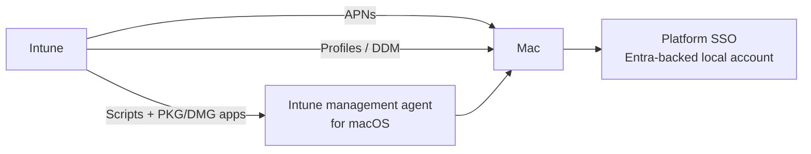

# 2.2.4 Create device configuration profiles for macOS devices

> **Exam objective:** Create device configuration profiles for macOS devices
>
> **Domain:** 2 - Manage and maintain devices (25-30%) · **Skill:** 2.2 Plan and implement device configuration profiles
>
> **Hands-on:** [LAB-2.08 Android, iOS and macOS configuration profiles](../labs/LAB-2.08-mobile-macos-configuration-profiles.md)

## Concept in plain English

macOS management in Intune has four levers:

| Lever | Use for |
|---|---|
| **Settings catalog** | Nearly all macOS payloads: restrictions, FileVault, firewall, login window, **Platform SSO**, **system extensions**, **PPPC (Privacy Preferences Policy Control)**, notifications, software update (DDM), Microsoft AutoUpdate, Edge, Office, Defender |
| **Templates** | Device restrictions, device features (SSO extension, login items, AirPrint), endpoint protection, **Preference file** (plist), Wi-Fi, VPN, certificates, custom `.mobileconfig` |
| **Shell scripts** (Devices > macOS > Scripts) | Anything not covered by a payload. Run as root or user, frequency, retries |
| **Custom attributes** | Collect inventory with a script (for example, a local admin list) |

Key macOS-specific concepts:

- **User-approved MDM** is required for kernel/system extension approval and PPPC. ADE devices are user-approved automatically.
- **Platform SSO** (macOS 14+) links the Mac local account to Entra ID (password or Secure Enclave key / smart card), giving SSO and phishing-resistant sign-in. Configure it in the settings catalog with the **Company Portal** (≥5.2404) as the SSO extension.
- **PPPC** pre-grants privacy permissions (Full Disk Access for Defender, screen recording for Teams/Remote Help).

## How it works

## Licensing requirements

Intune Plan 1. APNs. ABM/ADE recommended for supervision, locked enrollment, and Setup Assistant Platform SSO.

## Configuration steps

1. **Devices > Configuration > Create > macOS > Settings catalog**.
2. Examples:
   - **Full Disk Encryption > FileVault**: Enable, defer at sign-out, escrow recovery key to Intune (also possible through the endpoint security disk encryption policy).
   - **Security > Firewall**: Enable, block all incoming, stealth mode.
   - **Login > Login Window**: show name and password fields, disable guest.
   - **Authentication > Extensible Single Sign On (SSO)**: Platform SSO - *Extension identifier* `com.microsoft.CompanyPortalMac.ssoextension`, *Team identifier* `UBF8T346G9`, *Authentication method* **User Secure Enclave Key** (or Password), *Registration token* `{{DEVICEREGISTRATION}}`.
   - **Privacy > Privacy Preferences Policy Control**: grant *SystemPolicyAllFiles* to Microsoft Defender.
   - **System Configuration > System Extensions**: allowed team IDs/extensions for Defender, VPN clients.
3. Scripts: **Devices > macOS > Shell scripts > Add** → upload `.sh` → *Run script as signed-in user* No/Yes → frequency → assign.
4. Assign to device groups/filters.

## Comparison: Mac management techniques

| Need | Use |
|---|---|
| Standard setting with a payload | Settings catalog |
| App-specific plist preferences | **Preference file** template (or settings catalog if available) |
| Pre-approve Defender permissions | PPPC + System Extensions + Notifications payloads |
| SSO with Entra + passwordless | **Platform SSO** |
| Custom check/remediation | Shell script / custom attribute |
| Vendor-supplied profile | Custom `.mobileconfig` |

## Exam tips and common traps

- **"Grant an app Full Disk Access without user prompts"** → **PPPC** payload (needs user-approved MDM).
- **"Sign in to the Mac with the Entra ID password / passwordless"** → **Platform SSO**.
- Shell scripts need the **Intune management agent** for macOS (installed automatically when a script or PKG/DMG app is assigned).
- macOS **FileVault** recovery keys escrow to Intune and can be viewed in the device's **Recovery keys** blade.

## Real-world notes

- Deploy the Defender for Endpoint "stack" (PPPC, system extensions, network filter, notifications, MAU) in one ordered set before the Defender app. Missing one payload produces endless user prompts.
- Platform SSO with Secure Enclave keys is effectively WHfB for Macs and satisfies phishing-resistant CA authentication strengths.

## Microsoft Learn references

- [macOS settings catalog](https://learn.microsoft.com/intune/device-configuration/settings-catalog/)
- [Configure Platform SSO for macOS](https://learn.microsoft.com/intune/device-configuration/platform-sso-macos)
- [Use shell scripts on macOS](https://learn.microsoft.com/intune/device-management/tools/macos-shell-scripts)
- [macOS device features settings](https://learn.microsoft.com/intune/device-configuration/templates/ref-device-features-macos)
- [Deploy Defender for Endpoint on macOS with Intune](https://learn.microsoft.com/defender-endpoint/mac-install-with-intune)
