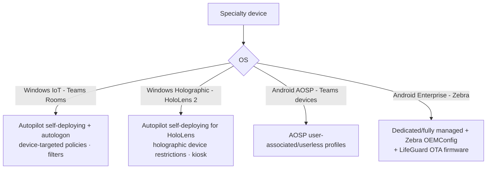

# 2.2.5 Create device configuration profiles for specialty devices

> **Exam objective:** Create device configuration profiles for specialty devices, including Microsoft Teams Rooms, HoloLens 2, and Zebra
>
> **Domain:** 2 - Manage and maintain devices (25-30%) · **Skill:** 2.2 Plan and implement device configuration profiles
>
> **Hands-on:** [LAB-2.09 Specialty devices](../labs/LAB-2.09-specialty-devices.md)

## Concept in plain English

"Specialty devices" are purpose-built endpoints that aren't ordinary laptops or phones. Intune manages them with the same building blocks (enrollment, configuration profiles, compliance), but each has its own OS flavour and quirks.

| Device | OS / management mode | Enrollment | Key configuration |
|---|---|---|---|
| **Microsoft Teams Rooms on Windows** (MTR-W) | Windows 11 IoT Enterprise, dedicated resource account | Autopilot **self-deploying** + **Autologon** for the Teams Rooms resource account, or manual enrollment | Device groups (no user), filters on model, **avoid** policies that break the Teams Rooms app (Windows Hello, BitLocker PIN, aggressive restart, some baselines). Teams Rooms Pro Management portal for app health |
| **Teams Rooms on Android / Teams phones / panels / displays** | **Android AOSP** (Teams Android devices moved from device administrator to **AOSP** management) | Sign-in on the device (Teams admin center/Intune AOSP profile) | AOSP compliance/configuration. Exclude from CA policies that require MFA for device resource accounts where appropriate |
| **HoloLens 2** | Windows Holographic for Business | **Autopilot self-deploying** (HoloLens-specific) or Entra join OOBE | Device restrictions, kiosk (single/multi-app), Wi-Fi, certificates, **Windows Holographic for Business** edition upgrade (automatic when Entra joined), update rings, Dynamics 365 Remote Assist/Guides apps |
| **Zebra** (rugged Android) | Android Enterprise (fully managed/dedicated) | QR / zero-touch | **OEMConfig** with the **Zebra OEMConfig** app (Zebra MX settings: scanner, battery, display, keys), **Zebra LifeGuard OTA** firmware updates via Intune FOTA integration |
| Surface Hub, AR/VR headsets (Meta Quest), large screens | Windows Team / AOSP | Varies | Specialty profiles |

## How it works

## Licensing requirements

- **Specialty device management** for AR/VR headsets, large smart screens and conference room devices is an **Intune Plan 2** capability (included in Microsoft 365 E3/E5 since July 2026, and in Intune Suite).
- Teams Rooms devices need a **Teams Rooms Pro** or **Basic** license on the resource account (Pro includes Intune and Entra ID P1).
- Zebra LifeGuard OTA through Intune uses the **firmware-over-the-air** capability (Intune Plan 2).

## Configuration steps

### Teams Rooms on Windows

1. Create a dynamic device group, for example `(device.deviceModel -contains "Teams Room")` or use the Autopilot group tag `MTR`.
2. Autopilot profile: **Self-deploying**, and in **Devices > Windows > Enrollment > Windows Autopilot devices** assign the **Teams Rooms resource account** to the device (*Autologon* support).
3. Assign only MTR-compatible policies. Exclude the MTR group from general-purpose policies with an **assignment filter** (exclude mode).
4. Compliance: a dedicated MTR compliance policy (BitLocker, firewall, Defender, min OS). Exclude resource accounts from MFA/compliant-device CA policies, or use a dedicated CA policy with network location conditions.

### HoloLens 2

1. Autopilot for HoloLens: register the HoloLens hash, profile **Self-deploying**, assign to a group.
2. **Devices > Configuration > Create > Windows 10 and later > Templates > Device restrictions** (Windows Holographic for Business settings) or **Kiosk** (multi-app kiosk with Holographic apps).
3. Update rings for HoloLens (Windows Holographic updates).

### Zebra

1. Enroll as **dedicated** or **fully managed** (QR/zero-touch).
2. **Apps > Android > Add > Managed Google Play** → approve **Zebra OEMConfig Powered by MX**.
3. **Devices > Configuration > Create > Android Enterprise > OEMConfig** → select the Zebra app → use the configuration designer (scanner settings, battery optimization, hardware keys) → assign.
4. Firmware: connect **Zebra LifeGuard OTA** under **Tenant administration > Connectors and tokens > Firmware over-the-air update** and create **Zebra LifeGuard update** policies (objective 3.2.5).

## Exam tips and common traps

- **Teams Rooms on Windows** → Autopilot **self-deploying** + **autologon** with the resource account. Don't target user-based policies at it.
- **HoloLens 2** kiosk → **Kiosk** profile (Windows Holographic). HoloLens supports **Autopilot self-deploying** (not user-driven classic OOBE with ESP user phase).
- **Zebra-specific settings** → **OEMConfig** (Zebra app from Managed Google Play). Firmware → **Zebra LifeGuard OTA** integration.
- **Teams Android devices** are managed as **AOSP**, not device administrator (deprecated).
- Resource accounts don't do MFA - plan Conditional Access exclusions or device-based conditions carefully.

## Real-world notes

- Keep an **MTR exclusion filter** on every broad Windows policy. One badly timed restart or a Windows Hello prompt takes a meeting room offline.
- Zebra OEMConfig profiles are large. Split them by feature (scanner, power, UI) so a change doesn't re-push everything.

## Microsoft Learn references

- [Manage Teams Rooms with Intune](https://learn.microsoft.com/microsoftteams/rooms/rooms-deploy-autopilot)
- [Teams Android devices - AOSP device management](https://learn.microsoft.com/microsoftteams/rooms/android-migration-guide)
- [HoloLens 2 - Windows Autopilot](https://learn.microsoft.com/hololens/hololens2-autopilot)
- [HoloLens kiosk configuration](https://learn.microsoft.com/hololens/hololens-kiosk)
- [Use OEMConfig on Android Enterprise devices](https://learn.microsoft.com/intune/device-configuration/templates/configure-oemconfig-android)
- [Zebra LifeGuard OTA integration with Intune](https://learn.microsoft.com/intune/device-updates/android/zebra-lifeguard-ota-integration)
