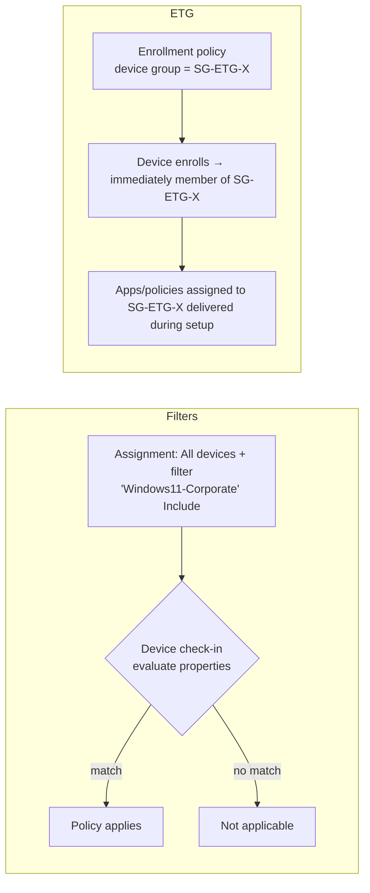

# 2.2.6 Target a profile by using assignment filters and enrollment time grouping

> **Exam objective:** Target a profile by using assignment filters and enrollment time grouping
>
> **Domain:** 2 - Manage and maintain devices (25-30%) · **Skill:** 2.2 Plan and implement device configuration profiles
>
> **Hands-on:** [LAB-2.10 Assignment filters and enrollment time grouping](../labs/LAB-2.10-assignment-filters-etg.md)

## Concept in plain English

Groups answer *who*. **Assignment filters** refine that at **check-in time** using device properties - "assign to *All users*, but **only** their Windows 11 corporate laptops". **Enrollment time grouping (ETG)** adds a device to a **static** group **during enrollment**, so group-targeted policies and apps arrive immediately instead of waiting for dynamic group processing.

| | Assignment filters | Enrollment time grouping |
|---|---|---|
| Where configured | Tenant administration > Filters; chosen on each assignment | Inside the **enrollment policy** (Autopilot device preparation, Android Enterprise corporate profiles, Apple ADE/tvOS/visionOS) |
| Evaluated | Every check-in, on the device's properties | Once, at enrollment |
| Mode | **Include** or **Exclude** | - |
| Solves | Precise targeting without extra groups | Speed - apps/policies ready at first desktop/home screen |
| Group type | Works on top of any group incl. **All users / All devices** | **Static** security group owned by the **Intune Provisioning Client** |

## How it works

## Filter properties (managed devices)

| Property | Example |
|---|---|
| `deviceName` | `(device.deviceName -startsWith "KIOSK")` |
| `manufacturer`, `model` | `(device.model -contains "Surface")` |
| `osVersion` | `(device.osVersion -startsWith "10.0.26100")` |
| `operatingSystemSKU` | `(device.operatingSystemSKU -eq "Enterprise")` |
| `deviceOwnership` | `(device.deviceOwnership -eq "Corporate")` |
| `enrollmentProfileName` | `(device.enrollmentProfileName -eq "AE-COSU-Kiosk")` |
| `deviceCategory` | `(device.deviceCategory -eq "Finance")` |
| `isRooted` (Android) | `(device.isRooted -eq "False")` |
| `deviceTrustType` | `(device.deviceTrustType -eq "Microsoft Entra hybrid joined")` |
| `cpuArchitecture` | `(device.cpuArchitecture -eq "arm64")` |

There are also **managed app filters** (for app protection and app configuration policies) with properties such as `appVersion`, `deviceManufacturer`, `operatingSystemVersion`, and `deviceManagementType` (Unmanaged / Managed / Android Enterprise).

Rules:

- **One filter per assignment**, in **Include** or **Exclude** mode.
- Filters work with user **and** device groups, including virtual *All users* / *All devices*.
- Supported by most workloads: configuration profiles, compliance, apps, app protection/configuration, Autopilot profiles, ESP, update rings, endpoint security, scripts/remediations.
- Up to 200 filters per tenant, and rule syntax length is capped (about 3,072 characters).

## Licensing requirements

Filters: Intune Plan 1. ETG: Intune Plan 1 (with the supported enrollment method).

## Configuration steps

### Create and use a filter

1. **Tenant administration > Filters > Create > Managed devices** → Name `WIN-11-Corporate` → Platform **Windows 10 and later**.
2. Rule: `(device.osVersion -startsWith "10.0.2") and (device.deviceOwnership -eq "Corporate")`.
3. **Preview** tab: shows matching enrolled devices (up to a sample).
4. On a policy → **Assignments** → *Included groups: All devices* → **Edit filter** → `WIN-11-Corporate` → **Include filtered devices in assignment**.
5. Check results: device → **Filter evaluation** report, or the policy's per-device status shows *Not applicable* (filter excluded).

### Enrollment time grouping

1. Create a **static** security group → **Owners** → add **Intune Provisioning Client** (AppId `f1346770-5b25-470b-88bd-d5744ab7952c`).
2. Make sure your admin role has the **enrollment time device membership assignment** permission and the group is in its **scope groups**.
3. Select the group in the enrollment policy: *Autopilot device preparation* (Device security group), *Android Enterprise* COPE/fully managed/dedicated (Device group), *Apple ADE* enrollment policy.
4. Assign apps/policies to the group.
5. Monitor: **Devices > Monitor > Enrollment time grouping failures**.

## Exam tips and common traps

- **"Apply the policy to All devices except kiosks without creating new groups"** → assignment filter in **Exclude** mode on `enrollmentProfileName` or `deviceName`.
- **"Target only Windows 11 devices of users in the Sales group"** → assign to Sales (user group) + **filter** on OS version.
- **"Apps must be installed during Android/Apple/Windows setup, not hours later"** → **ETG**.
- ETG requires a **static** group whose owner is **Intune Provisioning Client**. **Staging tokens** (Android) aren't supported.
- Filters **can't** reference user attributes (department, and so on). Use user groups for that.
- Filter + include/exclude groups: exclusion by **group** still wins over inclusion. A filter only narrows the included set.

## Real-world notes

- Microsoft recommends **All users/All devices + filters** at scale. It performs better than many dynamic groups.
- Name filters clearly with platform and intent (`WIN-EXCL-MTR`, `AND-INCL-Dedicated-Scanners`), and use the filter's *Associated assignments* view before editing.

## Microsoft Learn references

- [Use filters when assigning apps, policies, and profiles](https://learn.microsoft.com/intune/fundamentals/filters/)
- [Filter properties list](https://learn.microsoft.com/intune/fundamentals/filters/ref-filter-properties)
- [Filter reports and troubleshooting](https://learn.microsoft.com/intune/fundamentals/filters/reports)
- [Enrollment time grouping](https://learn.microsoft.com/intune/device-enrollment/setup-time-grouping)
