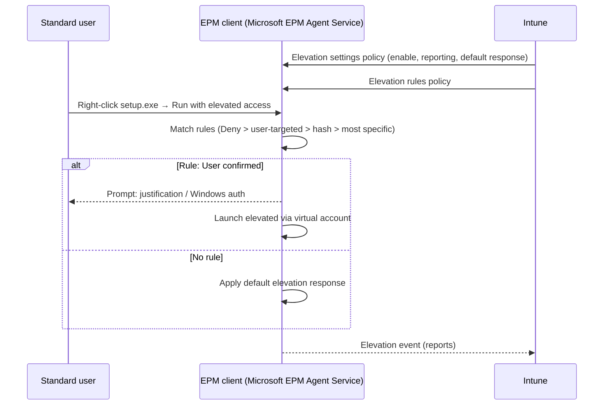

# 2.3.1 Configure Endpoint Privilege Management

> **Exam objective:** Configure Endpoint Privilege Management including configuring elevation policies, monitoring elevated actions, and adjusting EPM settings
>
> **Domain:** 2 - Manage and maintain devices (25-30%) · **Skill:** 2.3 Implement Intune Suite add-on capabilities
>
> **Hands-on:** [LAB-2.11 Endpoint Privilege Management](../labs/LAB-2.11-endpoint-privilege-management.md)

## Concept in plain English

Removing local admin rights is one of the most effective security controls, but users still need to install a driver or run an admin tool now and then. **Endpoint Privilege Management (EPM)** lets **standard users** run **approved** files with elevated rights, under rules you define, with full reporting.

Two policy types (both under **Endpoint security > Endpoint Privilege Management**):

| Policy | Purpose |
|---|---|
| **Windows elevation settings policy** | Turns the EPM client on/off, sets **reporting scope**, and sets the **default elevation response** for files with **no rule** |
| **Windows elevation rules policy** | One or more **rules** that identify files (name, hash, certificate, path, version, arguments) and set their **elevation type** |

Plus **reusable settings groups** for publisher certificates.

### Elevation types

| Type | User experience | Runs as | Use for |
|---|---|---|---|
| **Automatic** | Silent | Virtual account | Trusted tools needed constantly (requires **file hash**) |
| **User confirmed** (default) | Right-click → **Run with elevated access** → confirm, optionally **business justification** and/or **Windows authentication** | Virtual account | Most rules |
| **Elevate as current user** | Windows authentication required | **The signed-in user's own account** | Apps that break under a virtual account (need the user profile). Wider attack surface |
| **Support approved** | User submits a request → admin approves in Intune → user retries | Virtual account | Rare or unknown files |
| **Deny** | Elevation blocked | - | Known-bad or risky binaries. **Deny always wins** |

### Default elevation response (settings policy)

When no rule matches a *Run with elevated access* request: **Deny all requests**, **Require user confirmation**, or **Require support approval**. Microsoft recommends **Require support approval** or **Deny** over user confirmation.

## How it works



**Rule precedence:** Deny first → rules targeted to **users** beat rules targeted to **devices** → **hash** rules are most specific → then the rule with most attributes → tie-breaker order: *User confirmed*, *Elevate as current user*, *Support approved*, *Automatic*.

**Child processes** per rule: *Allow all child processes to run elevated*, *Require rule to elevate*, or *Deny all*.

## Licensing requirements

**Intune Suite**, the standalone **EPM add-on**, or **Microsoft 365 E5/E7 (since July 2026)**. Windows 10/11 devices that are Entra joined or hybrid joined. Built-in roles: **Endpoint Privilege Manager** and **Endpoint Privilege Reader**.

## Configuration steps

1. **Elevation settings policy**: *Endpoint security > Endpoint Privilege Management > Create > Windows > Elevation settings policy*
   - *Endpoint Privilege Management* = **Enabled**
   - *Default elevation response* = **Require support approval** (lab: Require user confirmation to test)
   - *Validation* (for user confirmation) = Business justification + Windows authentication
   - *Send elevation data for reporting* = Yes, *Reporting scope* = **Diagnostic data and all endpoint elevations** (needed to see unmanaged elevations for rule creation)
   - Assign to devices/users. The EPM client installs automatically (`C:\Program Files\Microsoft EPM Agent`).
2. **Reusable settings** (optional): upload a publisher certificate (for example, your packaging certificate).
3. **Elevation rules policy**: *Create > Windows > Elevation rules policy* → add rule:
   - Rule name `Notepad++ installer`, Elevation type **User confirmed** + Business justification
   - File name `npp.*.Installer.x64.exe` (wildcards allowed), **File path** `C:\Program Files\Contoso\Installers` (a path standard users can't write to)
   - Signature source: **Use a certificate in a reusable group** or **File hash** (required for Automatic)
   - Child process behavior: **Require rule to elevate**
4. Monitor: **Endpoint security > Endpoint Privilege Management > Reports** → **Elevation report** (managed + unmanaged elevations), **Managed elevation report**. **Elevation requests** lists pending *support approved* requests → **Approve/Deny** (approved requests are valid for a limited time).
5. Adjust: create rules directly **from the Elevation report** or from a support request record (*Create rule*), then tighten the default response.

### Get a file hash for a rule

```powershell
Get-FileHash 'C:\Installers\tool.exe' -Algorithm SHA256
# Or use the EPM PowerShell module on a device with the EPM client:
Import-Module 'C:\Program Files\Microsoft EPM Agent\EpmTools\EpmCmdlets.dll'
Get-FileAttributes -FilePath 'C:\Installers\tool.exe'
```

## Comparison: ways to handle admin tasks

| Approach | Security | User friction | Audit |
|---|---|---|---|
| Users are local admins | ❌ Low | None | Poor |
| LAPS password shared by help desk | Medium | High (call help desk) | Entra audit of reads |
| **EPM user confirmed / support approved** | ✅ High | Low-Medium | ✅ Per-elevation reports |
| Deploy the app with Intune (system context) | ✅ High | None | App install status |

## Exam tips and common traps

- **"Standard users must install a specific signed app without admin credentials"** → EPM elevation rule (**User confirmed** or **Automatic** + certificate/hash).
- **Automatic** rules **require a file hash**.
- **Deny** always wins, and **user-targeted** rules win over **device-targeted** rules.
- Without an elevation **settings** policy that enables EPM, rules do nothing.
- **Support approved** requests are approved in **Endpoint Privilege Management > Elevation requests** (requires the EPM elevation request approval permission).
- Elevation runs under a **virtual account**, not by adding the user to Administrators (except *Elevate as current user*).
- Reporting scope must include **all endpoint elevations** to see unmanaged elevations.

## Real-world notes

- Roll out in **audit mode**: default response = user confirmation with justification + reporting of all elevations for 2-4 weeks, then build rules from the report and switch the default to support approval.
- Always add a **file path** condition in a protected location. Wildcard rules without a path are an easy privilege-escalation path.
- Copilot in Intune can **analyze EPM elevation requests** and summarize file risk before you approve.

## Microsoft Learn references

- [Use Endpoint Privilege Management with Intune](https://learn.microsoft.com/intune/epm/overview)
- [Plan and prepare for EPM deployment](https://learn.microsoft.com/intune/epm/deployment-planning)
- [Configure elevation settings](https://learn.microsoft.com/intune/epm/manage-elevation-settings)
- [Create elevation rules](https://learn.microsoft.com/intune/epm/create-elevation-rules)
- [Support approved elevation requests](https://learn.microsoft.com/intune/epm/manage-support-approvals)
- [EPM reports](https://learn.microsoft.com/intune/epm/monitor-reports)
