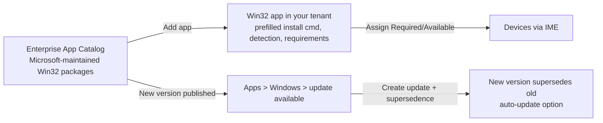

# 2.3.2 Manage applications by using the Enterprise App Catalog

> **Exam objective:** Manage applications by using the Enterprise App Catalog
>
> **Domain:** 2 - Manage and maintain devices (25-30%) · **Skill:** 2.3 Implement Intune Suite add-on capabilities
>
> **Hands-on:** [LAB-2.12 Enterprise App Catalog](../labs/LAB-2.12-enterprise-app-catalog.md)

## Concept in plain English

Packaging third-party Win32 apps (7-Zip, Chrome, Zoom, Notepad++, VLC, Adobe Reader...) and keeping them updated takes a lot of packaging effort. **Enterprise App Management (EAM)** provides the **Enterprise App Catalog**: a Microsoft-curated library of **prepackaged Win32 apps**, hosted in **Microsoft storage**, with install/uninstall commands, **requirement** and **detection rules** already filled in.

EAM also gives you **update awareness**: Intune tells you when a newer catalog version exists for apps you deployed, and helps you create an updated app with **supersedence** to the old one.

## How it works

## Licensing requirements

**Intune Suite**, the **Enterprise App Management** add-on, or **Microsoft 365 E5/E7 (since July 2026)**. Windows 10/11 devices with the Intune Management Extension.

## Configuration steps

1. **Apps > Windows > Add** → App type **Enterprise App Catalog app** → **Search the Enterprise App Catalog** → pick the app (for example, *7-Zip*) and the **package** (architecture/language).
2. **App information** is prefilled (publisher, description). Edit as needed.
3. **Program**: install/uninstall commands, install behavior (System/User), return codes - prefilled. Review them.
4. **Requirements**: OS architecture, minimum OS - prefilled.
5. **Detection rules**: prefilled (file/registry/MSI) - review.
6. **Dependencies / Supersedence** (optional).
7. **Assignments**: Required / Available / Uninstall → groups (+ filters).
8. **Updates:** **Apps > Windows** → the app shows **Update available** (also the *Enterprise App Management* update report) → **Update** creates a new app version configured to **supersede** the previous one, with *Uninstall previous version* = No (in-place upgrade) or Yes.

### Comparison: app sources for Windows

| Source | Packaging effort | Hosting | Updates |
|---|---|---|---|
| **Enterprise App Catalog** | None (prepackaged) | Microsoft | Update notifications + supersedence |
| Microsoft Store (new) / WinGet | None | Microsoft Store | Auto-update by Store |
| Win32 (`.intunewin`) | You package with IntuneWinAppUtil | Intune (your upload) | You repackage + supersedence |
| LOB MSI | Minimal | Intune | You upload new version |
| Microsoft 365 Apps built-in | None | Office CDN | Update channel |

## Exam tips and common traps

- **"Deploy common third-party apps without packaging them"** → **Enterprise App Catalog** (Intune Suite/EAM). Without the add-on, the answer is usually the **Microsoft Store (WinGet)** or **Win32** packaging.
- Catalog apps are **Win32 apps** - they support dependencies, supersedence, requirement rules and ESP tracking like any Win32 app.
- Updates for catalog apps use **supersedence**, not an in-place edit of the original app.
- Catalog apps can be selected as **essential apps in Autopilot device preparation**.

## Real-world notes

- Check the catalog before you package anything. It covers hundreds of common titles and removes the packaging backlog.
- Review prefilled **install commands**. Some vendors' defaults enable auto-updaters or desktop shortcuts you may not want.
- Keep the old version assigned until the superseding version reports success on pilot devices.

## Microsoft Learn references

- [Microsoft Intune Enterprise Application Management](https://learn.microsoft.com/intune/app-management/deployment/enterprise-app-management)
- [Add an Enterprise App Catalog app](https://learn.microsoft.com/intune/app-management/deployment/add-enterprise-catalog-app)
- [Win32 app supersedence](https://learn.microsoft.com/intune/app-management/deployment/win32-app-supersedence)
