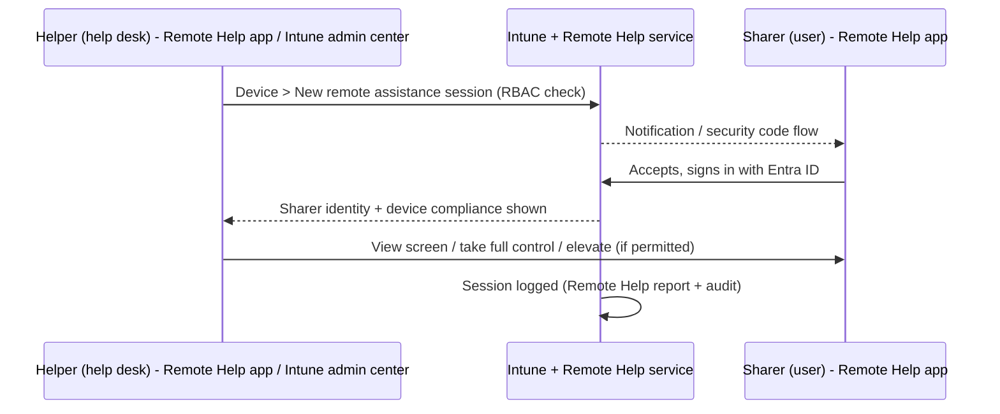

# 2.3.3 Configure Microsoft Intune Remote Help

> **Exam objective:** Configure Microsoft Intune Remote Help
>
> **Domain:** 2 - Manage and maintain devices (25-30%) · **Skill:** 2.3 Implement Intune Suite add-on capabilities
>
> **Hands-on:** [LAB-2.13 Remote Help](../labs/LAB-2.13-remote-help.md)

## Concept in plain English

**Remote Help** is Intune's cloud-based remote assistance tool. Compared with Quick Assist, it adds:

- **Microsoft Entra authentication** for both helper and sharer.
- **Intune RBAC**: who may view, control, elevate, or connect unattended.
- **Compliance awareness**: the helper sees the sharer device's compliance status.
- **Session reporting and audit**.
- **Elevation**: helpers with permission can respond to UAC prompts on the sharer's device.

| Platform | Capabilities |
|---|---|
| Windows 10/11 | View, full control, elevation (UAC), chat. Enrolled and unenrolled devices (if allowed). Also Azure Virtual Desktop sessions and RemoteApp |
| macOS | View / control (with the Remote Help app for macOS). Enrolled devices |
| Android (Samsung / Zebra dedicated & fully managed) | View and control, including **unattended** control for dedicated devices |

## How it works

## Licensing requirements

Remote Help is an **Intune Plan 2 / Intune Suite** capability (also sold standalone), included in **Microsoft 365 E3/E5 since July 2026**. **Both** the helper and the sharer need the license.

## Configuration steps

1. **Tenant administration > Remote Help > Settings > Configure**:
   - *Enable Remote Help* = **Enabled**
   - *Allow Remote Help to unenrolled devices* = Enabled/Disabled
   - *Disable chat* = No
2. **RBAC**: create a custom role (or use **Help Desk Operator**) with **Remote Help app** permissions:
   - *View screen*
   - *Take full control*
   - *Elevation* (respond to UAC)
   - *Unattended control* (Android dedicated)
   Assign it to the help desk group with the right **scope groups** / **scope tags**.
3. **Deploy the Remote Help app** to Windows devices: download `RemoteHelpInstaller.exe` from `aka.ms/downloadremotehelp`, package it as **Win32** with the silent switches (`/quiet acceptTerms=1`), and assign as Required. macOS: deploy the Remote Help PKG. Android: available through Managed Google Play for supported OEMs.
4. **Conditional Access (optional):** target the **Remote Assistance Service** cloud app (created by enabling Remote Help) to require a compliant device or MFA for helpers.
5. **Start a session**: Intune admin center → **Devices > [device] > New remote assistance session** (Windows/macOS) or the Remote Help app → *Get help / Give help* with a security code.
6. **Monitor**: **Tenant administration > Remote Help > Remote Help sessions** / Monitor tab (session history, duration, helper, sharer).

## Comparison: Remote Help vs Quick Assist vs RDP

| | Remote Help | Quick Assist | RDP |
|---|---|---|---|
| Authentication | Entra (both sides) | Microsoft account / Entra | Windows credentials |
| RBAC | ✅ Intune | ❌ | Local groups |
| Compliance shown | ✅ | ❌ | ❌ |
| UAC elevation | ✅ (permission) | ❌ (secure desktop hidden) | N/A |
| Reporting | ✅ | Minimal | Event logs |
| License | Plan 2 / Suite / M365 E3+ | Free | Free |

## Exam tips and common traps

- **"Help desk must remotely control devices and respond to UAC prompts, with RBAC and auditing"** → **Remote Help** with the *Elevation* permission.
- Remote Help must be **enabled at tenant level** first. **Unenrolled** device support is a separate toggle.
- Both helper **and** sharer need a Remote Help license.
- **Unattended control** is for **Android dedicated devices** (Samsung/Zebra), not Windows.

## Real-world notes

- Deploy the Remote Help app **as part of Autopilot** so it's ready on day 1. It's the first thing help desk will need.
- Use scope tags so regional help desks can only remote into their region's devices.

## Microsoft Learn references

- [Remote Help overview](https://learn.microsoft.com/intune/remote-help/)
- [Remote Help on Windows](https://learn.microsoft.com/intune/remote-help/start-session)
- [Remote Help RBAC permissions](https://learn.microsoft.com/intune/fundamentals/role-based-access-control/create-custom-role)
- [Remote Help for Android](https://learn.microsoft.com/intune/remote-help/android)
