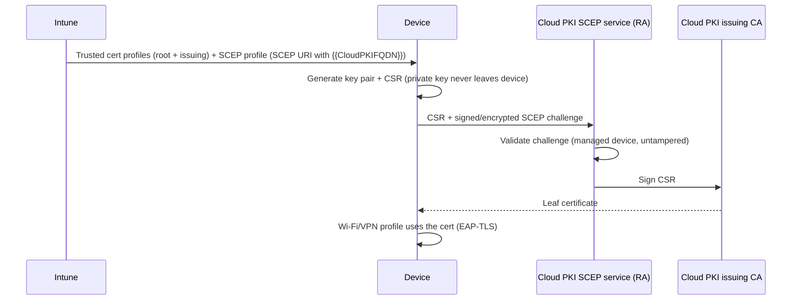

# 2.3.4 Plan and implement Microsoft Cloud PKI

> **Exam objective:** Plan and implement Microsoft Cloud PKI, including setting up cloud-based PKI, automating certificate issuance, and monitoring certificate health
>
> **Domain:** 2 - Manage and maintain devices (25-30%) · **Skill:** 2.3 Implement Intune Suite add-on capabilities
>
> **Hands-on:** [LAB-2.14 Cloud PKI with a SCEP profile](../labs/LAB-2.14-cloud-pki-scep.md)

## Concept in plain English

Certificates authenticate devices and users to **Wi-Fi (EAP-TLS)**, **VPN**, and apps. Traditionally that needs **AD CS** + **NDES** + the **Intune Certificate Connector** on-premises. **Microsoft Cloud PKI** replaces all of that with a **cloud-hosted CA** and a **built-in SCEP registration authority**, managed from Intune.

### Certificate options in Intune (context for the exam)

| Option | Infrastructure | Issues | Notes |
|---|---|---|---|
| **SCEP with Microsoft Cloud PKI** | None on-prem | Private key generated **on the device** | Intune Suite / Cloud PKI add-on / M365 E5 |
| **SCEP with NDES** | AD CS + NDES + Intune Certificate Connector | Key on device | Classic |
| **PKCS (.pfx)** | AD CS (or third-party CA) + Intune Certificate Connector | Key generated **by the CA/connector**, delivered to device | Needed for S/MIME (key escrow) |
| **PKCS imported** | Connector | Import existing S/MIME certs | Email encryption |
| **Trusted certificate** | - | Root/intermediate public cert | **Always required** so devices trust the chain |

### Cloud PKI deployment models

| Model | Hierarchy |
|---|---|
| **Cloud PKI root CA** | Two-tier: **root CA** + one or more **issuing CAs**, all in the cloud, private to the tenant |
| **Bring your own CA (BYOCA)** | Cloud issuing CA **anchored to your private CA** (for example, AD CS). Intune creates a **CSR** that your CA signs |

Features: RSA 2048/3072/4096, SHA-256/384/512, keys in **Azure Managed HSM** (software keys in trials), Intune-hosted **CRL** (valid 7 days, republished every 3.5 days and on each revocation) and **AIA**, SCEP URI per issuing CA.

## How it works

## Licensing requirements

**Intune Suite**, the **Cloud PKI** standalone add-on, or **Microsoft 365 E5/E7 (since July 2026)**. Built-in roles **Cloud PKI Administrator / Reader**. Trials create CAs with software-backed keys that can't be converted to HSM later.

## Configuration steps

1. **Create the root CA**: **Tenant administration > Cloud PKI > Create** → *CA type* **Root CA** → validity (for example, 10 years) → **Extended key usages** (Client Authentication `1.3.6.1.5.5.7.3.2`; *Any Purpose* isn't allowed) → subject (CN `Contoso Lab Root CA`) → key size/algorithm → Create.
2. **Create the issuing CA**: **Create** → *CA type* **Issuing CA** → *Root CA source* **Intune** → select the root → validity ≤ root → EKUs (subset of the root's) → CN `Contoso Lab Issuing CA`.
3. **Download** the root and issuing CA certificates (CA → *Download*).
4. **Trusted certificate profiles** per platform: one for the **root**, one for the **issuing** CA.
5. **SCEP certificate profile** per platform:
   - *Certificate type*: User or Device
   - *Subject name format*: `CN={{UserPrincipalName}}` (user) or `CN={{AAD_Device_ID}}` (device)
   - *Subject alternative name*: UPN = `{{UserPrincipalName}}`
   - *Key usage*: Digital signature, Key encipherment. *Key size* 2048. *Hash* SHA-2
   - *Root certificate*: select the **root** trusted certificate profile
   - *Extended key usage*: Client Authentication
   - *SCEP Server URLs*: paste the issuing CA's **SCEP URI** (keep `{{CloudPKIFQDN}}` as is)
6. Reference the SCEP profile in your **Wi-Fi (EAP-TLS)** or **VPN** profile.
7. **BYOCA instead:** *Create* → Issuing CA → *Root CA source* **Bring your own root CA** → download the **CSR** → sign it on AD CS with the *Subordinate Certification Authority* template → upload the signed cert + chain.

### Monitor certificate health

- **Cloud PKI > [CA] > View all certificates**: issued leaf certificates, status, expiry. **Revoke** individual certificates (added to the CRL).
- SCEP profile **device status** report: *Succeeded / Error / Pending* (subject variables missing → error).
- Device → **Device configuration** → certificate profile per-setting state. On Windows, check `certlm.msc` / `certmgr.msc`.
- Plan renewal: SCEP certificates renew automatically when the profile's *renewal threshold* (%) is reached.

## Comparison: Cloud PKI vs NDES/AD CS

| | Cloud PKI | AD CS + NDES |
|---|---|---|
| On-prem servers | 0 | CA, NDES, connector, reverse proxy |
| HSM | Included (Azure Managed HSM) | You buy/operate |
| CRL/AIA hosting | Intune | You publish |
| Works for non-Intune (on-prem servers, GPO autoenrollment) | ❌ Intune-managed devices only | ✅ |
| PKCS / S/MIME escrow | ❌ (SCEP only) | ✅ |
| Keep existing root | ✅ BYOCA | ✅ |

## Exam tips and common traps

- **"Issue certificates for Wi-Fi EAP-TLS with no on-premises infrastructure"** → **Cloud PKI + SCEP profile**.
- **"Keep our existing enterprise root CA"** → **BYOCA** (sign the Intune CSR with AD CS).
- Every SCEP profile needs a **trusted certificate profile** for the root. Deploy the issuing CA too, so the chain builds.
- Cloud PKI supports **SCEP only** (no PKCS). S/MIME with key escrow still needs PKCS + a traditional CA.
- The issuing CA's validity and EKUs can't exceed the root's, and CA properties **can't be edited** after creation.
- Don't mix NDES SCEP URLs and Cloud PKI SCEP URIs in one profile.

## Real-world notes

- Start with a separate issuing CA per use case (Wi-Fi users, VPN devices) so you can revoke or rotate independently.
- Your RADIUS server (NPS, Cisco ISE, cloud RADIUS) must trust the Cloud PKI root and reach the **CRL** URL, or authentication fails when it checks revocation.

## Microsoft Learn references

- [Overview of Microsoft Cloud PKI](https://learn.microsoft.com/intune/cloud-pki/)
- [Cloud PKI deployment models](https://learn.microsoft.com/intune/cloud-pki/deployment-models)
- [Configure root and issuing CA](https://learn.microsoft.com/intune/cloud-pki/configure-ca)
- [Configure bring your own CA](https://learn.microsoft.com/intune/cloud-pki/configure-byoca)
- [Create a SCEP certificate profile](https://learn.microsoft.com/intune/device-configuration/certificates/scep-profiles)
- [Trusted root certificate profiles](https://learn.microsoft.com/intune/device-configuration/certificates/trusted-root-profiles)
