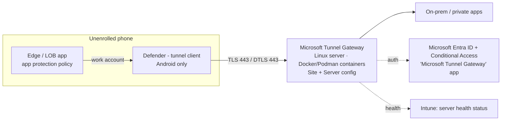

# 2.3.5 Implement Microsoft Tunnel for Mobile Application Management

> **Exam objective:** Implement Microsoft Tunnel for Mobile Application Management, including configuring the Microsoft Tunnel VPN Gateway, extending support to MAM devices, and monitoring tunnel connections
>
> **Domain:** 2 - Manage and maintain devices (25-30%) · **Skill:** 2.3 Implement Intune Suite add-on capabilities
>
> **Hands-on:** [LAB-2.15 Microsoft Tunnel for MAM](../labs/LAB-2.15-microsoft-tunnel-mam.md)

## Concept in plain English

**Microsoft Tunnel** is Intune's own **VPN gateway** for **iOS/iPadOS and Android**. It runs as containers on a **Linux server** (on-premises or in a cloud VM) and authenticates users with **Microsoft Entra ID** (with Conditional Access).

- **Microsoft Tunnel (enrolled devices, Plan 1):** device VPN profiles push the tunnel config. The **Microsoft Defender** app is the tunnel client.
- **Tunnel for MAM (Plan 2):** extends the same gateway to **unenrolled (BYOD)** devices. Only **MAM-protected apps** (Edge, LOB apps built with the Intune App SDK / Tunnel for MAM SDK) use the tunnel, configured with **app configuration + app protection policies**.

| | Android MAM | iOS/iPadOS MAM |
|---|---|---|
| Tunnel client | **Microsoft Defender** app (configured as tunnel client via app config) | **Tunnel for MAM iOS SDK** inside Edge and your LOB apps |
| Required apps | Defender, Edge, Company Portal (installed, no sign-in or enrollment) | Edge / SDK-integrated LOB apps |
| Policies | App config for **Defender** + App config for **Edge** (identity switch / strict tunnel mode) + **App protection** for Edge | App config for Edge/LOB + App protection |

## How it works

**Gateway components:** a **Server configuration** (IP address range for clients, DNS servers, DNS suffix, split tunneling include/exclude routes, port 443 TCP/UDP), a **Site** (public address/FQDN, server config, update schedule), and one or more **servers** in the site (load balanced). The TLS certificate for the public FQDN comes from a trusted public CA (or a private CA with trusted-root profiles).

## Licensing requirements

- Microsoft Tunnel for enrolled devices: **Intune Plan 1**.
- **Tunnel for MAM**: **Intune Plan 2** / Intune Suite / standalone add-on, or **Microsoft 365 E3/E5 (since July 2026)**.
- Linux server: supported distros (RHEL 8/9, Ubuntu 22.04/24.04, and so on) with Docker or Podman, 2+ vCPU, 4 GB+ RAM.

## Configuration steps

### Gateway (shared by MDM and MAM)

1. **Tenant administration > Microsoft Tunnel Gateway > Server configurations > Create**: IPv4 range (for example `169.254.0.0/16`), DNS servers, DNS suffix, split tunnel routes, server port 443.
2. **Sites > Create**: public IP/FQDN `tunnel.contoso.com`, server configuration, (optional) internal URL health check, update schedule.
3. **Servers > Create** → download the **`mstunnel-setup`** script → run it on the Linux server as root → accept the EULA, supply the TLS certificate, and **sign in with an Intune admin** during setup to register the server.
4. Open inbound TCP/UDP 443 to the server. Allow outbound access to Intune/Entra endpoints.

### Extend to MAM (Android)

1. **Apps > Configuration > Create > Managed apps** → **Microsoft Defender Endpoint (Android)** → *Microsoft Tunnel settings*: *Use Microsoft Tunnel VPN* = Yes, *Connection name*, **Select a site**, optional proxy and trusted root certificates.
2. **App configuration for Microsoft Edge (Android)**: `com.microsoft.intune.mam.managedbrowser.TunnelAvailable.IntuneMAMOnly` = `True` (identity switch). Optionally `com.microsoft.intune.mam.managedbrowser.StrictTunnelMode` = `True` (block Edge traffic when the tunnel is down).
3. **App protection policy** for Edge (and LOB apps) → assign **to the same user groups**.
4. Users install Defender, Edge, Company Portal. When they open Edge with the work account, the tunnel connects automatically.

### Extend to MAM (iOS)

Integrate the **Tunnel for MAM iOS SDK** into LOB apps (Edge already supports it) → app configuration policy for the apps (site, connection) → app protection policy.

### Monitor

- **Tenant administration > Microsoft Tunnel Gateway > Health status**: per server - CPU, memory, latency, TLS certificate expiry, internal network access, server version, number of active connections.
- **Monitor** tab: active connections/users per server.
- On the server: `mst-cli server show health`, `mst-cli server show status`, and `journalctl -u mstunnel_monitor`, or `mst-cli server logs`.
- Defender app → **Microsoft Tunnel** → connection logs. **Send logs** from Company Portal for support.

## Comparison: Tunnel options

| | Microsoft Tunnel (MDM) | Tunnel for MAM | Third-party per-app VPN |
|---|---|---|---|
| Device enrolled | ✅ | ❌ | Usually ✅ |
| Scope | Device or per-app VPN profile | MAM-protected apps only | Per vendor |
| Delivery | VPN device configuration profile | App config + app protection | VPN profile |
| License | Plan 1 | **Plan 2** | Vendor |
| Client | Defender | Defender (Android) / SDK (iOS) | Vendor app |

## Exam tips and common traps

- **"Personal Android phones must reach intranet sites in Edge without enrolling"** → **Tunnel for MAM** (Defender + Edge app config + app protection).
- Tunnel for MAM **reuses the same gateway, site and server configuration** as MDM Tunnel.
- On **Android**, **Defender** is the tunnel client. On **iOS**, the **Tunnel for MAM SDK** inside the app does the tunnelling.
- An **enrolled** device must use either MDM tunnel **or** MAM tunnel configurations, not both.
- Only **one** Defender app configuration policy with tunnel settings should target a device.
- Monitor the **server TLS certificate expiry** in Health status - an expired certificate breaks every connection.

## Real-world notes

- Put two servers in each site for resilience and patching (the site update schedule upgrades servers one at a time).
- Use split tunneling. Sending all traffic through the tunnel doubles latency for Teams and M365 on mobile.

## Microsoft Learn references

- [Microsoft Tunnel overview](https://learn.microsoft.com/intune/device-security/microsoft-tunnel/overview)
- [Tunnel prerequisites](https://learn.microsoft.com/intune/device-security/microsoft-tunnel/prerequisites)
- [Install and configure Microsoft Tunnel](https://learn.microsoft.com/intune/device-security/microsoft-tunnel/install)
- [Microsoft Tunnel for MAM](https://learn.microsoft.com/intune/device-security/microsoft-tunnel/mam)
- [Tunnel for MAM on Android](https://learn.microsoft.com/intune/device-security/microsoft-tunnel/mam-android)
- [Monitor Microsoft Tunnel](https://learn.microsoft.com/intune/device-security/microsoft-tunnel/monitor)
