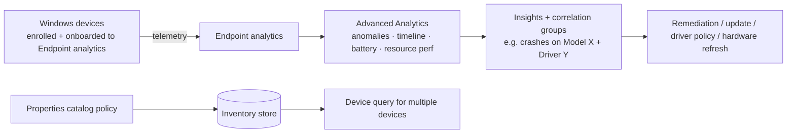

# 2.3.6 Implement Microsoft Intune Advanced Analytics

> **Exam objective:** Implement Microsoft Intune Advanced Analytics, including anomaly detection, proactive insights, and risk-based policy recommendations
>
> **Domain:** 2 - Manage and maintain devices (25-30%) · **Skill:** 2.3 Implement Intune Suite add-on capabilities
>
> **Hands-on:** [LAB-2.16 Advanced Analytics](../labs/LAB-2.16-advanced-analytics.md)

## Concept in plain English

**Endpoint analytics** (Plan 1) scores startup performance, app reliability and work-from-anywhere readiness. **Advanced Analytics** builds on it with deeper, faster, more targeted insights:

| Capability | What it gives you |
|---|---|
| **Anomaly detection** | Detects spikes in app crashes, app hangs, stop errors (BSOD) and boot/sign-in regressions, and correlates them to **device groups sharing a factor** (model, OS build, driver, app version) |
| **Device timeline** | Near real-time event history per device (restarts, crashes, updates, anomalies). Replaces the app reliability detail view |
| **Battery health** | Capacity, cycle count, runtime estimates, battery health score by model |
| **Resource performance** | CPU and RAM spike scores by device/model/manufacturer - evidence for hardware refresh decisions |
| **Device query (single device)** | Live KQL queries against one device's state (objective [2.4.6](2.4.6-device-query-kql.md)) |
| **Device query for multiple devices** | KQL across collected inventory for the fleet (Windows needs a **properties catalog** policy) |
| **Custom device scopes** | Filter all Endpoint analytics reports by **scope tag** |
| **STIG audit baseline** | Audit Windows against DoD STIG requirements |

**Proactive insights / risk-based recommendations** show up as **Insights and recommendations** in Endpoint analytics (for example, "Upgrade to SSD for these models", "Update driver X on devices with anomalies", "Remove startup processes") and in **anomaly correlation groups**. When combined with **Copilot in Intune** and **Security Copilot agents**, they give prioritized recommendations (objectives [5.1.3](../../05-Optimize-Endpoint-Operations/docs/5.1.3-security-copilot-agents-device-performance.md)-5.1.4).

## How it works

## Licensing requirements

**Intune Plan 2** (Advanced Analytics is now listed as a Plan 2 capability), **Intune Suite**, the standalone add-on, or **Microsoft 365 E3/E5 (since July 2026)**. Features appear automatically up to 48 hours after licensing. Devices must be enrolled and **onboarded to Endpoint analytics** (Intune data collection policy).

## Configuration steps

1. **Onboard to Endpoint analytics:** **Reports > Endpoint analytics > Settings** → *Intune data collection policy* assigned to all Windows devices (or the built-in *All cloud-managed devices*).
2. **Properties catalog** (for fleet device query): **Devices > Configuration > Create > Windows > Properties catalog** → select properties (CPU, disk, battery, BIOS, TPM, video, network adapters) → assign.
3. **Anomalies:** **Reports > Endpoint analytics > Anomalies** → review *severity*, *affected devices*, and **device correlation groups** (for example, "Model: Latitude 7440 + Driver: Intel Wi-Fi 23.x"). Drill into affected devices → **Device timeline**.
4. **Battery health / Resource performance:** Endpoint analytics tabs → sort by model → export for procurement.
5. **Device scopes:** **Endpoint analytics > Settings > Device scopes** → create a scope from a scope tag → switch scope at the top of reports.
6. **Act:** create a **Remediation** (objective [5.2.3](../../05-Optimize-Endpoint-Operations/docs/5.2.3-remediation-scripts.md)), a **driver update policy**, or a feature update rollback plan for the correlated population.

## Comparison: Endpoint analytics vs Advanced Analytics

| | Endpoint analytics (Plan 1) | + Advanced Analytics |
|---|---|---|
| Startup performance, app reliability, WFA scores | ✅ | ✅ |
| Remediations | ✅ (Windows E3/E5 license) | ✅ |
| Anomaly detection + correlation | ❌ | ✅ |
| Device timeline | ❌ | ✅ |
| Battery health, resource performance | ❌ | ✅ |
| Device query (single/multiple) | ❌ | ✅ |
| Scoped reporting (device scopes) | ❌ | ✅ |

## Exam tips and common traps

- **"Detect that a new driver version caused a spike in stop errors on one model"** → **Advanced Analytics anomalies** (device correlation groups).
- **"Find devices with degraded batteries to replace"** → **Battery health** report.
- **Device query for multiple devices** on Windows requires a **properties catalog** policy. Other platforms collect inventory automatically.
- Advanced Analytics needs devices **onboarded to Endpoint analytics** first.

## Real-world notes

- Review anomalies **after every Patch Tuesday and driver rollout**. It's the fastest way to catch a bad update before the help desk does.
- Resource performance data makes hardware refresh budgets far easier to justify ("these 300 devices spend 40% of the day at >90% RAM").

## Microsoft Learn references

- [Advanced Analytics overview](https://learn.microsoft.com/intune/advanced-analytics/)
- [Anomalies](https://learn.microsoft.com/intune/advanced-analytics/anomalies)
- [Device timeline](https://learn.microsoft.com/intune/advanced-analytics/device-timeline)
- [Battery health](https://learn.microsoft.com/intune/advanced-analytics/battery-health)
- [Resource performance](https://learn.microsoft.com/intune/advanced-analytics/resource-performance)
- [Device scopes](https://learn.microsoft.com/intune/advanced-analytics/device-scopes)
