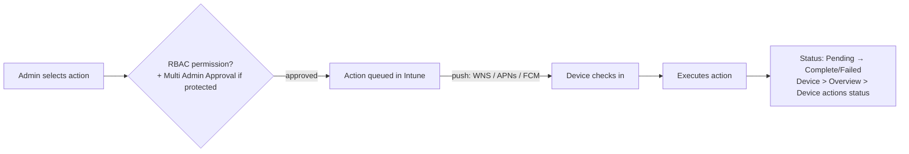

# 2.4.1 Sync, restart, retire, or wipe devices

> **Exam objective:** Sync, restart, retire, or wipe devices
>
> **Domain:** 2 - Manage and maintain devices (25-30%) · **Skill:** 2.4 Perform remote actions on devices
>
> **Hands-on:** [LAB-2.17 Remote actions](../labs/LAB-2.17-remote-actions.md)

## Concept in plain English

Remote actions are one-off commands sent to a device from **Devices > [device] > (toolbar)**. The four core ones:

| Action | What it does | Data impact |
|---|---|---|
| **Sync** | Forces an immediate check-in (policies, apps, compliance) | None |
| **Restart** | Restarts the device (Windows; macOS; some Android corporate) | Unsaved work lost |
| **Retire** | Removes **company data, apps, profiles and management**; unenrolls | **Personal data kept** |
| **Wipe** | **Factory reset** | Everything removed (options below) |

Related actions you should know: **Delete** (removes the Intune record), **Autopilot Reset** (Windows, returns to business-ready and keeps Entra join + enrollment), **Fresh Start** (legacy, deprecated in favour of Autopilot Reset/Wipe), **Remote lock**, **Reset passcode**, **Lost mode** (supervised iOS), **Locate device**, **Rename**, **Collect diagnostics**, **Quick/Full scan**, **Update Defender security intelligence**, **BitLocker key rotation**, **Rotate local admin password**, **New remote assistance session**.

## Wipe options (Windows)

| Option | Result |
|---|---|
| (default) | Full reset. Device leaves Intune/Entra |
| **Retain enrollment state and user account** | Resets Windows but keeps the Entra join and MDM enrollment and user profiles on data partition. Similar to *Keep my files* |
| **Wipe device, and continue to wipe even if device loses power** | *Protected* wipe - more secure, but can leave the device unbootable if interrupted. Needs reimaging then |

For **iOS/iPadOS**: *Keep eSIM data plan*, *Preserve user data* (Shared iPad). For **macOS**: an **Obliteration behavior** setting and a PIN for older Macs.

## How it works



Devices must be **online** to receive the command. Retire/wipe on an offline device stays **pending** until it checks in. Deleting the record meanwhile cancels the command.

## Retire vs wipe vs delete - by platform

| | Retire | Wipe | Delete |
|---|---|---|---|
| Windows (corporate) | Removes Intune-managed apps/profiles, keeps OS and personal files, unenrolls | Factory reset | Removes record. Device unenrolls at next check-in |
| iOS/iPadOS BYOD | Removes management profile, managed apps and data | Full erase (device enrollment only) | Record removed |
| iOS user enrollment | Removes work partition | ❌ Not available | - |
| Android work profile (BYOD) | Removes work profile | ❌ (can't factory reset personal devices) | - |
| Android fully managed / dedicated / COPE | Factory reset (for COPE, retire removes the work profile) | Factory reset | - |

## Licensing requirements

Intune Plan 1. **RBAC:** *Remote tasks* permissions (Wipe, Retire, Reboot now, Sync devices, and so on). High-impact actions can be protected with **Multi Admin Approval** (objective 1.3.3).

## Configuration steps

1. **Devices > All devices > [device]** → toolbar: **Sync**, **Restart**, **Retire**, **Wipe**, **Delete**.
2. Confirm the dialog (select wipe options if applicable).
3. Monitor: device **Overview > Device actions status**, or **Devices > Monitor > Device actions** (tenant-wide history of who did what).
4. Audit: **Tenant administration > Audit logs**.

### Microsoft Graph

```powershell
Connect-MgGraph -Scopes DeviceManagementManagedDevices.PrivilegedOperations.All
$id = (Get-MgDeviceManagementManagedDevice -Filter "deviceName eq 'CONTOSO-LAB-01'").Id
Sync-MgDeviceManagementManagedDevice -ManagedDeviceId $id           # sync
Restart-MgDeviceManagementManagedDeviceNow -ManagedDeviceId $id     # restart
# Retire (company data only):
Invoke-MgRetireDeviceManagementManagedDevice -ManagedDeviceId $id
# Wipe with options:
Clear-MgDeviceManagementManagedDevice -ManagedDeviceId $id -KeepEnrollmentData:$false -KeepUserData:$false
```

## Exam tips and common traps

- **"Remove corporate data from a departing employee's personal phone without touching personal photos"** → **Retire**.
- **"Lost corporate laptop, protect data"** → **Wipe** (and rotate BitLocker/LAPS afterwards if recovered).
- **"Repurpose a Windows device for a new user but keep it enrolled and Entra joined"** → **Autopilot Reset** (or wipe with *Retain enrollment state*).
- **Delete** alone doesn't wipe data. It only removes the Intune record, and the device unenrolls at next check-in.
- Personal **Android work profile** devices can't be fully wiped. Only the work profile is removed.
- **Sync** doesn't reinstall failed apps immediately - Win32 apps retry on the IME schedule (and can be retried from Company Portal).

## Real-world notes

- Before wiping, **back up the BitLocker recovery key** reference and ensure the Autopilot registration remains, so the device can be redeployed.
- Put **Wipe/Retire/Delete** behind **Multi Admin Approval** in production.
- Use **Devices > Monitor > Device actions** during incident reviews - it shows initiator, time and status.

## Microsoft Learn references

- [Remote device actions overview](https://learn.microsoft.com/intune/device-management/actions/)
- [Retire](https://learn.microsoft.com/intune/device-management/actions/retire)
- [Wipe](https://learn.microsoft.com/intune/device-management/actions/wipe)
- [Delete](https://learn.microsoft.com/intune/device-management/actions/delete)
- [Autopilot Reset](https://learn.microsoft.com/autopilot/tutorial/reset/autopilot-reset-overview)
