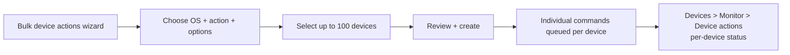

# 2.4.2 Perform bulk remote actions

> **Exam objective:** Perform bulk remote actions
>
> **Domain:** 2 - Manage and maintain devices (25-30%) · **Skill:** 2.4 Perform remote actions on devices
>
> **Hands-on:** [LAB-2.17 Remote actions](../labs/LAB-2.17-remote-actions.md)

## Concept in plain English

Instead of clicking through devices one by one, **bulk device actions** send the same action to many devices at once. There are three ways to do it:

| Method | Scale | Notes |
|---|---|---|
| **Devices > All devices > Bulk device actions** | Up to **100 devices** per run | Wizard: choose OS, action, then devices (search/select) |
| **Select multiple rows in the device list** | Page of results | Limited actions (for example, delete, sync) |
| **Microsoft Graph / PowerShell** | Unlimited (with throttling) | Loop through a filtered device list. Best for recurring or large jobs |

Actions available in bulk depend on the platform. They typically include: **Autopilot Reset**, **Delete**, **Rename**, **Restart**, **Retire**, **Sync**, **Wipe**, **Rotate local admin password**, **Rotate BitLocker keys**, **Update Defender security intelligence**, **Collect diagnostics**, **Quick/Full scan**.

## How it works



## Licensing requirements

Intune Plan 1 (and the licenses of the underlying feature, for example Advanced Analytics for device query). RBAC permissions for each action. **Multi Admin Approval** also applies to bulk wipe/retire/delete if protected.

## Configuration steps

1. **Devices > All devices > Bulk device actions**.
2. *Basics*: **OS** = Windows → **Device type** (if shown) → **Device action** = *Sync* (or *Rotate BitLocker keys*, *Update Windows Defender security intelligence*, and so on). Set action-specific options (for example, wipe options, rename template `CON-{{serialnumber}}`).
3. *Devices*: **Select devices to include** → search → add (max 100).
4. *Review + create*.
5. Monitor in **Devices > Monitor > Device actions**.

### Graph: bulk sync for all Windows devices that haven't synced in 3 days

```powershell
Connect-MgGraph -Scopes DeviceManagementManagedDevices.PrivilegedOperations.All,DeviceManagementManagedDevices.Read.All
$cutoff = (Get-Date).ToUniversalTime().AddDays(-3).ToString('o')
Get-MgDeviceManagementManagedDevice -Filter "operatingSystem eq 'Windows' and lastSyncDateTime le $cutoff" -All |
  ForEach-Object {
      Sync-MgDeviceManagementManagedDevice -ManagedDeviceId $_.Id
      Start-Sleep -Milliseconds 300   # be gentle with Graph throttling
  }
```

A reusable version with `-WhatIf`, logging and action selection lives in [`08-Scripts/graph/Invoke-BulkDeviceAction.ps1`](../../08-Scripts/graph/Invoke-BulkDeviceAction.ps1).

Graph also offers true batch endpoints for some actions (for example `deviceManagement/managedDevices/executeAction` in beta, which accepts up to 100 device IDs).

## Comparison

| | Portal bulk wizard | Graph script |
|---|---|---|
| Max devices per run | 100 | No hard limit (throttling applies) |
| Filtering | Manual selection | Any Graph filter/logic |
| Repeatable / scheduled | ❌ | ✅ (Azure Automation, runbooks) |
| Audit | Intune audit log | Intune audit log (app identity) |

## Exam tips and common traps

- **"Rename 80 Windows devices using a template"** → **Bulk device actions > Rename** with a template like `{{serialnumber}}`.
- Bulk device actions are capped at **100** devices per run. For more, use **Graph**.
- Actions listed depend on the **OS** you select first.
- Bulk actions still respect **RBAC scope** - devices outside your scope groups can't be selected.

## Real-world notes

- For incident response ("update Defender signatures on everything now"), a Graph script against a filtered set is faster than several 100-device wizard runs.
- Always test destructive bulk actions on a **pilot group** and use `-WhatIf` in scripts.

## Microsoft Learn references

- [Use bulk device actions](https://learn.microsoft.com/intune/device-management/actions/bulk-device-actions)
- [Remote actions overview](https://learn.microsoft.com/intune/device-management/actions/)
- [managedDevice: executeAction (Graph beta)](https://learn.microsoft.com/graph/api/intune-devices-manageddevice-executeaction?view=graph-rest-beta)
