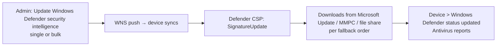

# 2.4.3 Update Microsoft Defender Antivirus security intelligence

> **Exam objective:** Update Microsoft Defender Antivirus security intelligence
>
> **Domain:** 2 - Manage and maintain devices (25-30%) · **Skill:** 2.4 Perform remote actions on devices
>
> **Hands-on:** [LAB-2.17 Remote actions](../labs/LAB-2.17-remote-actions.md)

## Concept in plain English

Microsoft Defender Antivirus relies on **security intelligence** (signature and definition) updates, released several times a day, plus cloud protection. Normally devices update automatically. When a new threat is active, or a device reports **outdated signatures** in compliance, you can push an immediate update with the **Update Windows Defender security intelligence** remote action (single device or bulk). You can then run a **Quick scan** or **Full scan**.

Three update types (don't confuse them):

| Update type | Contents | Cadence |
|---|---|---|
| **Security intelligence** | Signatures/definitions | Multiple times a day |
| **Engine update** | Antimalware engine | Monthly |
| **Platform update** | Defender client binaries | Monthly |

## How it works



The **fallback order** and sources (Microsoft Update, Microsoft Malware Protection Center, UNC file share, internal definition update server) come from the antivirus policy (*Signature update fallback order*, *Signature update file shares sources*).

## Licensing requirements

Intune Plan 1. Microsoft Defender Antivirus is built into Windows. Defender for Endpoint isn't required for this action.

## Configuration steps

### Remote action

1. **Devices > Windows > [device] > ... > Update Windows Defender security intelligence** → **Yes**.
2. Optionally **Quick scan** / **Full scan**.
3. Check **Devices > [device] > Windows Defender** (or **Endpoint security > Antivirus > Windows 10 and later unhealthy endpoints**) for *Security intelligence version* and *Last updated*.

Bulk: **Devices > All devices > Bulk device actions** → Windows → *Update Windows Defender security intelligence*.

### Policy (prevent the problem)

**Endpoint security > Antivirus > Microsoft Defender Antivirus** policy:

- *Signature Update Interval* (hours) = **4** (0 = default schedule)
- *Check For Signatures Before Running Scan* = Enabled
- *Signature update fallback order*, *Allow Cloud Protection* = Allowed, *Cloud Block Level* = High
- Compliance policy: *Microsoft Defender Antimalware security intelligence up-to-date* = **Require**

### On the device

```powershell
Get-MpComputerStatus | Select-Object AntivirusSignatureVersion, AntivirusSignatureLastUpdated, AMEngineVersion, AMProductVersion
Update-MpSignature   # local manual update
```

## Exam tips and common traps

- **"Devices report noncompliant because security intelligence is out of date - fix immediately"** → remote action **Update Windows Defender security intelligence** (bulk if many).
- The remote action updates **signatures**, not the engine or platform.
- Ongoing prevention = **antivirus policy** (update interval, cloud protection), not repeated remote actions.
- **Quick scan** vs **Full scan**: quick checks common malware locations. Full scans every file and takes much longer.

## Real-world notes

- Devices that are off VPN and blocked from Microsoft Update often have stale signatures. Allow direct internet for definition updates, or configure a file-share fallback.
- Combine the **Antivirus agent status** report with a Graph bulk update script after major outbreaks.

## Microsoft Learn references

- [Update Windows Defender security intelligence (remote action)](https://learn.microsoft.com/intune/device-management/actions/defender-security-intelligence)
- [Manage Microsoft Defender Antivirus updates](https://learn.microsoft.com/defender-endpoint/microsoft-defender-antivirus-updates)
- [Antivirus policy settings for Windows](https://learn.microsoft.com/intune/device-security/endpoint-security/antivirus-microsoft-defender-settings-windows)
- [Defender CSP](https://learn.microsoft.com/windows/client-management/mdm/defender-csp)
