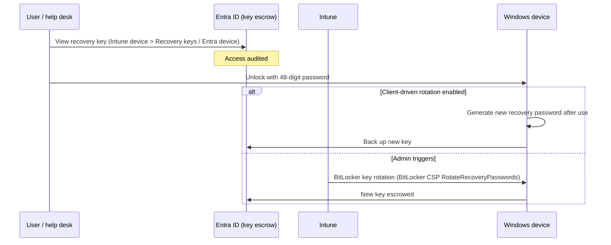

# 2.4.4 Rotate BitLocker recovery keys

> **Exam objective:** Rotate BitLocker recovery keys
>
> **Domain:** 2 - Manage and maintain devices (25-30%) · **Skill:** 2.4 Perform remote actions on devices
>
> **Hands-on:** [LAB-2.17 Remote actions](../labs/LAB-2.17-remote-actions.md)

## Concept in plain English

A BitLocker **recovery password** (48 digits) unlocks a drive when the TPM can't, for example after a firmware change or too many PIN failures. Once a recovery key has been **shown to anyone** (a user reading it to the help desk, a technician), it should be **rotated**. Otherwise the person who saw it could unlock the drive later.

Intune supports:

- **Client-driven recovery password rotation** (policy): Windows automatically generates a new recovery password **after it's used** to unlock the drive, and backs it up to Entra ID.
- **Remote action "BitLocker key rotation"** (single device or bulk): rotate on demand.

## How it works



## Prerequisites

| Requirement | Detail |
|---|---|
| OS | Windows 10 1909+ / Windows 11 |
| Join type | Entra joined or hybrid joined (hybrid needs the key backed up to Entra) |
| Policy | **Configure client-driven recovery password rotation** = *Enable rotation on Microsoft Entra joined devices* or *…on Microsoft Entra joined and hybrid joined devices* (disk encryption policy) |
| Escrow | *Save BitLocker recovery information to Microsoft Entra ID* = Enabled. *Do not enable BitLocker until recovery information is stored* recommended |
| Protector | A recovery password protector must exist on the OS drive |

## Licensing requirements

Intune Plan 1. RBAC permission: *Remote tasks: Rotate BitLocker keys*. To **view** keys: *Managed devices: View BitLocker keys* (Intune) or Entra roles such as Cloud Device Administrator / Helpdesk Administrator (who can read BitLocker keys).

## Configuration steps

1. **Endpoint security > Disk encryption > BitLocker** policy (objective [3.1.2](../../03-Protect-Devices/docs/3.1.2-disk-encryption-bitlocker-filevault.md)) → *Configure client-driven recovery password rotation* = **Enable rotation on Microsoft Entra joined and Microsoft Entra hybrid joined devices** → *Save recovery information to Entra ID* = Enabled.
2. Rotate on demand: **Devices > Windows > [device] > ... > BitLocker key rotation** → **Yes**. Or use **Bulk device actions** → *Rotate BitLocker keys*.
3. Verify: **Devices > [device] > Recovery keys** shows a new *Key ID* with a new date. On the device:

```powershell
manage-bde -protectors -get C:
# Compare the Numerical Password ID before and after rotation
```

4. Event log: **Applications and Services Logs > Microsoft > Windows > BitLocker-API > Management** (key backup events).

## Exam tips and common traps

- **"Ensure a recovery key can't be reused after it's disclosed to a user"** → **client-driven recovery password rotation** (policy) - rotates automatically after use.
- **"Help desk suspects a key was exposed"** → remote action **BitLocker key rotation**.
- Rotation requires the key to be **escrowed to Entra ID**. Hybrid devices escrowing only to AD won't rotate through Intune.
- Viewing a key is **audited** in Entra/Intune audit logs (*Read BitLocker key*).
- Users can self-serve recovery keys at the **Company Portal website** or `myaccount.microsoft.com` if self-service BitLocker recovery is allowed (objective [3.1.2](../../03-Protect-Devices/docs/3.1.2-disk-encryption-bitlocker-filevault.md)).

## Real-world notes

- Turn on client-driven rotation for **all** devices. It's free and closes a common audit finding.
- After bulk firmware (BIOS/TPM) updates that trigger recovery prompts, run a bulk rotation for the affected devices.

## Microsoft Learn references

- [BitLocker key rotation (remote action)](https://learn.microsoft.com/intune/device-management/actions/bitlocker-key-rotation)
- [Manage BitLocker policy - rotate keys](https://learn.microsoft.com/intune/device-security/endpoint-security/encrypt-devices#rotate-bitlocker-recovery-keys)
- [BitLocker CSP](https://learn.microsoft.com/windows/client-management/mdm/bitlocker-csp)
