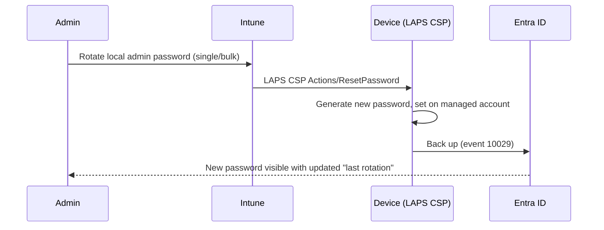

# 2.4.5 Rotate local administrator passwords

> **Exam objective:** Rotate local administrator passwords
>
> **Domain:** 2 - Manage and maintain devices (25-30%) · **Skill:** 2.4 Perform remote actions on devices
>
> **Hands-on:** [LAB-2.17 Remote actions](../labs/LAB-2.17-remote-actions.md) (and [LAB-1.13](../../01-Prepare-Infrastructure/labs/LAB-1.13-windows-laps-local-groups.md))

## Concept in plain English

With **Windows LAPS** (objective [1.3.7](../../01-Prepare-Infrastructure/docs/1.3.7-windows-laps.md)), each device's local admin password is unique and rotates on a schedule (*Password Age Days*). Sometimes you need it rotated **now**: a technician finished working on the device, a password was shared, or an incident occurred. The **Rotate local admin password** remote action tells the device to generate a new password immediately and back it up to **Microsoft Entra ID**.

Three rotation triggers:

| Trigger | Configured in |
|---|---|
| Password age expires | LAPS policy *Password Age Days* |
| **Post-authentication action** (after someone signs in with the managed account, after the reset delay) | LAPS policy *Post Authentication Actions* + *Reset Delay* |
| **On demand** | **Intune remote action** (single or bulk) or `Reset-LapsPassword` locally |

## How it works



## Prerequisites

- A Windows LAPS policy with **backup to Microsoft Entra ID** is applied. On-demand rotation from Intune isn't supported for AD backup.
- *Enable Microsoft Entra LAPS* = Yes in Entra device settings.
- Windows 10 20H2+ (with the April 2023 update) / Windows 11. Entra joined or hybrid joined with Entra backup.
- RBAC: *Remote tasks: **Rotate local admin password***, plus Entra read permission if the same admin must view the password.

## Licensing requirements

Intune Plan 1. Any Entra ID edition for LAPS backup.

## Configuration steps

1. **Devices > Windows > [device] > ... > Rotate local admin password** → confirm.
2. Wait for the device to sync (or **Sync** it). Status in **Device actions**.
3. **Devices > [device] > Local admin password** → *Last rotation* updated → **Show local administrator password**.
4. Bulk: **Bulk device actions** → Windows → *Rotate local admin password*.
5. Graph:

```powershell
Connect-MgGraph -Scopes DeviceManagementManagedDevices.PrivilegedOperations.All
$id = (Get-MgDeviceManagementManagedDevice -Filter "deviceName eq 'CONTOSO-LAB-01'").Id
Invoke-MgGraphRequest -Method POST -Uri "https://graph.microsoft.com/beta/deviceManagement/managedDevices/$id/rotateLocalAdminPassword"
```

## Exam tips and common traps

- **"Immediately invalidate the local admin password a technician just used"** → **Rotate local admin password** (or rely on **post-authentication actions** if configured).
- Rotation from Intune requires **Entra ID** as the LAPS backup directory.
- The remote action permission (Intune RBAC) and the password read permission (Entra role) are **separate**.
- If the device is offline, the action stays **pending**. The old password still works until the device checks in.

## Real-world notes

- Use **post-authentication actions** (reset + sign out after 1-8 hours). It removes the need to remember to rotate.
- Build a help desk runbook: *view password → use → rotate → verify*. Reading passwords is audited, so reviews are simple.

## Microsoft Learn references

- [Rotate local admin password (remote action)](https://learn.microsoft.com/intune/device-management/actions/rotate-local-admin-password)
- [Windows LAPS policy with Intune](https://learn.microsoft.com/intune/device-security/endpoint-security/windows-laps-policy)
- [LAPS CSP](https://learn.microsoft.com/windows/client-management/mdm/laps-csp)
