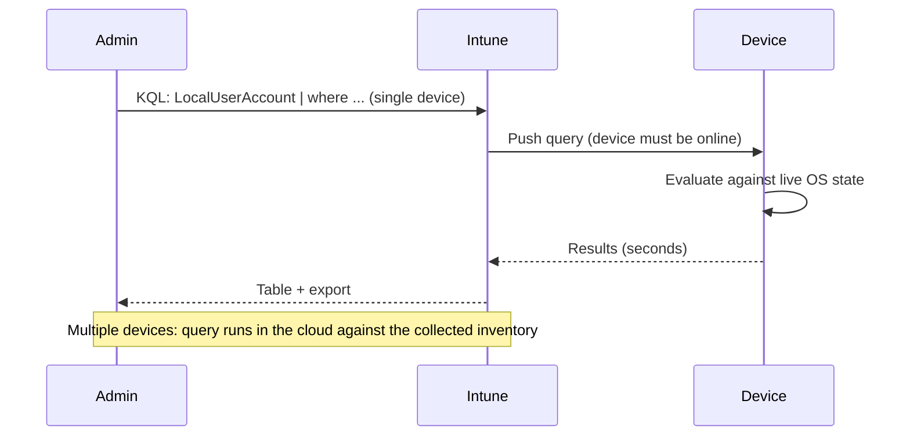

# 2.4.6 Run a device query by using KQL

> **Exam objective:** Run a device query by using KQL
>
> **Domain:** 2 - Manage and maintain devices (25-30%) · **Skill:** 2.4 Perform remote actions on devices
>
> **Hands-on:** [LAB-2.18 KQL device query and diagnostics collection](../labs/LAB-2.18-device-query-diagnostics.md)

## Concept in plain English

**Device query** lets you ask a device questions in **Kusto Query Language (KQL)** and get answers back **in seconds**, without scripts or remote sessions. "Is BitLocker on?", "Which processes use the most memory?", "What's in this registry key?", "Show the last Application errors".

| | **Device query (single device)** | **Device query for multiple devices** |
|---|---|---|
| Where | Devices > [device] > **Monitor > Device query** | **Devices > Device query** |
| Data | **Live** state from the device (online required) | **Collected inventory** (not live) |
| Platforms | Windows (corporate, Intune-managed) | Windows (needs **properties catalog** policy), iOS/iPadOS, macOS, Android Enterprise corporate (COBO/COSU/COPE) |
| Typical use | Troubleshooting one device | Fleet questions ("devices without TPM 2.0") |
| Extras | Copilot can generate KQL from natural language | Export up to 50,000 rows, **Add all items to a group** |

## How it works



## Supported KQL (subset)

- **Table operators:** `where`, `project`, `summarize`, `count`, `distinct`, `join` (limited types), `order by`, `take`, `top`.
- **Scalar operators / functions:** `==`, `!=`, `contains`, `startswith`, `has`, `in`, `and/or`, `ago()`, `now()`, `datetime()`, `tostring()`, `strcat()` and similar.
- **Entities (examples):** `Device`, `Cpu`, `Memory`, `Disk`, `BiosInfo`, `Tpm`, `EncryptableVolume`, `LocalUserAccount`, `LocalGroup`, `Process`, `Service`, `WindowsDriver`, `WindowsQfe`, `WindowsRegistry('path')`, `WindowsEvent('Log', timespan)`, `FileInfo('path')`, `Certificate`, `BatteryInfo`, `NetworkAdapter`, `SystemEnclosure`, `OsVersion`.

### Examples

```kusto
// Single device: is the OS volume encrypted?
EncryptableVolume
| where DriveLetter == "C:"
| project DriveLetter, ProtectionStatus, EncryptionMethod

// Single device: top 10 memory consumers
Process
| order by WorkingSetSizeBytes desc
| take 10
| project ProcessName, ProcessId, WorkingSetSizeBytes

// Single device: last Application errors (24h)
WindowsEvent('Application', 1d)
| where Level == "Error"
| take 20

// Single device: check a registry value
WindowsRegistry('HKEY_LOCAL_MACHINE\\SOFTWARE\\Policies\\Microsoft\\Windows\\WindowsUpdate')

// Multiple devices: devices without TPM 2.0
Tpm
| where SpecVersion !startswith "2.0"
| project Device, Manufacturer = Device.Manufacturer, SpecVersion
```

Schemas can change. Use the **property pane** on the left of the query editor as the source of truth.

## Licensing requirements

**Advanced Analytics** (Intune Plan 2 / Intune Suite / Microsoft 365 E3+ since July 2026). RBAC: **Managed devices: Query** + read permissions (Help Desk Operator includes the fleet query).

## Configuration steps

1. Single device: **Devices > Windows > [device] > Device query** → type KQL → **Run** → results. Use **Copilot** ("Show me expired certificates on this device") to draft KQL.
2. Multiple devices: deploy a **Properties catalog** profile to Windows devices (objective 2.3.6), wait for inventory → **Devices > Device query** → run → **Export** or **Add all items to a group**.

## Exam tips and common traps

- **"Retrieve live information from one Windows device without running a script"** → **device query (single device)**.
- **"Find all devices with a specific driver version across the fleet"** → **device query for multiple devices** (Windows needs a **properties catalog** policy).
- Device query uses a **subset** of KQL - not everything from Log Analytics works.
- The single-device query needs the device **online**. The multiple-device query uses inventory that may be hours old.
- Results from a fleet query can be turned into an **Entra group** for targeting (for example, remediation).

## Real-world notes

- Save your go-to queries (encryption, local admins, top processes, recent errors) in a team wiki. First-line support can answer most "what's wrong with this PC" questions in under a minute.
- Pair fleet queries with **Remediations**: query → group → remediation script → query again to verify.

## Microsoft Learn references

- [Device query (single device)](https://learn.microsoft.com/intune/advanced-analytics/device-query)
- [Device query for multiple devices](https://learn.microsoft.com/intune/advanced-analytics/device-query-multiple-devices)
- [Use Copilot to create KQL queries](https://learn.microsoft.com/intune/copilot/)
- [Properties catalog](https://learn.microsoft.com/intune/device-configuration/collect-device-properties)
