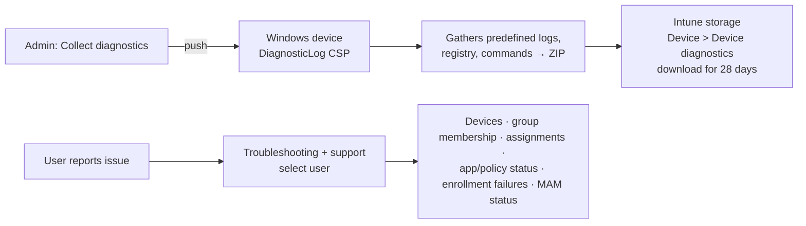

# 2.4.7 Collect device diagnostics and logs by using Intune

> **Exam objective:** Collect device diagnostics and logs by using Microsoft Intune, including using the Troubleshooting blade for user-based diagnostics
>
> **Domain:** 2 - Manage and maintain devices (25-30%) · **Skill:** 2.4 Perform remote actions on devices
>
> **Hands-on:** [LAB-2.18 KQL device query and diagnostics collection](../labs/LAB-2.18-device-query-diagnostics.md)

## Concept in plain English

When something fails on a device, you need logs. Intune gives you **device-centric** and **user-centric** tools:

| Tool | Scope | What you get |
|---|---|---|
| **Collect diagnostics** (remote action) | One Windows device | A ZIP of predefined **event logs, registry keys, MDM/IME/Autopilot logs, command outputs** (`dsregcmd`, `ipconfig`, `certutil`...) uploaded to Intune. Download from **Device diagnostics** (kept 28 days) |
| **Troubleshooting + support > Troubleshoot** blade | **One user** | All the user's devices, **assignments** (apps, configuration, compliance, app protection), **enrollment failures**, app install failures, license status, **app protection status** - one pane |
| Company Portal / Intune app **Send logs** | User-initiated (Windows, iOS, Android, macOS) | Client logs uploaded with an incident ID the user gives to IT |
| **MDM diagnostic report** on Windows (Settings > Access work or school > Export) | Local | `MDMDiagReport.html`, event logs, registry |
| `mdmdiagnosticstool.exe` | Local/scripted | Targeted areas: `-area Autopilot;DeviceEnrollment;DeviceProvisioning;TPM -cab` |
| **Autopilot / ESP log collection** | OOBE error page | ZIP export during failed setup |
| **Windows 365 Collect diagnostics** / **Troubleshooting** | Cloud PCs | Connection and provisioning diagnostics |

## How it works

## Requirements for Collect diagnostics (Windows)

- Windows 10 1909+ (with required cumulative updates) / Windows 11.
- **Corporate-owned**, Intune managed (Entra joined, hybrid joined, co-managed). Not for personal devices.
- Tenant setting **Tenant administration > Device diagnostics** = *Enabled* (on by default). Optionally allow **automatic diagnostic collection** on Autopilot failures.
- RBAC: *Remote tasks: Collect diagnostics*.
- Collections are size-limited, and Intune keeps a limited number of recent collections per device (check the current limits in the documentation).

Also available for **Windows 365 Cloud PCs** and **HoloLens 2**. Android/iOS use app-based log upload (Company Portal/Intune app, Microsoft Edge/Outlook for MAM).

## Licensing requirements

Intune Plan 1.

## Configuration steps

### Collect diagnostics

1. **Devices > Windows > [device] > Collect diagnostics** → **Yes**.
2. **Device diagnostics** tab: status *Pending → Complete* → **Download** the ZIP.
3. Key contents: `MDMDiagReport`, **IntuneManagementExtension.log**, `AgentExecutor.log`, Autopilot logs, event logs (`DeviceManagement-Enterprise-Diagnostics-Provider`, `AAD`, `BitLocker-API`), `dsregcmd /status` output, Windows Update logs.

### Troubleshooting blade (user-based)

1. **Troubleshooting + support > Troubleshoot** → **Select user** → `user1`.
2. Review:
   - **Summary**: license, Intune license status, devices.
   - **Devices**: compliance, ownership, last check-in.
   - **Policies / Applications / App protection policies**: assignment and status per device.
   - **Enrollment failures**: reason, time, platform.
   - **App installation failures**.
3. Filter by **Assignment type** to see whether an item is targeted to the user or the device.

### Guided scenarios / help

**Troubleshooting + support > Help and support** - search Microsoft's troubleshooting articles or open a support request. **Copilot in Intune** can summarize a device and analyze error codes.

## Comparison

| Question | Tool |
|---|---|
| "Why didn't user1's app install on any of her devices?" | **Troubleshooting blade** (user-centric) |
| "Get me the IME log from this laptop now" | **Collect diagnostics** |
| "What's the BitLocker state right now?" | **Device query** (objective 2.4.6) |
| "Autopilot failed at ESP" | ESP log export / auto-collected diagnostics / Autopilot deployments report |
| "iPhone app protection isn't applying" | Troubleshooting blade → App protection status. Edge `about:intunehelp` / Company Portal logs |

## Exam tips and common traps

- **User-based** troubleshooting across all their devices → **Troubleshooting + support > Troubleshoot** (select user).
- **Device-based log collection** without touching the device → **Collect diagnostics** (Windows, corporate).
- Collect diagnostics isn't available for **personal** Windows devices.
- Diagnostics are retained for **28 days**.
- Intune Management Extension log path: `C:\ProgramData\Microsoft\IntuneManagementExtension\Logs\`.

## Real-world notes

- Enable **automatic diagnostic collection on Autopilot failure** - you get logs from a failed OOBE without the device ever reaching a desktop.
- Train first-line support to start every Intune ticket in the **Troubleshooting blade**. It answers "is it assigned?" in seconds.

## Microsoft Learn references

- [Collect diagnostics from a Windows device](https://learn.microsoft.com/intune/device-management/actions/collect-diagnostics)
- [Troubleshoot users with the Troubleshooting pane](https://learn.microsoft.com/intune/fundamentals/help-desk-operators)
- [DiagnosticLog CSP](https://learn.microsoft.com/windows/client-management/mdm/diagnosticlog-csp)
- [Company Portal log upload](https://learn.microsoft.com/intune/user-help/send-logs-to-your-it-admin-by-using-the-company-portal-app)
