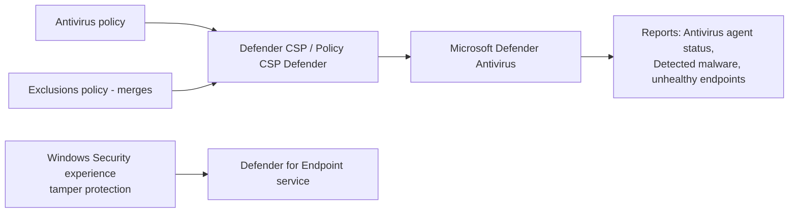

# 3.1.1 Create antivirus policies by using Microsoft Intune

> **Exam objective:** Create antivirus policies by using Microsoft Intune
>
> **Domain:** 3 - Protect devices (15-20%) · **Skill:** 3.1 Configure endpoint security
>
> **Hands-on:** [LAB-3.01 Antivirus and firewall policies](../labs/LAB-3.01-antivirus-firewall-policies.md)

## Concept in plain English

**Endpoint security > Antivirus** policies configure **Microsoft Defender Antivirus** (Windows), **Defender for Endpoint on macOS/Linux**, and a few related profiles. They're focused, security-team-friendly views over the same CSPs the settings catalog uses.

| Platform | Profiles |
|---|---|
| **Windows** | **Microsoft Defender Antivirus** (real-time, cloud protection, scans, remediation, updates, PUA, network protection), **Microsoft Defender Antivirus exclusions** (separate profile so exclusions merge), **Windows Security experience** (hide/lock Windows Security app areas, **tamper protection** for Defender for Endpoint-onboarded devices) |
| **macOS** | Antivirus, Antivirus exclusions (Defender for Endpoint on Mac) |
| **Linux** | Microsoft Defender Antivirus, exclusions (Defender for Endpoint on Linux, via security settings management) |
| Windows Server | Via **Defender for Endpoint security settings management** (no Intune enrollment needed) |

## Key settings (Windows)

| Setting | Recommended | Why |
|---|---|---|
| Allow Realtime Monitoring | Allowed | Core protection |
| **Allow Cloud Protection** | Allowed | Cloud-delivered protection (MAPS) |
| **Cloud Block Level** | High | Aggressive cloud blocking |
| Cloud Extended Timeout | 50 seconds | More time for cloud analysis |
| **Submit Samples Consent** | Send safe samples automatically | Needed for block-at-first-sight |
| **PUA Protection** | On (block) | Potentially unwanted apps |
| Enable Network Protection | Enabled (block) | Also in ASR |
| Allow Behavior Monitoring / Script Scanning / Scanning all downloaded files / Archive scanning | Allowed | |
| Scan schedule (quick daily, full weekly) | Configure | Plus *Check for signatures before scan* |
| **Signature Update Interval** | 4 hours | Keep security intelligence fresh (objective [2.4.3](../../02-Manage-Maintain-Devices/docs/2.4.3-defender-security-intelligence-update.md)) |
| Days to retain cleaned malware | 30 | |
| **Tamper protection** (Windows Security experience) | On | Stops local changes to Defender settings (requires Defender for Endpoint connection) |
| **Disable Local Admin Merge** | Enabled | Only Intune exclusions apply - local admins can't add exclusions |

**Exclusions** belong in the separate *Defender Antivirus exclusions* profile. Unlike other settings, exclusion lists from multiple policies **merge** instead of conflicting.

## How it works



## Licensing requirements

Intune Plan 1 (Defender Antivirus is built into Windows). Tamper protection management and advanced reporting need Defender for Endpoint onboarding (P1/P2 or Business).

## Configuration steps

1. **Endpoint security > Antivirus > Create policy** → Platform **Windows** → Profile **Microsoft Defender Antivirus**.
2. Configure settings (table above) → scope tags → assign to `DG-Lab-Windows-Corporate`.
3. **Create policy** → **Microsoft Defender Antivirus exclusions** → add only justified exclusions (for example, a line-of-business database folder) → assign.
4. **Create policy** → **Windows Security experience** → *TamperProtection (Device)* = On → assign.
5. Monitor: **Endpoint security > Antivirus** → *Summary*, **Windows 10 and later unhealthy endpoints**, **active malware**. Also **Reports > Microsoft Defender Antivirus > Antivirus agent status / Detected malware**.

### Verify on the device

```powershell
Get-MpPreference | Select-Object DisableRealtimeMonitoring, MAPSReporting, CloudBlockLevel, PUAProtection, EnableNetworkProtection, SubmitSamplesConsent
Get-MpComputerStatus | Select-Object RealTimeProtectionEnabled, IsTamperProtected, AntivirusSignatureLastUpdated
```

## Comparison: where Defender settings can be configured

| Location | Use |
|---|---|
| **Endpoint security > Antivirus** | Recommended, security-focused, merges exclusions |
| Security baseline (Windows / Defender for Endpoint) | Microsoft-recommended defaults, conflicts possible |
| Settings catalog > Defender | Same CSP - avoid duplicating |
| Device configuration > Endpoint protection template (legacy) | Legacy |

## Exam tips and common traps

- **"Prevent local administrators from adding Defender exclusions"** → **Disable Local Admin Merge** (and tamper protection).
- **"Two teams manage exclusions separately"** → separate **exclusions** policies. They **merge**.
- **Tamper protection** managed from Intune requires the device to be **onboarded to Defender for Endpoint** (the Windows Security experience profile).
- **Block at first sight** needs *cloud protection* + *submit samples* enabled.
- Settings in baselines, antivirus policies and the settings catalog can **conflict**. Pick one owner per setting.

## Real-world notes

- Keep exclusions minimal and documented with an owner and review date. Attackers love broad folder exclusions.
- Use the **Antivirus agent status** report weekly. "Real-time protection off" or "signatures older than 3 days" usually means a broken device, VPN or proxy.

## Microsoft Learn references

- [Antivirus policy for endpoint security in Intune](https://learn.microsoft.com/intune/device-security/endpoint-security/antivirus-policy)
- [Antivirus policy settings for Windows](https://learn.microsoft.com/intune/device-security/endpoint-security/antivirus-microsoft-defender-settings-windows)
- [Protect security settings with tamper protection](https://learn.microsoft.com/defender-endpoint/prevent-changes-to-security-settings-with-tamper-protection)
- [Configure Defender Antivirus exclusions](https://learn.microsoft.com/defender-endpoint/configure-exclusions-microsoft-defender-antivirus)
