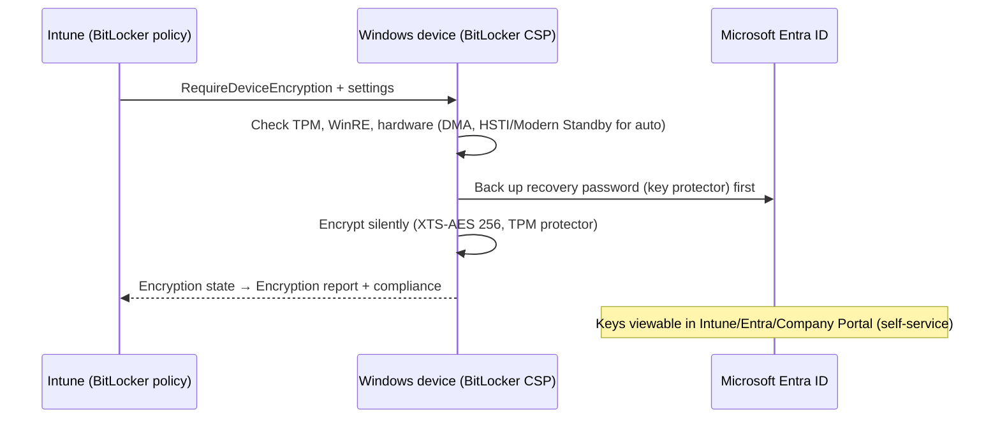

# 3.1.2 Create and manage disk encryption policies

> **Exam objective:** Create and manage disk encryption policies by using Microsoft Intune, including managing BitLocker recovery keys, configuring user self-service recovery, and monitoring encryption compliance status
>
> **Domain:** 3 - Protect devices (15-20%) · **Skill:** 3.1 Configure endpoint security
>
> **Hands-on:** [LAB-3.02 BitLocker and FileVault with self-service recovery](../labs/LAB-3.02-bitlocker-filevault.md)

## Concept in plain English

A lost laptop without disk encryption is a data breach. **Endpoint security > Disk encryption** policies turn on **BitLocker** (Windows) and **FileVault** (macOS), escrow the **recovery keys** to Microsoft Entra ID or Intune, and report encryption state. **Silent encryption** means users never see a wizard.

### BitLocker - key decisions

| Decision | Typical choice |
|---|---|
| Silent vs user-initiated | **Silent** on Entra joined devices: *Allow warning for other disk encryption* = Disabled (+ *Allow standard user encryption* = Enabled) |
| Encryption method | **XTS-AES 256** for OS and fixed drives, AES-CBC 256 for removable |
| Startup authentication | **TPM only** (silent). TPM + PIN for high-security (not silent - the user must set a PIN) |
| Recovery key escrow | *Save BitLocker recovery information to Microsoft Entra ID* = Enabled. **Don't enable BitLocker until recovery information is stored** = Enabled |
| Recovery options | *Allow 48-digit recovery password*, *Omit recovery options from the BitLocker setup wizard*, *Configure user storage of recovery info* |
| Key rotation | **Client-driven recovery password rotation** = Entra joined + hybrid (objective [2.4.4](../../02-Manage-Maintain-Devices/docs/2.4.4-rotate-bitlocker-keys.md)) |
| Used space only | Speeds up encryption on new devices |

### FileVault (macOS)

*Enable FileVault*, *Defer* until sign-out, *Personal recovery key* **escrowed to Intune**, *Recovery key rotation* (months), *Hide recovery key* from the user, *Number of times allowed to bypass*. Keys are visible in **Devices > [Mac] > Recovery keys**.

## How it works



## Self-service recovery

Users locked out at the **BitLocker recovery** screen can get their own key:

- **Company Portal website** (`portal.manage.microsoft.com`) → *Devices* → device → **Get recovery key** (or the Company Portal app on another device).
- **My Account** (`myaccount.microsoft.com`) → *Devices* → **View BitLocker Keys**.

Requirements: Entra joined/registered device owned by the user, key escrowed in Entra ID, and the Entra device setting **Restrict users from recovering the BitLocker key(s) for their owned devices** = **No** (the default). Every key read is **audited** (*Read BitLocker key* in Entra audit logs).

Admins: **Intune > Devices > [device] > Recovery keys**, or Entra device → *BitLocker keys*. Roles: Intune *Managed devices > View BitLocker keys*, Entra Cloud Device Administrator / Helpdesk Administrator / Security Reader / Global Reader (key read is audited).

## Monitor encryption compliance

- **Reports > Device management > Encryption report**: per-device *Encryption readiness* (TPM version, OS), *Encryption status*, *Profile state*, **Status details** explaining why a device isn't encrypted (for example, *WinRE not configured*, *TPM not ready*, *Hardware test failed*, *Not PSTI/Modern Standby*).
- **Compliance policy**: *Require BitLocker* (Device Health Attestation) or **Require encryption of data storage on device** → drives Conditional Access (objective [1.3.4](../../01-Prepare-Infrastructure/docs/1.3.4-compliance-policies.md)).
- Endpoint security > Disk encryption → per-policy status.

## Licensing requirements

Intune Plan 1. BitLocker on Windows Pro/Enterprise/Education. FileVault on macOS.

## Configuration steps

1. **Endpoint security > Disk encryption > Create policy** → **Windows** → **BitLocker**:
   - *Require Device Encryption* = Enabled
   - *Allow Warning For Other Disk Encryption* = **Disabled** → *Allow Standard User Encryption* = **Enabled** (silent for standard users)
   - *Configure Recovery Password Rotation* = Refresh on for Entra joined and hybrid joined devices
   - *Choose drive encryption method and cipher strength* = XTS-AES 256 (OS/fixed)
   - *Enforce drive encryption type on operating system drives* = **Used Space only**
   - *Require additional authentication at startup* = Enabled → *Configure TPM startup* = **Allow TPM**, *TPM startup PIN* = Do not allow (silent)
   - *Choose how BitLocker-protected OS drives can be recovered* = Enabled → allow 48-digit recovery password → **Save BitLocker recovery information to Microsoft Entra ID** → **Do not enable BitLocker until recovery information is stored**
2. Assign to device groups.
3. macOS: **Disk encryption > Create > macOS > FileVault** → Enable, *Recovery key type* Personal key, escrow description, rotation 6 months → assign.
4. Check the **Encryption report** and the compliance policy.

```powershell
manage-bde -status C:
Get-BitLockerVolume -MountPoint C: | Select-Object VolumeStatus, EncryptionMethod, KeyProtector
(Get-BitLockerVolume C:).KeyProtector | Where-Object KeyProtectorType -eq RecoveryPassword
```

## Exam tips and common traps

- **"Encrypt without user interaction"** → silent encryption: *Allow warning for other disk encryption* = **Disabled** + *Allow standard user encryption* = **Enabled** + **TPM-only** startup.
- **TPM + PIN** is **not** silent - the user has to set a PIN.
- **"Users must retrieve their own keys"** → Company Portal website / My Account, with keys escrowed to **Entra ID**, and *Restrict users from recovering BitLocker keys* = **No**.
- *Do not enable BitLocker until recovery information is stored* prevents devices from encrypting without a backup key.
- The **Encryption report** shows **why** a device isn't encrypted. The compliance report only shows **that** it isn't.
- FileVault personal recovery keys escrow to **Intune** (not Entra).

## Real-world notes

- VMs without vTPM and devices with WinRE disabled never encrypt silently. The encryption report's *status details* tell you exactly why.
- Before BIOS/firmware updates, **suspend BitLocker** (`Suspend-BitLocker -RebootCount 1`) or expect a wave of recovery prompts. Rotate keys afterwards.
- Hybrid devices migrating from MBAM/AD escrow: make sure keys are also escrowed to Entra (`BackupToAAD-BitLockerKeyProtector`) before relying on self-service.

## Microsoft Learn references

- [Disk encryption policy for endpoint security](https://learn.microsoft.com/intune/device-security/endpoint-security/disk-encryption-policy)
- [Encrypt Windows devices with BitLocker in Intune](https://learn.microsoft.com/intune/device-security/endpoint-security/encrypt-devices)
- [Encryption report](https://learn.microsoft.com/intune/device-security/endpoint-security/encryption-monitor)
- [FileVault for macOS](https://learn.microsoft.com/intune/device-security/endpoint-security/encrypt-devices-filevault)
- [Self-service BitLocker recovery](https://learn.microsoft.com/intune/user-help/get-recovery-key-windows)
- [BitLocker CSP](https://learn.microsoft.com/windows/client-management/mdm/bitlocker-csp)
