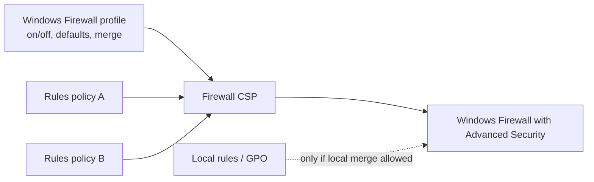

# 3.1.3 Create firewall policies by using Microsoft Intune

> **Exam objective:** Create firewall policies by using Microsoft Intune
>
> **Domain:** 3 - Protect devices (15-20%) · **Skill:** 3.1 Configure endpoint security
>
> **Hands-on:** [LAB-3.01 Antivirus and firewall policies](../labs/LAB-3.01-antivirus-firewall-policies.md)

## Concept in plain English

**Endpoint security > Firewall** manages **Windows Firewall** (Windows Defender Firewall) and the **macOS firewall**. On Windows there are two profile types:

| Profile | Purpose |
|---|---|
| **Windows Firewall** | Global and per-network-profile settings: enable firewall for **Domain / Private / Public**, default inbound/outbound action, stealth mode, **Allow local policy merge** (local rules), logging, IPsec exemptions |
| **Windows Firewall rules** | Individual rules: direction, action, program/service, protocol, local/remote ports and addresses, interface types, network profiles. Up to 150 rules per policy |
| *Windows Hyper-V Firewall rules* | Rules for WSL/Hyper-V containers |
| **macOS firewall** | Enable, block all incoming, stealth mode, allowed/blocked apps |

Windows network profiles:

- **Domain**: connected to a network where the device authenticates to an AD DC (or configured via the *network location* settings).
- **Private**: trusted home or work networks.
- **Public**: everything else (default for unknown networks) - the most restrictive.

## How it works

**Rules from multiple rules policies are additive.** Global settings can conflict like any other setting.

## Licensing requirements

Intune Plan 1. Defender for Endpoint integration adds firewall reporting in Defender XDR (P2).

## Configuration steps

### Windows Firewall profile

**Endpoint security > Firewall > Create policy** → **Windows** → **Windows Firewall**:

| Setting | Value |
|---|---|
| Enable Domain / Private / Public Network Firewall | **True** |
| Default Inbound Action (all profiles) | **Block** |
| Default Outbound Action | Allow |
| **Allow Local Policy Merge** (Public) | **False** (only Intune rules apply on public networks) |
| Allow Local IPsec Policy Merge | False |
| Disable Stealth Mode | False |
| Enable Log Dropped Packets | True |

### Rules

**Create policy** → **Windows Firewall rules** → **Add**:

| Rule | Direction | Action | Program/Port | Profiles |
|---|---|---|---|---|
| Allow Remote Help / RDP from IT subnet | Inbound | Allow | TCP 3389, remote address `10.10.50.0/24` | Domain, Private |
| Block SMB outbound on Public | Outbound | Block | TCP 445 | Public |
| Allow LOB app | Inbound | Allow | `%ProgramFiles%\Contoso\App\app.exe` | Domain |

Assign to device groups.

### Monitor

- **Reports > Firewall > MDM Firewall status for Windows 10 and later** - shows whether the firewall is On/Off per device.
- Compliance: *Firewall* = Require (objective [1.3.4](../../01-Prepare-Infrastructure/docs/1.3.4-compliance-policies.md)).
- On the device: `Get-NetFirewallProfile | Select Name, Enabled, DefaultInboundAction, AllowLocalFirewallRules` and `Get-NetFirewallRule -PolicyStore ActiveStore`.

## Comparison: firewall rule sources

| Source | Wins? |
|---|---|
| Intune (MDM) firewall rules | Always applied |
| Local rules (created by apps/users) | Only if **Allow Local Policy Merge** = True for that profile |
| Group Policy rules (hybrid) | Applied. Watch for overlap |

## Exam tips and common traps

- **"Ensure only centrally managed firewall rules apply on public networks"** → *Allow Local Policy Merge* = **False** for the Public profile.
- Firewall **rules** from several policies are **merged**. Global **settings** can conflict.
- The firewall report is under **Reports > Firewall**.
- Blocking all inbound by default can break apps (Teams calls, peer-to-peer Delivery Optimization). Test in pilot.

## Real-world notes

- Keep rule policies small and purpose-named (`FW-Rules-RemoteSupport`, `FW-Rules-LOB-Finance`) to stay under the rules-per-policy limit and ease troubleshooting.
- Don't disable local merge on the Domain/Private profiles until you've inventoried apps that create their own rules at install time (many VPN and collaboration clients do).

## Microsoft Learn references

- [Firewall policy for endpoint security](https://learn.microsoft.com/intune/device-security/endpoint-security/firewall-policy)
- [Firewall CSP](https://learn.microsoft.com/windows/client-management/mdm/firewall-csp)
- [Windows Firewall overview](https://learn.microsoft.com/windows/security/operating-system-security/network-security/windows-firewall/)
- [Firewall reports](https://learn.microsoft.com/intune/device-security/endpoint-security/firewall-policy-reports)
