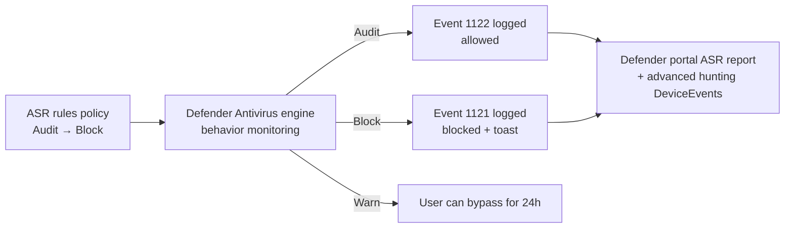

# 3.1.4 Configure attack surface reduction policies

> **Exam objective:** Configure Attack surface reduction policies by using Microsoft Intune, including applying Zero Trust principles for endpoint protection
>
> **Domain:** 3 - Protect devices (15-20%) · **Skill:** 3.1 Configure endpoint security
>
> **Hands-on:** [LAB-3.03 Attack surface reduction rules](../labs/LAB-3.03-attack-surface-reduction.md)

## Concept in plain English

The **attack surface** is every way an attacker can get code running on a device: Office macros, scripts, USB drives, malicious websites, exploits. **Endpoint security > Attack surface reduction (ASR)** policies close those doors.

| ASR profile (Windows) | What it controls |
|---|---|
| **Attack Surface Reduction Rules** | ~19 behaviour rules (for example, *Block Office applications from creating child processes*, *Block credential stealing from LSASS*, *Block executable content from email*, *Block untrusted/unsigned processes from USB*, *Use advanced protection against ransomware*, *Block abuse of exploited vulnerable signed drivers*). Modes: **Off / Block / Audit / Warn** |
| **Device Control** | USB/removable storage, printers, Bluetooth - allow/deny by device ID, vendor, group, with read/write/execute granularity (Defender device control) |
| **Exploit Protection** | Import an Exploit Guard XML (DEP, ASLR, CFG per app) |
| **App and browser isolation** | Microsoft Defender Application Guard (retired for Edge; legacy) |
| **Web protection** (Edge Legacy) / **Network protection** | Block access to malicious domains/IPs in any app (network protection is set in AV/ASR) |
| *App Control for Business* | Separate node (objective [3.1.8](3.1.8-app-control-for-business.md)) |

## Zero Trust principles for endpoints

| Principle | Endpoint control |
|---|---|
| **Verify explicitly** | Compliance + Conditional Access (device health, risk score from Defender for Endpoint) |
| **Use least privilege** | No local admin, EPM, LAPS, App Control, ASR rules blocking credential theft |
| **Assume breach** | ASR rules, device control, network protection, EDR in block mode, attack disruption, encryption, isolation actions |

Microsoft's **Zero Trust Assessment** and the Intune *Zero Trust configuration* guidance map these to recommended Intune policies (for example, Windows security baseline + ASR rules in block + LAPS + BitLocker + Defender for Endpoint).

## How it works



**Rollout pattern:** deploy in **Audit** → review hits in the Defender portal ASR rules report (or event logs 1121/1122 in *Microsoft-Windows-Windows Defender/Operational*) → add **per-rule exclusions** → switch to **Block** (or **Warn** for user-facing rules).

## Licensing requirements

Intune Plan 1 to configure. ASR rules require Microsoft Defender Antivirus as the active AV with real-time protection and cloud protection. **Full reporting, Warn mode analytics and device control reporting need Defender for Endpoint** (P1 for ASR/device control, P2/E5 for advanced hunting).

## Configuration steps

1. **Endpoint security > Attack surface reduction > Create policy** → **Windows** → **Attack Surface Reduction Rules**.
2. Set rules to **Audit** initially (Microsoft's "standard protection" rules to **Block** immediately: *Block abuse of exploited vulnerable signed drivers*, *Block credential stealing from LSASS*, *Block persistence through WMI event subscription*).
3. Add **ASR Only Per Rule Exclusions** for known false positives (paths only).
4. Assign to a pilot device group → review 2-4 weeks → move to **Block**.
5. **Device control**: **Create policy** → *Device Control* → reusable settings (removable storage groups by VID/PID) → rule: *Deny write to removable storage* except the approved encrypted USB group → assign.
6. Monitor: Defender portal (**Reports > Attack surface reduction rules**), Intune **Reports > Endpoint security > Attack surface reduction** (where available), and device event logs.

```powershell
Get-MpPreference | Select-Object -ExpandProperty AttackSurfaceReductionRules_Ids
Get-WinEvent -LogName 'Microsoft-Windows-Windows Defender/Operational' |
  Where-Object Id -in 1121,1122 | Select-Object -First 10 TimeCreated, Id, Message
```

## Comparison: ASR modes

| Mode | Effect | Use |
|---|---|---|
| Off / Not configured | Rule inactive | - |
| **Audit** | Logs only | First 2-4 weeks |
| **Warn** | Blocks, user can unblock for 24 h | Rules that affect productivity |
| **Block** | Blocks | Target state |

## Exam tips and common traps

- **"Prevent Word from launching PowerShell"** → ASR rule *Block all Office applications from creating child processes*.
- **"Evaluate ASR rule impact without affecting users"** → **Audit** mode.
- **"Block writing to USB drives except approved ones"** → **Device Control** profile (not an ASR rule).
- ASR rules need **Defender Antivirus** active. With a third-party AV, ASR rules don't work.
- Event IDs: **1121 = blocked**, **1122 = audited** (1129 = user allowed a Warn block).
- **Exploit protection** takes an **XML** export (`Get-ProcessMitigation -RegistryConfigFilePath`).

## Real-world notes

- The "child process from Office" and "obfuscated scripts" rules generate the most false positives. Plan exclusions with app owners.
- Pair ASR with **network protection in block mode** - it's the cheapest phishing/C2 mitigation you can turn on.

## Microsoft Learn references

- [Attack surface reduction policy in Intune](https://learn.microsoft.com/intune/device-security/endpoint-security/attack-surface-reduction-policy)
- [ASR rules reference](https://learn.microsoft.com/defender-endpoint/attack-surface-reduction-rules-reference)
- [ASR rules deployment overview](https://learn.microsoft.com/defender-endpoint/attack-surface-reduction-rules-deployment)
- [Device control in Defender for Endpoint](https://learn.microsoft.com/defender-endpoint/device-control-overview)
- [Zero Trust for endpoints with Intune](https://learn.microsoft.com/security/zero-trust/deploy/endpoints)
